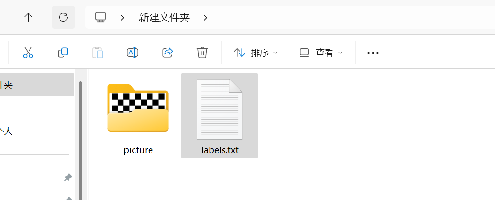

# 1.准备需要进行标注的图片文件夹

**格式最好是jpg**


# 2.准备labels.txt(文件名任取)

**其中是一些标签**

**必要的两个标签**

```
__ignore__
_background_
```

**然后是自己需要的一些标签，比如我们标记装甲板**

```
armor
```

**还要可以再往后加，按行分割**

**上述两个文件（labels.txt和图片文件夹）需要在同一个目录底下**




# 3.进入上述目录使用labelme命令打开标记软件

```
labelme picture --labels labels.txt --nodata --validatelabel exact --config "{\"shift_auto_shape_color\": -2}" --labelflags "{\"car\": [\"color_red\", \"color_blue\"]}"

```

**注意这里labelme images中的images其实就是对应的存储图片的文件命名，所以我这里要使用的应该是labelme picture**

**这里的labelflags可以为具体的标签再增加属性，这里就是给car标签增加了对应的颜色属性**


# 4.使用下述代码将Labelme标签转COCO目标检测标签

```python
import os
import json
import argparse
import numpy as np
from sklearn.model_selection import train_test_split
from tqdm import tqdm

# ================== 参数解析 ==================
parser = argparse.ArgumentParser()
parser.add_argument('--root_dir', type=str, default="C:\\Users\\lenovo\\Desktop\\TUP\\标注数据",
                    help="根目录路径（包含所有labelme标注的json文件）")
parser.add_argument('--save_path', type=str, default="C:\\Users\\lenovo\\Desktop\\TUP\\COCOtest\\coco.json",
                    help="保存路径（不划分数据集时使用）")
parser.add_argument('--random_split', action='store_true', default=True,
                    help="启用随机划分数据集（默认比例8:1:1）")
args = parser.parse_args()


# ================== 数据集划分函数 ==================
def split_dataset(data, test_size=0.1, val_size=0.1):
    """
    划分数据集为train/val/test (比例 8:1:1)
    """
    # 第一次划分：分出训练集
    train_data, temp_data = train_test_split(
        data,
        test_size=test_size + val_size,
        random_state=42
    )

    # 第二次划分：从剩余数据中分出验证集和测试集
    val_data, test_data = train_test_split(
        temp_data,
        test_size=test_size / (test_size + val_size),
        random_state=42
    )

    return train_data, val_data, test_data


# ================== 主转换函数 ==================
def labelme2coco():
    # 初始化数据结构
    coco_template = {
        "info": {"description": "COCO Dataset"},
        "licenses": [],
        "categories": [],
        "images": [],
        "annotations": []
    }

    # 收集所有标注数据和类别
    all_data = []
    category_map = {}
    image_id_map = {}

    print("正在扫描标注文件...")
    # 遍历根目录下的所有json文件
    # 遍历根目录下的所有json文件
    for idx, filename in enumerate(tqdm(os.listdir(args.root_dir))):
        if filename.endswith(".json"):
            filepath = os.path.join(args.root_dir, filename)
            try:
                with open(filepath, 'r', encoding='utf-8') as f:
                    data = json.load(f)

                    # 记录图像路径映射
                    image_id_map[data["imagePath"]] = idx

                    # 收集类别信息
                    for shape in data["shapes"]:
                        label = shape["label"]
                        if label not in category_map:
                            # 新增颜色相关字段
                            category_map[label] = {
                                "id": len(category_map),
                                "keypoints": [f"point_{i + 1}" for i in range(len(shape["points"]))],
                                "skeleton": [[i + 1, (i + 1) % len(shape["points"]) + 1] for i in
                                             range(len(shape["points"]))],
                                "colors": {},  # 颜色名称到ID的映射
                                "color_list": []  # 颜色名称顺序列表
                            }
                        # 处理颜色信息
                        flags = shape.get("flags", {})
                        for flag_key in flags:
                            if flag_key.startswith("color_") and flags[flag_key]:
                                color_name = flag_key[6:]  # 去除"color_"前缀
                                # 如果颜色不存在则添加
                                if color_name not in category_map[label]["colors"]:
                                    color_id = len(category_map[label]["color_list"])
                                    category_map[label]["colors"][color_name] = color_id
                                    category_map[label]["color_list"].append(color_name)
                        # ...其他处理...
                    all_data.append(data)
            except Exception as e:
                print(f"错误加载文件 {filename}: {str(e)}")
                continue

    # 构建categories
    for label, info in category_map.items():
        # 转换颜色信息为列表格式
        color_info = [{"id": idx, "name": name} for idx, name in enumerate(info["color_list"])]
        coco_template["categories"].append({
            "id": info["id"],
            "name": label,
            "supercategory": "object",
            "keypoints": info["keypoints"],
            "skeleton": info["skeleton"],
            "colors": color_info  # 新增颜色字段
        })

    # 数据集划分
    if args.random_split:
        train_data, val_data, test_data = split_dataset(all_data)
        datasets = {
            "train": train_data,
            "val": val_data,
            "test": test_data
        }
    else:
        datasets = {"all": all_data}

    # 处理每个数据集划分
    for phase, data in datasets.items():
        coco_data = coco_template.copy()
        coco_data["images"] = []
        coco_data["annotations"] = []
        ann_id = 0

        print(f"正在处理 {phase} 数据集...")
        for img_data in tqdm(data):
            # 构建image信息
            image_info = {
                "id": image_id_map[img_data["imagePath"]],
                "file_name": os.path.basename(img_data["imagePath"]),
                "width": img_data["imageWidth"],
                "height": img_data["imageHeight"],
                "license": 0,
                "date_captured": ""
            }
            coco_data["images"].append(image_info)

            # 处理标注
            for shape in img_data["shapes"]:
                points = np.array(shape["points"])
                # 转换关键点格式 [x1,y1,v1,x2,y2,v2,...]
                keypoints = []
                for x, y in points:
                    keypoints.extend([float(x), float(y), 2])  # v=2表示可见

                # 计算边界框
                x_coords = points[:, 0]
                y_coords = points[:, 1]
                bbox = [
                    float(np.min(x_coords)),  # x_min
                    float(np.min(y_coords)),  # y_min
                    float(np.max(x_coords) - np.min(x_coords)),  # width
                    float(np.max(y_coords) - np.min(y_coords))  # height
                ]

                # 计算多边形面积（使用shoelace公式）
                area = 0.5 * abs(np.sum(
                    x_coords * np.roll(y_coords, 1) -
                    np.roll(x_coords, 1) * y_coords)
                )
                # 处理颜色信息（新增）
                color_id = -1  # 默认值
                flags = shape.get("flags", {})
                for flag_key in flags:
                    if flag_key.startswith("color_") and flags[flag_key]:
                        color_name = flag_key[6:]
                        if color_name in category_map[label]["colors"]:
                            color_id = category_map[label]["colors"][color_name]
                            break
                # 构建annotation
                coco_data["annotations"].append({
                    "id": ann_id,
                    "image_id": image_info["id"],
                    "category_id": category_map[shape["label"]]["id"],
                    "color_id": color_id,  # 新增颜色ID字段
                    "segmentation": [points.flatten().tolist()],
                    "area": float(area),
                    "bbox": bbox,
                    "iscrowd": 0,
                    "keypoints": keypoints,
                    "num_keypoints": len(points)
                })
                ann_id += 1

                # 保存结果（修正保存逻辑）
                output_path = args.save_path
                if args.random_split:
                    base, ext = os.path.splitext(args.save_path)
                    output_path = f"{base}_{phase}{ext}"

                os.makedirs(os.path.dirname(output_path), exist_ok=True)
                with open(output_path, 'w') as f:
                    json.dump(coco_data, f, indent=2)
                print(f"已保存 {phase} 数据集到 {output_path}")

if __name__ == "__main__":
    labelme2coco()
```


**只需注意修改循环次数即可**
