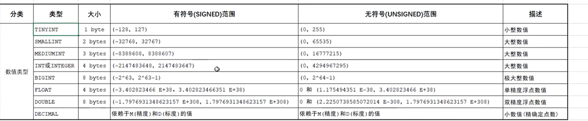
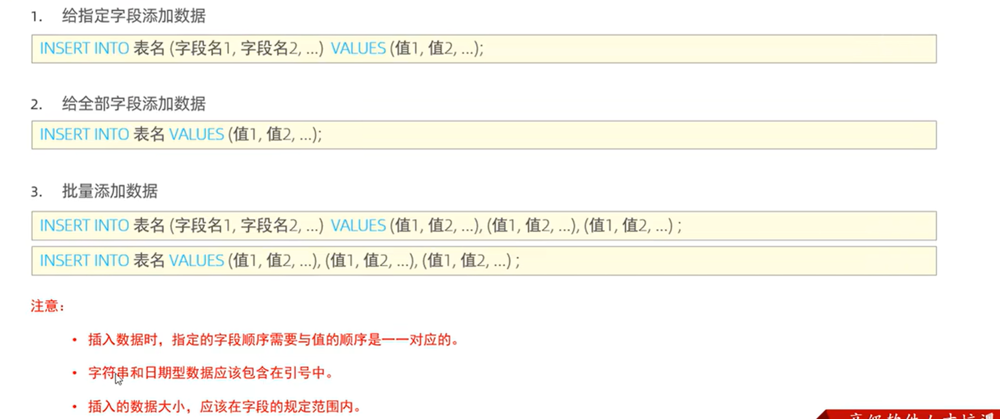
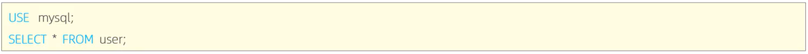

# 1.启动和停止mysql服务


这里的mysql80就是我们安装时起的名字


# 2.客户端连接

**客户端的作用**


用来访问mysql服务器，发送请求创建数据


## 1.方法一

用mysql提供的命令行

****

然后输入密码


## 2.方法二

用cmd连接


中间第一个参数是ip，第二个参数是端口，可以省略，使用默认值

-u root 就是进入root用户

-p 就是提示输入密码


# 3.SQL语法

## 1.通用语法


## 2.DDL

**数据定义语言，用来定义数据库对象（数据库，表，字段）**


**下面代码中括号的意思代表可选参数，在实际编写过程中 并无中括号**

### 1.查询(对库和表)

**查询所有数据库**

```SQL
SHOW DATABASES;
```

**查询当前正在使用的数据库**

```SQL
SELECT DATABASE();
```

**查询当前库中的所有表**

```SQL
SHOW TABLES;
```

**查询表结构**

```sql
DESC 表名;
```

**查询指定表的建表语句**

```sql
SHOW CREATE TABLE 表名;
```


### 2.创建(create)(对库和表)

**创建数据库**

```sql
CREATE DATABASE [IF NOT EXISTS] 数据库名 [DEFAULT CHARSET 字符集] [COLLATE 排序规则];
```

[IF NOT EXISTS] 加上这句话代表如果不存在该数据库，就创建，否则不执行

[DEFAULT CHARSET 字符集] 指定字符集 如utf8

[COLLATE 排序规则] 指定排序规则


**创建表**


对应的字段类型（默认使用有符号的范围，若想使用无符号的范围如 tinyint unsigned即可）



double的使用：如：double(4,1)    第一个参数是这个数字总共有多长(整数部位+小数部位),第二个参数是这个数的小数部位有多长


char和varchar的使用: 如 char(10),  varchar(10)   这两个后面的参数都代表多长的字符，但是char是定长，即使存了1个字符也会

所以char的性能好，varchar性能差，因为varchar需要计算


### 3.删除(drop)(对库和表)

**删除数据库**

```sql
DROP DATABASE [IF EXISTS] 数据库名;
```


**删除表**


### 4.使用(use)(对库)

```sql
USE 数据库名;
```


### 5.修改(alter)(对表)

**添加表的总字段**


**仅修改字段的数据类型**


**同时修改字段名和字段的数据类型**


****

**删除字段**


**修改表名**


## 3.DML

**数据操作语言，对数据库表中的数据·进行增删改**


### 1.添加数据(INSERT)




### 2.修改数据(UPDATE)


### 3.删除数据(DELETE)


 


## 4.DQL

**数据查询语言，用来查询**


### 1.基本查询


### 2.条件查询


### 3.聚合函数


### 4.分组查询

这个实际上是让聚合函数，根据分组字段进行操作，比如以性别进行分组，求平均年龄，那么就可以男性的年龄求平均，女性的年龄求平均。不然只能得到一个值


### 5.排序查询


### 6.分页查询


起始索引其实就是，本页之前有多少个数据


### 7.去重查询

针对某一列进行去重

例如：article(数据表)中共有几个商品（id字段储存商品类型）

```sql
select distinct id from article;
```


### 8.执行顺序


## 5.DCL

**数据控制语言，用来创建数据库用户，控制数据库的访问权限**

### 1.管理用户


#### 1.查询用户



mysql的用户都是储存在mysql数据库中的user表中的


#### 2.创建用户


这样仅仅创建了用户，但还没有给其分配权限

如果主机名写成“%”，那么就是在所有机器上都可以访问


#### 3.修改用户密码


#### 4.删除用户


### 2.管理权限


主要介绍三种操作

#### 1.查询用户权限


#### 2.授予用户权限


#### 3.撤销用户权限


# 4.函数

## 1.字符串函数


```sql
#例如将workno这个字段的所有数字左填充0，补全5位数
update employee set workno = lpad(workno,5,'0');
```

​	

## 2.数值函数


```sql
#生成一个6位随机验证码
select lpad(round(rand()*100000,0),6,'0');
```


## 3.日期函数


```sql
#查询员工的入职天数，并降序排序
select name,datediff(curdate(),entrydate) from employee order by entrydate asc;
```


## 4.流程函数


# 5.约束

## 1.常见约束


## 2.外键约束

