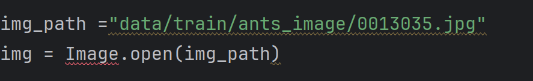

# 	1.学习时的两个法宝


准确来说就是dir是看到这个包里面都有什么工具

help就是这个工具要如何使用

当我们用dir函数不断深挖最终找到


这种类型的数据的时候，说明此时我们找的东西应该就是一个方法，可以直接使用的，这时我们可以使用help方法了

要注意例如help(torch.cuda.is_available)而不是help(torch.cuda.is_available())

要注意是不需要括号的

# 2.conda命令遇到的问题

## 1.Solving environment: unsuccessful initial attempt using frozen solve. Retrying with flexible solve.


[Solving environment: unsuccessful initial attempt using frozen solve. Retrying with flexible solve. - 知乎 (zhihu.com)](https://zhuanlan.zhihu.com/p/690255462)


# 3.pycharm的使用技巧

## 1.对于未知的数据类型

例如我们读取了一个图片，但是不知道这个图片下有什么信息，我们可以这样


在控制台下读取这张图片，看右侧有一个img


我们可以看到各种各样的对应的信息


## 2.对于位置的文件

在该文件下按住Alt+7就可以看到该文件的结构


## 3.对于不确定的导入模块



如图这样没有导入模块的话，这个东西会报错

此时我们将鼠标放在上面，按下Alt+Enter

会出现


然后点击导入此名称

选择我们需要导入的即可


# 4.python的一些知识

## 1.类中的____call____（）函数

这个函数的作用就是不再需要.的方式来引用，可以直接使用对象()的形式来调用


如图直接在person(“zhangsan”)就可以输出对应call的函数


## 2.类中的____getitem____（）函数

实际上就是给类的对象加上了一个[]访问数据的方式

```python
class datasets:
    def __init__(self, name, age):
        self.name = name
        self.age = age
    def __getitem__(self, key):
        return  self.name
a = datasets('wang', 23)
print(a[1])
```


## 3.类中的super()函数

可以调用父类或同级别类的方法

该方法是根据类的 **__mro__** 属性，可以理解成继承顺序

一旦调用super这个函数就要先考虑这个mro属性

```python
class A(object):
    def __init__(self):
        print("class ---- A ----")


class B(A):
    def __init__(self):
        print("class ---- B ----")
        super(B, self).__init__()


class C(A):
    def __init__(self):
        print("class ---- C ----")
        super(C, self).__init__()


class D(B, C):
    def __init__(self):
        print(D.__mro__)
        print("class ---- D ----")
        #super(D, self).__init__()

d = D()

```


这是对应的输出，每次调用super这个函数，就相当于在该mro属性中找到下一个对应的类别

```python
class A:
    def method(self):
        print("A")

class B(A):
    def method(self):
        super().method()
        print("B")

class C(A):
    def method(self):
        super().method()
        print("C")

class D(B, C):
    pass

d = D()
d.method()
```

例如这段代码的输出就是


# 5.pytorch读取数据

## 1.Dataset

**提供一种方式去获取数据及其label**

利用Dataset这个类来写的读取数据的方法

**一定要重写__getitem_这个函数**

```python
from torch.utils.data import Dataset
from PIL import Image
import os

class Mydata(Dataset):
    def __init__(self,root_dir,label_dir):
        self.root_dir = root_dir
        self.label_dir = label_dir
        self.path = os.path.join(self.root_dir,self.label_dir)
        #该函数的作用是将某一个文件夹下的所有文件的名字构成一个列表
        self.img_path = os.listdir(self.path)


    #这里我们是希望用idx这个索引来读取图片，所以我们要先获取图片的列表，然后就方便用索引了
    def __getitem__(self, idx):
        img_name = self.img_path[idx]
        #将两个路径拼接
        img_item_path = os.path.join(self.root_dir,self.label_dir,img_name)
        #打开图片的函数
        img = Image.open(img_item_path)
        label = self.label_dir
        return img, label

    def __len__(self):
        return len(self.img_path)
    
root_dir = "data/hymenoptera_data/train"
ants_label_dir = "ants"
bees_label_dir = "bees"
ants_dataset = Mydata(root_dir,ants_label_dir)
bees_dataset = Mydata(root_dir,bees_label_dir)

#将两个数据集拼接
train_dataset = ants_dataset+bees_dataset


```


## 2.Dataloader

**为后面的网络提供不同的数据形式**

**从dataset中取数据**

```python
import torchvision
from torch.utils.data import DataLoader
from torch.utils.tensorboard import SummaryWriter

data_transfrom = torchvision.transforms.Compose([
    torchvision.transforms.ToTensor()
])

tran_set = torchvision.datasets.CIFAR10(root="./dataset",train=True,transform=data_transfrom,download=True)
test_set = torchvision.datasets.CIFAR10(root="./dataset",train=False,transform=data_transfrom,download=True)

#dataset就是要加载哪个数据集
#batch_size就是每次从dataset中取几个数据
#shuffle就是是否每次读取这整个数据集的顺序是否相同，可以理解每次都要打乱顺序
#num_workers加载数据的时候使用几个进程，但在Windows下如果大于0可能会有一些错误	
#drop_last就是如果剩下数据不满足batch_size的数量的话就舍去
test_loader = DataLoader(dataset=test_set,batch_size=4,shuffle=True,num_workers=0,drop_last=False)

writer = SummaryWriter('dataloder')
step = 0
for data in test_loader:
    imgs, targets = data
    writer.add_images("test_data",imgs,step)
    step = step + 1
writer.close()

```

我的理解就是这里的test_set是从torchvision中下载的一整个数据集

然后用DataLoader读取成一个数组，每个数组都储存了batch_dsize张图片


# 6.TensorBoard的使用

## 1.实例化

```python
from torch.utils.tensorboard import SummaryWriter

writer = SummaryWriter("logs")#参数是将结果保存在目录的名字下
```


## 2.add_scalar()

将数据可视化

例如创建一个y=x的数据集图像

```python
from torch.utils.tensorboard import SummaryWriter

writer = SummaryWriter("logs")

for i in range(100):
    #第一个参数是标题，第二个参数是训练到多少步对应的数值，可以理解成y轴，第三个参数是训练到多少步，可以理解成x轴
    writer.add_scalar("y=x",i,i)


writer.close()
```

运行后他会生成文件夹


然后用命令行输入


logdir=对应的目录

就会出现


点击蓝色的就好


但是有的时候，一台服务器上好多个人训练，所以为了防止冲突，有的时候我们需要指定端口


只需要像这样用–port=指定端口就好


## 3.add_image()

将图片显示出来

```python
from torch.utils.tensorboard import SummaryWriter
import cv2
import numpy as np
from PIL import Image

writer = SummaryWriter("logs")

img_path = "data/train/ants_image/0013035.jpg"
img = Image.open(img_path)
#将图像转换成numpy型
img_array = np.array(img)

#第一个参数是标题，第二个参数是图像，第三个参数是步长，第四个参数很重要是对应图像的shape，要与图像对应上
writer.add_image("test",img_array,1,dataformats='HWC')

writer.close()
```

这里需要注意几点

**1.图像的格式必须是这几个**


所以这里我们把读取到的图像，转换成numpy型的

**2.就是这个dataformats要与图像的shape对应上**


运行后会出现


假如说我们再在该标题下添加一个图片，并把步长设置为2


我们发现上面的滑块就可以滑动，并显示对应的图像

## 4.add_imges()

用于一次加载多张图片

```python
import torchvision
from torch.utils.data import DataLoader
from torch.utils.tensorboard import SummaryWriter

data_transfrom = torchvision.transforms.Compose([
    torchvision.transforms.ToTensor()
])

tran_set = torchvision.datasets.CIFAR10(root="./dataset",train=True,transform=data_transfrom,download=True)
test_set = torchvision.datasets.CIFAR10(root="./dataset",train=False,transform=data_transfrom,download=True)

#dataset就是要加载哪个数据集
#batch_size就是每次从dataset中取几个数据
#drop_last就是如果剩下数据不满足batch_size的数量的话就舍去
test_loader = DataLoader(dataset=test_set,batch_size=4,shuffle=True,num_workers=0,drop_last=False)

writer = SummaryWriter('dataloder')
step = 0
for data in test_loader:
    imgs, targets = data
    #第一个参数是名称，，第二个参数是打开的哪个图像集，第三个是步长
    writer.add_images("test_data",imgs,step)
    step = step + 1
writer.close()

```


# 7.Transfrom的使用

**将一些特定形式的图片，进行形式，尺寸等方面的转换**


## 1.以ToTensor为例

我们可以先进入引入的文件


可以看到里面的各种各样的类，以及介绍，然后找到对应的函数

该函数的作用是将图片类型转换成tensor

```python
from torchvision import transforms
from PIL import Image

#两个问题
#1.transforms如何使用
#2.为什么我们需要Tensor数据类型

img_path ="data/train/ants_image/0013035.jpg"
img = Image.open(img_path)

#
tensor_trans = transforms.ToTensor()

img_tensor = tensor_trans.__call__(img)
#这样写也可以
#img_tensor = tensor_trans(img)

print(img_tensor)

```

这样我们就可以使用该函数


## 2.为什么用tensor

因为这个是将图片保存成神经网络需要的形式


## 3.常用的Transfrom

### 1.Normalize函数


根据介绍可以知道，是将tensor图片归一化的函数


```python
from torchvision import transforms
from PIL import Image
import cv2

img = cv2.imread()

#两个问题
#1.transforms如何使用
#2.为什么我们需要Tensor数据类型

img_path ="data/train/ants_image/0013035.jpg"
img = Image.open(img_path)

#
tensor_trans = transforms.ToTensor()

img_tensor = tensor_trans.__call__(img)
#这样写也可以
#img_tensor = tensor_trans(img)

trans_norm = transforms.Normalize([0.5,0.5,0.5],[0.5,0.5,0.5])
img_norm = trans_norm(img_tensor)

```

如果像我们这样设置mean和std的话他的计算格式就是


最终将【0-1】范围的数据转化成【-1-1】的数据


### 2.Resize()函数


调整PIL图像的尺寸到所给尺寸

```python
from torchvision import transforms
from PIL import Image

img_path ="data/train/ants_image/0013035.jpg"
img = Image.open(img_path)

#
tensor_trans = transforms.ToTensor()

img_tensor = tensor_trans(img)

trans_resize = transforms.Resize((512,512))
img_resize = trans_resize(img)
print(img.size)
print(img_resize)

```


可以看到图像的尺寸发生对应的改变


如果创建对象时传的是一个整数，就会对图片进行等比缩放


### 3.Compose函数


**将几个变换组合在一起**

```python
from torchvision import transforms
from PIL import Image

img_path ="data/train/ants_image/0013035.jpg"
img = Image.open(img_path)

#
tensor_trans = transforms.ToTensor()

img_tensor = tensor_trans(img)

trans_resize = transforms.Resize((512,512))
img_resize = trans_resize(img)

trans_resize2 = transforms.Resize(512)
trans_compose = transforms.Compose([trans_resize2,tensor_trans])
#这个传入的图片格式是由【】里的参数决定的
img_resize_2 = trans_compose(img)
```

这样的得到的img_resize_2就完成了两次变换


# 8.数据集和transfrom结合

## 1.从torchvision中获取数据集

```python
import torchvision

#如何转变图像
data_transfrom = torchvision.transforms.Compose([
    torchvision.transforms.ToTensor()
])


#二者的区别就是关于train参数是否设置为True

#root参数是保存在的路径
#train参数是是否将其当作训练集=
#download参数是是否下载数据集
#还有一个transfrom参数，是对数据集有何变化

#第一个是训练集
#我们获取的是torchvision中的CIFAR10的数据，具体的数据可以到官网上查看
tran_set = torchvision.datasets.CIFAR10(root="./dataset",train=True,transform=data_transfrom,download=True)

#这个是测试集
test_set = torchvision.datasets.CIFAR10(root="./dataset",train=False,transform=data_transfrom,download=True)
```

如果下载过程的速度比较慢，也可以用迅雷来下载


复制这个地址就好了


对于这个陌生的数据集我们可以先打印一个

```python
print(tran_set[0])
```

输出了


那么我们就可以知道这个东西是由两部分组成（由，隔开）

一部分是前面的，另一部分就是6（这部分就是标签）

这是我们就可以分别获取了

```python
img,target = tran_set[0]
```


对于标签的含义，我们可以先输出对应的.classes

```python
print(test_set.classes)
```


对于tran_set[0]这个数据，标签为6，那么对应的就是‘dog’


## 2.trochvision中的数据集


对于这些数据集，我们以CIFAR10来举例

点击进去后


这些是一些必要的参数。我在之前解释过


点击这个我们可以看到这个数据集的具体解释


# 9.神经网络的基本骨架

```python
from torch import nn
class Tudui(nn.Module):
    #初始化，这个一定要续写
    def __init__(self):
       · super().__init__()
	
    #向前传播的意思、
    #在PyTorch中，当你定义一个继承自nn.Module的神经网络模型时，forward函数是这个模型的核心，它定义了数据（输入input）如何通过模型进行前向传播。在这个Tudui类的例子中，forward函数中的input代表模型的输入数据。
    def forward(self,input):
        output = input + 1
        return output

```

利用pytorch里面的nn这个方法，首先要写一个类来继承这个nn.Module，

这个类相当于创建一个网络，我们希望这个网络对图像做什么操作，都可以在这个类里面定义


## 1.卷积层

就是定于用来进行卷积的那一层网络

```python
import torch
import torchvision
from torch import nn
from torch.nn import Conv2d
from torch.utils.data import DataLoader

dataset = torchvision.datasets.CIFAR10(root="./my_data",train=False,transform=torchvision.transforms.ToTensor(),download=True)
dataloader = DataLoader(dataset=dataset,batch_size=64,shuffle=True,num_workers=0,drop_last=True)
class Tudui(nn.Module):
    def __init__(self):
        super(Tudui,self).__init__()

        #in_channels是输入图像的通道数
        #out_channels是我们希望输出图像的通道数
        #kernel_size是卷积核的尺寸
        #stride是卷积核每次移动的步长
        #padding是否对图像周边进行填充
        self.conv1 = Conv2d(in_channels=3,out_channels=6,kernel_size=3,stride=1,padding=0)

    def forward(self,x):
        x = self.conv1(x)
        return x
tudui = Tudui()
print(tudui)

```


 如图这样我们就建立了一个一层卷积的网络

如何知晓padding和stride要如何填写，我们要根据，设计的网络来对应


如图这个卷积层将一个3通道，32x32尺寸的图像，转换成32通道，32x32尺寸的图像

对应的padding和stride的计算如图公式


现在我们要看看这个网络对图片卷积后的结果

```ppython
tudui = Tudui()

for data in dataloader:
    img,targets = data
    conv_img = tudui.forward(img)
    print(img.shape)
    print(conv_img.shape)
```


像这样的结果，那在图片上是如何呈现的呢？

```python
writer = SummaryWriter("logs")
step = 1
for data in dataloader:
    img,targets = data
    conv_img = tudui.forward(img)
    writer.add_images("data",img,step)
    #由于tensenboard不能输出6通道的数据，所以我们这里用不太合理的方法进行转换
    #该函数的(-1，3，30，30)对应着原图像的shape，我们只需要修改必要的通道数即可，第一个数量不清楚我们就可以添-1
    conv_img = torch.reshape(conv_img,(-1,3,30,30))
    writer.add_images("conv_img",conv_img,step)
    step = step + 1
writer.close()

```


## 2.池化层

池化操作与卷积操作类似，但是意义不同

池化操作不需要权重，一般是在卷积层后

本质是采样，可以使输入图片尺寸减少，防止过拟合，减少后续层的计算量，还可以使平移不变

池化一般分为最大池化（再池化范围内找到最大的像素点），和平均池化


这次实现的的代码为最大池化层


```python
import torch
from torch import nn
from torch.nn import MaxPool2d

#这里需要将input里的数据类型转化为浮点型，因为这个池化不支持整形
input = torch.tensor([[1,2,0,3,1],
                      [0,1,2,3,1],
                      [1,2,1,0,0],
                      [5,2,3,1,1],
                      [2,1,0,1,1]],dtype=torch.float32)
input = torch.reshape(input,(-1,1,5,5))
class Tudui(nn.Module):
    def __init__(self):
        super(Tudui,self).__init__()
		
        #ceil_mode当为True的时候，如果池化核已经走过这张图片了，也就是池化核对应的部分有空缺，此时仍会保留剩余部分的最大数值，如果为false的话就不保留了
        self.maxpool1 = MaxPool2d(kernel_size=3,ceil_mode=True)

    def forward(self,input):
        output = self.maxpool1(input)
        return output

tudui = Tudui()
output = tudui.forward(input)
print(output)

```

这是对应的输出


## 3.非线性激活

为了可以拟合所有的函数

不同网络的非线性激活函数可能会不同，具体其他非线性激活函数可以在官方文档中查询


这里讲一个ReLU的非线性优化

这是对应的Relu的函数


```python
import torch
from torch import nn
from torch.nn import ReLU

input = torch.tensor([[1,-5],
                      [2,-7]])
input = torch.reshape(input,(-1,1,2,2))

class Tudui(nn.Module):
    def __init__(self):
        super(Tudui,self).__init__()

        #inplace参数如果是False的话就是不改变输入的值而是返回一个优化后的值
        #如果是True的话就是将改变后的结果替换输入的结果，总而言之会改变输入的值
        self.relu1 = ReLU(inplace=False)

    def forward(self,input):
        output = self.relu1(input)
        return output

tudui = Tudui()
output = tudui.forward(input)
print(output)

```


输出结果：


## 4.线性层（全连接层）


```python
import torch
import torchvision
from torch.utils.data import DataLoader
from torch import nn
from torch.nn import Linear


data = torchvision.datasets.CIFAR10(root="/dataset",train= False,transform=torchvision.transforms.ToTensor(),download=True)

datalodaer = DataLoader(data,batch_size=64)

class Tudui(nn.Module):
    def __init__(self):
        super(Tudui,self).__init__()
        #第一个参数是输入参数的尺寸长度，第二个参数是我们想要的得到的输出的尺寸的长度
        self.linear1 = Linear(196608,10)

    def forward(self ,input):
        output = self.linear1(input)
        return output

tudui = Tudui()

for data in datalodaer:
    img,targets = data
    #将图像展开成一行
    output = torch.flatten(img)

    print(output.shape)
    output = tudui.forward(output)
    print(output.shape)


```


输出结果：


## 5.损失函数与反向传播

具体的损失函数可以在官方文档中查找，这里不过多介绍了

**唯一需要注意的就是对应损失函数要求的输出和输入的格式**


## 6.优化器

神经网络的目标是通过最小化损失函数来优化模型参数。而优化器则是一种迭代算法，通过更新参数的方式使得损失函数达到最小值。

优化器的基本原理可以归结为以下几个步骤：

计算损失函数对于参数的梯度；

根据梯度信息，更新参数值；

重复步骤1和步骤2，直到满足停止条件


这里只介绍其中一种优化器，其他的优化器可以在对应的pytorch网站上找到相对应的

```python
import torch.optim
import torchvision
from torch.utils.data import DataLoader
from torch import nn
from torch.nn import Sequential,Conv2d,MaxPool2d,Flatten,Linear


dataset = torchvision.datasets.CIFAR10(root="../data",train=False,transform=torchvision.transforms.ToTensor(),download=True)

dataloader = DataLoader(dataset,batch_size=1)

class Tudui(nn.Module):
    def __init__(self):
        super(Tudui,self).__init__()
        self.model1 = Sequential(
            Conv2d(3,32,5,padding=2),
            MaxPool2d(2),
            Conv2d(32,32,5,padding=2),
            MaxPool2d(2),
            Conv2d(32,64,5,padding=2),
            MaxPool2d(2),
            Flatten(),
            Linear(1024,64),
            Linear(64,10)
        )

    def forward(self,x):
        x = self.model1(x)
        return x


loss = nn.CrossEntropyLoss()
tudui = Tudui()

#第一个参数是对应神经网络的参数，因为只有知道参数才可以对其进行调整
#lr：该参数是学习速率，一般刚开始用大的学习速率，后期用小的学习速率
optim =torch.optim.SGD(tudui.params(),lr=0.01)

#进行20轮学习
for epoch in range(20):
    running_loss = 0.0
    for data in dataloader:
        img,targets = data
        outputs = tudui.forward(img)
        result_loss = loss(outputs,targets)


        #用优化器之前，要先将对应神将网络的参数的梯度初始化为0
        optim.zero_grad()

        #使用反向传播，得到每个可以调节参数对应的梯度
        result_loss.backward()

        #对参数进行更新
        optim.step()

        #计算每一轮学习中loss的误差求和
        running_loss = running_loss+result_loss
```


## 还有一些层可以在对应的官方文档中寻找


# 10.现有网络模型及修改

现有的很多网络模型都可以在pytorch的官方文档上找到，这里我们只讲一个VGG分类模型的使用及修改

## 1.添加

```python
from torchvision.models import vgg16, VGG16_Weights
from torch.nn import Linear
# 使用预训练的VGG16模型
vgg16_true = vgg16(weights=VGG16_Weights.IMAGENET1K_V1)

# 或者，如果你想要使用最新的默认权重（如果有的话），可以使用
# vgg16_true = vgg16(weights=VGG16_Weights.DEFAULT)


#在VGG16的网络基础上添加一些结构
#比如我们想要添加一个线性层
#
vgg16_true.add_module("add_liner",Linear(1000,10))
```

会在原本的网络模型的最后面添加一个


对于这个假如说我们想要把对应的层加入到classifier中也很简单

```python
vgg16_true.classifier.add_module("add_liner",Linear(1000,10))
```

对应好位置就行


## 2.修改

如果想要修改对应位置的层，如修改classifier的第七层

```python
vgg16_true.classifier[6] = Linear(1000,10)
```


# 11.网络模型的保存与读取

方式一：这种方式保存的文件既有网络结构也有对应的参数权重

方式二：保存对应参数（这种的保存形式没有网络结构，若想使用，需要自己构建或找到对应的网络结构）（推荐使用）


方式一：可以加载对应的.pth文件

方式二：构建对应的网络结构加载对应的参数文件


**一些陷阱**


然后在另一个文件加载该模型


会发生报错，原因是你没有对应的类，若想使用还需要把Tudui的类的定义给整过来很麻烦


# 12.完整的套路的训练


```python
import torch.optim
import torchvision
from torch import nn
from torch.utils.data import DataLoader
from torch.utils.tensorboard import SummaryWriter

#1.准备数据集
train_data = torchvision.datasets.CIFAR10("../data",train=True,transform=torchvision.transforms.ToTensor(),download=True)

test_data = torchvision.datasets.CIFAR10("../data",train=False,transform=torchvision.transforms.ToTensor(),download=True)


train_data_len = len(train_data)
test_data_len = len(test_data)
print("训练数据集的长度为：{}".format(train_data_len))
print("测试数据集的长度为:{}".format(test_data_len))

train_data_dataloader = DataLoader(train_data,batch_size=64)
test_data_dataloader = DataLoader(test_data,batch_size=64)


#2.搭建神经网络(这个网络往往用其他文件保存)
class Tudui(nn.Module):
    def __init__(self):
        super(Tudui,self).__init__()
        self.model = nn.Sequential(
            nn.Conv2d(3,32,5,1,2),
            nn.MaxPool2d(2),
            nn.Conv2d(32,32,5,1,2),
            nn.MaxPool2d(2),
            nn.Conv2d(32,64,5,1,2),
            nn.MaxPool2d(2),
            nn.Flatten(),
            nn.Linear(64*4*4,64),
            nn.Linear(64,10)
        )

    def forward(self,x):
        x = self.model(x)
        return x


#3.实例化模型
tudui = Tudui()

#4.创建损失函数
loss_fn = nn.CrossEntropyLoss()

#5.定义优化器x
learn_rate = 0.01
optimizer = torch.optim.SGD(tudui.parameters(),lr=learn_rate)


#6.设置网络的训练参数
total_tran_step = 0 #记录训练的次数
total_test_step = 0 #记录测试的次数
epoch = 10 #训练的轮数

#添加tensorboard
writer = SummaryWriter("../logs_train")

#7.将数据传入网络
for i in range(epoch):
    #训练
    print("------第{}轮训练开始------".format(i+1))

    tudui.train()  #该函数只有对特定的层有关系，如果特定的层没有特别需要可写可不写
    for data in train_data_dataloader:
        imgs,targets = data
        #将图片放入网络
        outputs = tudui(imgs)
        #将结果如targets进行loss
        loss = loss_fn(outputs,targets)
        #将优化器的对应梯度设置为0
        optimizer.zero_grad()
        #反向传播得到对应的梯度
        loss.backward()
        #根据梯度进行调优
        optimizer.step()

        total_tran_step = total_tran_step+1

        if total_tran_step %100 == 0:
            print("训练次数:{},Loss:{}".format(total_tran_step,loss.item()))
            writer.add_scalar("train_loss",loss.item(),total_test_step)
    #测试
    tudui.eval() #该函数只有对特定的层有关系，如果特定的层没有特别需要可写可不写
    total_test_loss = 0 #测试集的所有损失
    with torch.no_grad():#在不修改梯度的情况下
        for data in test_data_dataloader:
            imgs, targets = data
            outputs = tudui(imgs)
            loss = loss_fn(outputs,targets)
            total_test_loss = total_test_loss + loss

    print("整体测试集上的loss:{}".format(total_test_loss))
    writer.add_scalar("test_loss",total_test_loss,total_test_step)
    total_test_step = total_test_step+1


    #8.保存每一轮的训练结果
    torch.save(tudui,"tudui_{}.pth".format(i))

writer.close()
```


## 2.如何使用GPU训练

### 方法一

​	只需要对应的网络，损失函数，数据，cuda化就好

```python
#3.实例化模型
tudui = Tudui()

if torch.cuda.is_available():
    tudui = tudui.cuda()
#4.创建损失函数
loss_fn = nn.CrossEntropyLoss()
if torch.cuda.is_available():
    loss_fn = loss_fn.cuda()
    
#训练集转化    
imgs,targets = data
if torch.cuda.is_available():
	imgs = imgs.cuda()
	targets = targets.cuda()
#测试集转化
imgs, targets = data
if torch.cuda.is_available():
	imgs = imgs.cuda()
	targets = targets.cuda()
```

### 方法二

```python
#定义训练设备
device = torch.device("cpu")#在cpu上训练
#device = torch.device("cuda")   在gpu上来训练


#3.实例化模型
tudui = Tudui()
tudui = tudui.to(device)

#4.创建损失函数
loss_fn = nn.CrossEntropyLoss()
loss_fn = loss_fn.to(device)

#训练集转化    
imgs,targets = data
imgs = imgs.to(device)
targets = imgs.to(device)


#测试集转化
..............

```


# 13.完整模型的验证（使用模型）


```python
from PIL import Image
import torchvision
import torch
from torch import nn

image_path = "D:\\pycharm\\pycharm-project\\pytorch学习\\pythonProject\\image\\1.jpg"
image = Image.open(image_path)

#因为这种方式打开的图像是png格式，除了RGB三通道外，还有一个透明度通道
image = image.convert("RGB")

transform = torchvision.transforms.Compose([torchvision.transforms.Resize((32,32)),
                                            torchvision.transforms.ToTensor()])


class Tudui(nn.Module):
    def __init__(self):
        super(Tudui,self).__init__()
        self.model = nn.Sequential(
            nn.Conv2d(3,32,5,1,2),
            nn.MaxPool2d(2),
            nn.Conv2d(32,32,5,1,2),
            nn.MaxPool2d(2),
            nn.Conv2d(32,64,5,1,2),
            nn.MaxPool2d(2),
            nn.Flatten(),
            nn.Linear(64*4*4,64),
            nn.Linear(64,10)
        )

    def forward(self,x):
        x = self.model(x)
        return x


image = transform(image)
model = torch.load("tudui_0.pth")
print(model)
image = torch.reshape(image,(1,3,32,32))

model.eval()
with torch.no_grad():
    output = model(image)

print(output.argmax(1))


```


我们发现输出结果是对应的targets[6],也就是青蛙，但其实这张图片是狗

原因就是这个训练次数太少了也太差了

# 14.分类问题的结果的转化


如图两个输入加载进入Model（二分类问题），得到Outputs,(下表对应分类的物品，数字对应概率)，所以其实我们得到的结果是Preds（两个分类结果都是1），而真实的其实是第一个是【0】，第二个是【1】

这里我们需要用Argmax这个函数进行转化

```python
import torch

outputs = torch.tensor([[0.1,0.2],
                         [0.3,0.4]])
#这里的参数是方向，1就是横向看
print(outputs.argmax(1))
```


