# 1.监督学习

## 1.什么是监督学习

 **监督学习就是在学习过程中，给出对应的学习案例。**

**例如一个x----y的映射，我们需要提供多个x以及对应的y供机器学习**


## 2.监督学习的分类


### 1.回归算法

**总的来说就是用来拟合直线或者是曲线的算法**


#### 1.单特征线性回归模型

##### 1.成本函数

用于告诉我们，这个模型目前的结果有多好，以及优化方向。


**平方误差成本函数**

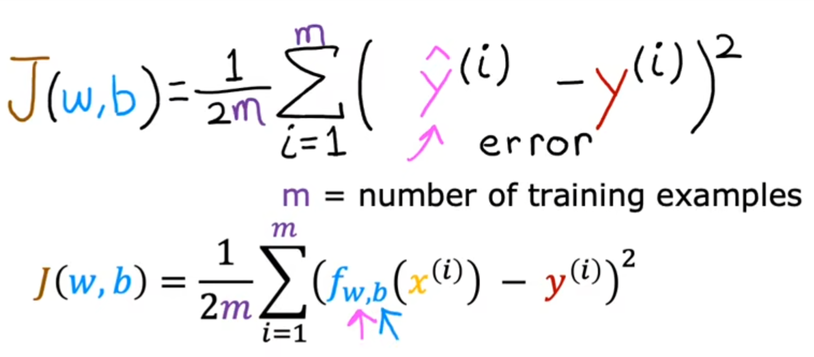

这里是1/2m，多了一个2的原因仅仅是为了后续计算的简洁，可有可没有。**该成本函数，通常用于线性回归**


**成本函数是用来描述在整个训练集上的损失，损失函数是定义在单个样本上的**


##### 2.梯度下降

利用成本函数的偏导数，实现最快减小成本函数的值，实现最优解的一种办法

**梯度下降的更新方法（注意这里说的是更新方法）**


1.右边是错误的更新方法，原因在于，把更新过的w带入了要更新的b中，导致，更新b时所处的位置，并不处于原位置中。

2.这里的$\alpha$是学习率，用来决定梯度下降的速度

3.$\alpha$后面的东西是成本函数的偏导，这里也叫作步长。（这两个可以理解为，已知在某一点的斜率(步长)，然后由我决定要下降多少学习率倍数的步长）


**梯度下降容易陷入局部最优解**

##### 3.学习率的选取

学习率的选取不能过大，过大的话，可能永远无法到达最优解

也不能过小，过小的话，会到达某一个最优解，但是素对会很慢很慢


 


##### 4.实现线性回归

我们需要一个线性回归的模型


然后我们需要一个成本函数


接下来我们要选取合适的学习率去计算每次梯度下降的值


这里就是简单的偏导计算


#### 2.多维度特征线性回归

##### 1.描述方式


##### 2.多维梯度下降迭代w和b


其实都一样，都是对所有的未知变量进行更新


##### 3.正规方程法求w和b


##### 4.特征放缩

可以使梯度下降的更快

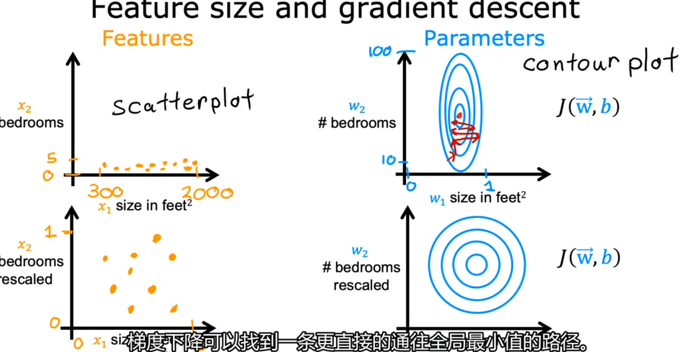

如图中上面两个所示，在没有进行特征放缩前，x轴值普遍偏大，y轴的值普遍偏小，这就导致对应的w和b应该会在x轴偏小y轴偏大的地方到达最优解，也就是如右上角的值，但这也就因为学习率率的选取，导致难以到达最优解，而是在最优解附近徘徊


但是进行特征放缩之后，将x轴和y轴的值，都限制在0-1之间，就可以使其分布均匀，也就是说更容易到达最优解


我最直观的理解就是不好选取学习率


**实现特征放缩的方法：**

1，均值归一化：

其中$\mu$是平均值


2.Z-score归一化：

利用了标准差和均值


##### 5.学习曲线


y轴为成本函数的值，x轴为迭代次数。

1.可以从中看出梯度下降后的值是否收敛，从而判断学习率的选取是否有误，或成本函数的选取有问题


2.可以用来判断学习率的问题


如图所示，下面的图为J和w的图像，而上面的图就对应的学习曲线，从中可以看出，学习率太大了，或者是代码本身有问题


#### 3.多项式回归(拟合曲线)


### 2.分类算法

#### 1.逻辑回归

**有有限个确定属性的输出类型数据，也就是分类。或者也可以理解成，找到一条线，把数据分割开，分成对应的几份，并且这对应的几块区域，又明确的属性**


##### 1.逻辑回归模型


**左上角的曲线图实际上就是g(z)的曲线，现在结合这个g(z)和线性回归的方程，就得到右边的方程，这个就是逻辑回归模型的函数**


##### 2.决策边界

**由于上述逻辑回归模型通过输入一个x我最终得到的y其实也是在0-1之间波动的，它代表着有多少的可能性是1或0，但也并不是真正的直接输出0或1，所以我们需要一个决策边界来判断超过多少是1**


##### 3.成本函数

**逻辑回归的成本函数不能使用平方误差成本函数，将逻辑归回模型带入平方误差成本函数会得到右下角的曲线**


**我们从单个样本的损失函数研究入手(每个样本的损失之和往往构成成本函数)，我们构建如下的损失函数**


**上述的一个复合函数，我们从y==1时分析，当y==1时，我们可以画出对应的图像时右图中的蓝色线，由于我们计算的是逻辑回归，所以y值只有0-1所以其真正的有效区间实际上就是左图。那么当f(x)越趋近与1，此时，损失函数就会无限趋近于0，也就是效果很好，反之则趋近于无穷大，也就是损失函数很大。**


**接下来分析下面的函数，其实和上面分析方法一样，不做过多赘述**


**所以我们选择该函数为成本函数**


**在对损失函数进行一步简化（太优美了兄弟）**


##### 4.实现梯度下降


**跟线性回归一样，其实还是对成本函数求偏导，在选取一个好的学习率进行更新w和b**

#### 2.感知机


感知机是一个二分类模型，他的大致思路就是

初始化w,b为0，对每一个样本进行预测，如果发现$y_i[<w,x_i>+b]<=0$那么说明预测错误了(因为时二分类嘛，不是正的就是负的)，此时我们就更新参数（每一个样本计算完，如果预测失败，都会进行参数的更新）

这里更新参数的思路是：假设说$y_i是正的，但是预测成负的了，此时让w+y_ix_i就可以让w向正确的方向进行更新$

- 如果样本是正类 $y_i=1$：表示当前超平面将正类误分到负类，所以我们**把超平面往正类样本靠近一点** ——即加上$x_i$
- 如果样本是负类 $y_i=-1$：表示负类被误分为正类，需要朝负类靠近，即减去 $x_i$

这其实是在用当前样本对决策边界进行“纠偏”。


然后当所有样本都被正确分类之后，结束训练


### 3.解决过拟合

**多的特征+少的训练数据集可能会造成过拟合现象**


#### 方法1：

**减少特征数量，只选取最相关的几个特征**


#### 方法2：正则化

**就是在不减少特征数量的前提下，防止特征产生较大影响**

##### 1.正则化成本函数

**那么重新构建我们的成本函数**


**对于这个式子，后面对w平方的求和，就是正则化项，这里的lambda也成为正则化参数类似于学习率，这么做的目的是最小化原始损失，使其更好地拟合数据**


**为什么不对b进行正则化呢：**

因为w决定模型的形状，b决定模型的位置，形状存在复杂程度，而位置不会对其影响


#  2.无监督学习

## 1.什么是无监督学习

**在学习过程中，不给出学习案例**

**也就是只有提供给学习过程一个输入x,而不提供输出y**


## 2.无监督学习的分类

### 1.聚类算法

**获取没有标签的数据，并尝试将他们自动分组到集群中**


这类数据的就像这样，没有标签。我们不能告诉算法正确答案


#### 1.K均值聚类

##### 1.直观理解

**我认为这个的大致思路就是，首先我们认为这些数据中相似数据是可以聚集在一起的，假设要分两类，我们可以随即找两个点A,B，然后把，离A近的归为A，离B近归为B。这样我们得到了两种数据集，接着我们可以得到两种数据集的均值，我们就可以把A和，B转移到对应均值上，然后重复进行这样的操作**


**1.定义聚类点（根据要分类的数量）**

 **2.根据聚类点分类**

**3.算出对应均值，转移对应聚类点**

**4.重复2，3步骤**


这样的数据随机找两个点（要分几类）


进行聚类


转移聚类点，然后重复以上步骤


##### 2.成本函数

**首先介绍一些符号**

**$c(i)代表的第i个数据属于哪个类别$**

**$\mu(k) 代表第k个类别的中心点在哪里$**

**$\mu(c(i))代表第i个数据所属类别的中心点在哪里$**


这个就是对应的成本函数


请注意这里的顺序是，在第一次训练的时候，我们先随机选取聚类点，然后用下面的式子进行分类，分类完成后，再用上面的损失函数计算损失值


##### 3.初始化k-means

###### 1.初始化k的数量(分类数量)


Elbow方法，我们可以把训练过程K与J的关系绘图，然后找到斜率最小的那个点作为分类数量


（如果我们总是以J最小时的k作为分类数量的话，就几乎总是会选择最大的k值）


###### 2.初始化聚类点位置

初始化的选择对后面的结果影响很大，如下图是三种不同初始化的结果


为了避免这种情况，我们往往会进行多次初始化，然后从头训练，找到损失函数最小的那个


### 2.异常检测

**试着考虑一个问题，假如说一架飞机的发动机在生产之后 ，我们可以进行多项数据的测试（测量共振，发热），但是，我们并没有一个明确的标准对于这些参数去了解这个发动机是否有问题。这时，我们可以通过以前生产的正常发动机的数据做训练，练出来的模型来判断之后的发动机**


**我的理解就是，建立一个系统去发现不寻常或者可以的现象**


##### 1.直观理解

我们根据数据建立一个概率模型，随后可以在有新数据后带入这个概率模型，看看可能出现的概率，与阈值进行判断


##### 2.高斯分布


##### 3.构建过程

**这里假设每个特征的数据服从正态分布，我们实际上是根据每一个特征都构建一个正态分布，最终让所有特征构建的概率模型相乘的到最终概率**


所以如图这里我们需要每一个特征的数据都有计算得到一个均值和方差用来构建正态分布


构建流程

1.选取n个特征的数据集用来进行训练

2.计算出每一个特征对应的均值和方差

3.给出新的数据用来预测,根据**阈值**大小来判断是否正常


##### 4.如何选择阈值epsilon

我们这时候就需要加上标签了(挺奇怪的)


大致思路就是，我们有1000个正常的数据集，和50个异常的数据集

我们把他们分为训练集和交叉验证集合(如果数据不够的话可以不用测试集)

用训练集构建概率模型的时候不需要标签，仍然正常构建

但用交叉验证集的时候，我们需要添加上标签，用来调整epsilon的大小


##### 5.如何选择数据集

**对于监督学习来说，即使特征选取的并不是很合适，学习过程中也会通过降低权重来减小它的重要性**

**但异常检测不可以，所以我们需要慎重选择我们的数据集**


我们可以通过绘制数据的直方图来判断该数据满不满足正态分布，来判断是不是一个好的数据集

如图：，这就是一个好的数据集，满足正态分布

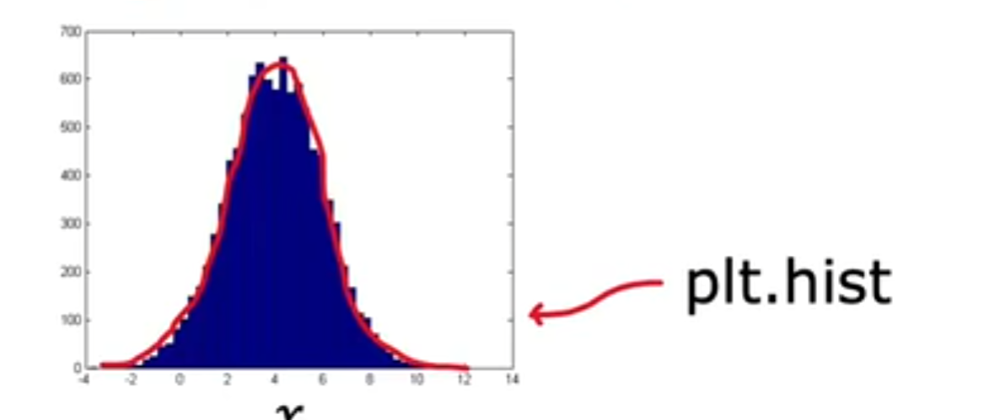


但假如说一个数据集不满足正态分布，但是我们可以通过某些转换，将其变成正态分布，这样也是可以的

如图

我们可以看到左边的图并不满足正态分布，但如果我们把x变成log(x)，我们发现数据满足正态分布了，那么log(x)就是我们可以用的数据集

（为什么用log(x)，因为左图分布看起来就像一个log(x)的函数）


##### 6.异常检测vs监督学习

当我们有大量的数据集的时候，我们推荐使用监督学习


当我们的数据集数量很少的时候，我们推荐使用异常检测


## 2.降维


# 3.神经网络

## 1.神经网络中的层

**每一层包含多个神经元，每个神经元执行一个“线性变换 + 激活函数”的操作**


**如图放大了第一层的个个神经元的计算**


**稍微复杂一点的网络，请注意右侧图中的上标和下标**


### 层的种类


#### 1.激活层

**对卷积层的输出进行一次非线性的映射，可以解决线性模型不能解决的问题**

**所以一般来说，激活层不是用线性回归，因为这样处理的神经网络，无论怎么训练，本质上其实就是一个简单的线性回归，不能训练出更智能的模型**


#### 2.卷积层

**主要用于特征的提取**


**如图我们输入一个图像，我们构建一个隐藏层，该隐藏层的神经元不会全部读取整个图像，而是每个神经元读取一部分图像，这样的好处就是，计算更迅速，也增加了泛化能力**


**卷积核**


**每个神经元如何选取合适的读取范围，这就牵扯到卷积核，卷积核一般是一个奇数相乘大小的矩阵，如3x3的卷积核用来卷积一个4x4的数据，那么每一次卷积都做了什么呢 **

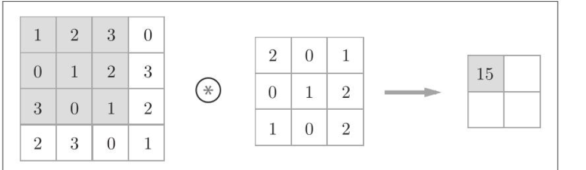


**步幅**


**但接下来要如何进行呢，我们需要步幅这个数据，也就是卷积核在输入的数据中怎么进行下一步的处理，例如这里我选取的步幅为2**


**偏执**

**接下来我们再加上对应的偏执**


**填充**


**本来到这里应该结束，但实际上在实际应用中，为了得取到边缘数据的信息，我们往往会在最外层再填充一层0数据**


**对于一个真实的图像，往往是一个三位图片，例如一个4x4x3的图片，我们用一个3x3x3的卷积核去处理的话，最终得到的其实是一个2x2的数据**

**一个RGB三通道的图像，我用一个3x3x3的卷积核做处理的话，第一个神经元做卷积的流程应该是，R通道与卷积核第一层卷积，G通道与卷积核第二层卷积，B通道与卷积核第三层卷积**


#### 3.池化层

**所谓池化（欠采样或下采样），主要用于特征降维，压缩数据和参数的数量，减小过拟合**


**池化的操作方法有很多，这里讲解一个最大值池化法**

**最大值池化法就是在定义的池化窗口中选取最大值，作为输出**


#### 4.全连接层

**首先，不管什么样的神经网络，如果最后一层是全连接层，那么全连接层必然会承担下面任务的一种**

**回归问题；分类问题**‘


**分类的数量决定了全连接层神经元的数量**


**本质上就是卷积层和池化层的输出结果，进行展开铺平后(展开铺平就是，假设说卷积层和池化层的输出结果是10x10的数据，那么我们就展开成100个数据的列向量)，与全连接层进行连接，而可训练的参数w就有列向量的数据量(100)x分类的数量(全连接层神经元的数量)，b的数量就是分类的数量**


## 2.推理(向前传播)


## 3.激活函数

### 1.为什么需要激活函数

**假设说我们不用激活函数，如下图，一个隐藏层，一个输出层，我们都用一个线性回归，这个根据右式，最终输出的a2，其实也是相当于一层线性回归罢了，这样的神经网络，不能学习到比线性回归更复杂的东西**


**我们也得到一个经验就是，不要再神经网络的隐藏层中使用线性激活函数**


### 2.常见的激活函数


**如果是一个二分类问题，那么我们通常使用Sigmoid这个函数**


**如果y可以取正可以取负，也就是说可能是一个回归问题，那么我们通常选用第一个线性激活函数**


**如果y只取正数的话，那么我们通常选取ReLU这个函数**


**神经网络中常用的激活函数就是ReLU，可以使得训练更快**


## 4.多分类问题

### 1.多个输出的分类


#### 1.softmax回归

**如下图一个四分类的softmax的激活函数的展开**


**我们可以总结出来其激活函数**


#### 2.softmax的代价函数


#### 3.softmax的改进

**使用不同的计算方法，获取精度更高的结果**


**这是两种计算方法，让我们来看看，在python中他们的精度**


**也就是最终的输出y是一个向量**


**相比起单个输出的分类的区别，我们需要在该网络的最后一层加入一层有多个神经元的输出即可**


## 5.优化算法

### 1.Adam算法

**Adam算法可以根据经验来调整学习率,并且该算法不使用单一学习率，你每有一个更新公式，就有一个全新的学习率，例如这样的就有11个学习率**


**更新的思想就是如图，如果是左图，学习过程中，我们发现我们一直沿着相同梯度在进行学习，这时候，我们就会把学习率拉高，**

**如果是右图，我们发现，梯度在不同的变化，这时候我们会把学习率拉低**


#### 算法演变过程

##### 1.自适应学习率方法

###### 1.Adagrad算法

这个算法也是用来实时变化学习率，避免因学习率问题造成的一些问题


**分母 $\sigma$ 越大（说明历史上该方向梯度一直很大）**
 → 学习率 ησit\frac{\eta}{\sigma_i^t}σit​η​ 越小
 → 该方向更新就会越来越谨慎。

**分母 $\sigma$ 越小（说明该方向梯度一直很小）**
 → 学习率相对较大
 → 该方向能被放大，避免“几乎不更新”。


这个算法会使梯度在大的地方下降的慢，梯度在小的地方下降的快


Adagrad把之前所有的梯度权重一致的作为参考，导致不同地方针对不一样就会导致下面这种情况


有一些优化方法可以解决这个问题


第一种**Learning Rate Decay**,思路就是学习率随着时间逐渐变小


第二种**Warm Up**，思路就是学习率先变大后变小


###### 2.RMSProp

这个算法是对Adagrad的优化


他与Adagrad的区别就是，Adagrad把之前所有的梯度权重一致的作为参考，导致不同地方针对不一样

而RMSProp通过$a$这个超参可以动态调整是以前的梯度重要，还是我现在的梯度更重要


##### 2.动量类方法

###### 1.Momentum算法

**主要思路就是把以前的更新方向也考虑进来，可以避免局部最优(不绝对)**


1. **背景**

- 在普通的 **梯度下降 (Gradient Descent, GD)** 中，每一步更新只依赖于当前梯度：

  $\theta_{t+1} = \theta_t - \eta \nabla_\theta L(\theta_t)$

- 问题：

  - 在“狭长谷地”里（比如某些维度陡峭，某些维度平缓），更新方向会来回震荡，收敛慢。
  - 直观上，就像小球在峡谷里“抖动着”往下滚。

------

2. **核心思想**

- Momentum 引入了“惯性”概念，把之前的更新方向也考虑进来。

- 公式：

  $v_{t+1} = \beta v_t - \eta \nabla_\theta L(\theta_t)$

  $\theta_{t+1} = \theta_t + v_{t+1}$

  其中：

  - $v_{t+1}$：速度（累计的更新方向）
  - $\beta$：动量系数（0~1，常用 0.9）
  - $\eta$：学习率

直观解释：参数更新不只看这次的梯度，还会沿着过去梯度的方向继续前进，相当于“加了惯性”。


##### 3.结合二者Adam


**最终的算法形式**


对于Momentum来说是考虑过去各个时间的g的正负号的

而RMSProp只考虑g的大小


### 2.归一化

#### 1.数据层面

##### 1.Batch Normalization


#### 2.权重层面

##### 1.Weight Normalization


**问题背景：**

在训练神经网络时，权重的**尺度（magnitude）** 和 **方向（direction）** 共同决定了前向传播的结果。但这两者对优化的影响不同：

- **方向**：决定特征如何组合（更重要）
- **长度（L2 范数）**：决定输出的缩放大小（容易引起梯度不稳定）


**💡 核心思想：**

> **把权重拆开：让“方向”**和“长度”独立学习！ 

这样优化器可以更专注地调整方向（真正影响模型能力的部分），而长度可以单独控制输出尺度。


$V_i是与 W_i 同方向的一个非零向量（即V_i=aW_i ，其中a>0 )，而 g_i=||W_i|| 。
于是，通过公式 W_i=g_i*V_i/||V_i|| ，可以精确重构出原始的 W_i 。$


这样我们要更新的参数就变成了


然后我们可以分别求到得到进行梯度下降


## 6.反向传播

**反向传播其实就是链式求导**

**反向传播，需要前向传播时，每个神经元的值保留下来，因为反向传播的时候需要用到这些数据**


### 1.pytorch默认累计梯度

**pytorch当中自动求导系统会默认累计梯度**

```python
import torch

x = torch.tensor([1.0, 2.0, 3.0], requires_grad=True)

# 第一次计算
y1 = x.sum()       # y1 = x0 + x1 + x2
y1.backward()
print("after y1.backward:", x.grad)  # [1., 1., 1.]

# 第二次计算
y2 = (x * 2).sum()  # y2 = 2x0 + 2x1 + 2x2
y2.backward()
print("after y2.backward:", x.grad)  # [3., 3., 3.] ← 累加了 [2., 2., 2.]

#例如上述计算，两次反向传播的值会进行累加，尽管对应的是不同的函数

```


这样有什么意义呢


 🌟 1. **实现小批量模拟大批量（Gradient Accumulation）**

在**显存不足**的情况下，我们可以：

> 把一个大批量（例如 128）的训练分为多个小批次（如 4 次，每次 32），
>  在每次小批次上执行 `.backward()`，但**不清除 `.grad`**，而是累计！

最后一次再 `optimizer.step()` 更新参数。

✅ 优点：显存不够也能模拟大 batch，提高训练稳定性。


### 2.with torch.no_grad()：

讲一下计算图与requires_grad=True的关系


默认情况下，对带 requires_grad=True 的张量进行任何操作，都会被记录在计算图中，例如

```python
a = torch.tensor(1.0, requires_grad=True)

b = a + 2     # b 现在依赖于 a
```

但是说，我们再进行参数更新的时候，是不能要这一层关系的

所以说，我们在进行更新操作的时候需要with torch.no_grad()：

暂时关闭梯度追踪，让我们可以安全地修改模型参数而不影响计算图。


### 3.计算图

**其实就是链式求导法则，在网络中的表示**


就像这样的一张计算图，变量之间的对应关系对会被计算在图中，这样方便你后续反向传播


## 7.梯度消失和爆炸

### 1.梯度消失的原因


## 8.超参数


### 1.Batch

每一轮的epoch都会对数据Shuffer，把数据分成不同的batch

然后在一轮epoch中，每一次训练会读取一个batch，进行update，

所以说一轮epoch过程要update $datasize/batch$次数


（上面的累计梯度可以理解成我把batch分的很小，然后我可以每读三个batch进行一次更新，这样就模拟了大batch）


#### 如何选取batch

##### 1. **Batch 大小与训练速度**

- ✅ **并行计算的影响**：在 GPU 上，运算往往是并行的。
  - 小 batch：虽然每次前向/反向传播数据量少，但 GPU 没有“吃满”，利用率低。
  - 大 batch：一次算更多样本，GPU 吞吐更高，单位时间算的样本多。
- ⚠️ 但大 batch 不一定总是更快：
  - 如果 batch 太大接近显存上限，会增加内存开销和 I/O 开销。
  - 在同样的 epoch 数下，大 batch 更新次数少，迭代次数少，可能“墙钟时间”更短，但**每次 update 的信息量更大**。


##### 2. **Batch 大小与梯度方向**

- ✅ **大 batch → 梯度更精确、更“笔直”**：
  - 因为包含的样本多，能更好近似整体 loss 的真实梯度。
- ✅ **小 batch → 梯度更 noisy**：
  - 因为样本少，梯度估计偏差大，方向带有噪声。
  - 
  - 

**Noisy 梯度的好处**

- 小 batch 的梯度虽然 noisy，但**有时能帮助模型跳出局部最优，获得更好的泛化能力**。
- 大 batch 虽然更稳定，但容易陷入 sharp minima（尖锐极小值），泛化性能可能差一些。
- 这也是为什么在实践中，**中等 batch size（比如 32~512）往往表现最好**。
- 


为什么看起来loss的曲线发生了变化

- **全局 loss（true loss）**：指用整个训练集算出来的损失，函数曲面是固定的。
- **mini-batch loss**：只用一个 batch 的数据算出来的损失。
  - 因为 batch 是随机抽的，里面的数据分布会有偏差。
  - 所以每个 batch 的 loss 曲面都只是全局 loss 的一个近似。

➡️ 换句话说：**小 batch 时，优化的并不是一个固定的 loss 函数，而是每次迭代都在优化一个带噪声的近似 loss**。


（**这里没看懂为什么小BATCH可能帮助逃脱局部最优！！！！！！！！**）


## 9.经典模型

### 1.CNN


#### 1.输入


我们可以把图像拉直成一个100x100x3的向量作为模型的输入


那假如我们使用全连接的话


假设全连接层有1000个神经元，那么就会出现100x100x3x1000个weight，参数会很多很多


#### 2.Convolutional Layer(卷积层)

##### 1.Receptive field

**现在让我们考虑一下图像辨识的特性**


在进行勘测的时候，其实每个神经元不需要读取全部的图像数据，而是只需要读取一小部分的图像数据，来勘测这一小部分是什么（鸟嘴，鸟眼，鸟爪）,通过每一小部分的勘测来确定，图像中有什么


针对这种思考

我们可以定义一个Receptive field(感受野)，让每一个神经元只在乎自己分配的感受野即可


**最经典的Receptive field是 **

**1.我们设置的kernel size(一般是3x3)会关注全部的channel，**

**2.从左上角开始，每次移动kernel ，stride(步长)的长度，作为下一个Receptive field（往往Receptive field是有重叠的 **

**3.超出范围了，我们就做padding(就是把最外层补0)**


（**每个神经元的Receptive field的大小可以不一样(毕竟不同东西可能需要的视野不同)**）

（**也可以说考虑不同的channel**）

(**或者说Receptive field也可以不是正方形的**)


##### 2.Parameter Sharing	


**让我们再思考一下下面的情景**


这两个神经元确实都可以去训练勘测鸟嘴，但是这两个神经元的功能不就重复了么，我们可不可以避免这种情况


**我们可以采用共享参数的方式**


我们用 64 个不同的 filter 对整张图像进行卷积，每个 filter 在图像的每个 receptive field 上都产生一个输出值（相当于一个神经元的激活）。这样一来，每个位置都会对应 64 个特征响应，从而形成 64 张 feature maps。

这里的每个filter其实就是一个卷积核(kernel)


#### 3.Pooling(池化)


类似于这样我们可以把一个大的图片筛选信息变小


具体在上面讲过


#### 4.Flatten

其实就是把上面的做完卷积和池化后的数据进行拉直然后放入下面的一层


#### 5.Fully Connected Layers


我们把经过Flatten的数据送进全连接层，可能再通过一个	完成了


#### 6.缺点


**CNN 对缩放（scaling）和旋转（rotation）不具备天然的不变性**。

如果输入图片被 **缩放（狗放大或缩小）** 或 **旋转（狗歪头或翻转）**，

- 原先的 filter 可能无法激活，因为卷积核学到的特征是针对某种固定尺度或角度的。
- 例如图中上下两张狗的照片：同一只狗，只是缩放不同，但 CNN 不一定能马上把它们识别为相同目标。


**这是为什么呢？**

如果仅仅是平移的话，我们往往还是可以得到的，因为换个位置问题不大，因为卷积是权重共享的。（**平移不变性**）

但如果是缩放或者是旋转的话，

举例：filter1 学到的是「一个 3×3 的斜边缘」。

- 如果耳朵在输入图片里大概就是这种 3×3 模式，它能识别。
- **但是**如果耳朵被放大成覆盖 9×9 的区域，这个 filter 就“看不全”了，
  - 在 3×3 的小窗口里只能看到模糊的曲线片段，无法和原来的模式对上。

同理，如果耳朵旋转了 30°，原来的「斜边缘」就变成「竖直边缘」或别的角度了，filter 参数也对不上。


所以我们往往需要做**数据增强（Data Augmentation）**：在训练时人为增加旋转、缩放、裁剪等变换后的样本，让模型学到“这还是同一个类”。


### 2.自注意力机制


#### 1.Self-attention


其实就是指每一个输入向量都考虑与全部向量后的一层输出,每个向量都会与其他向量有一层关系，叫关联性


如何判断是否相关呢？

如图是两种计算相关性的算法

左边是较为常用的算法，也是用在transfomer里面的


如这里要计算a1的输出结果

那么我们就用Dot-product的方法对每个向量计算与a1的相关性，（这里要注意，a1也要与自己计算相关性）

然后把计算得到的值经过一层Soft-max(这一层不一定非要是他，也可以是其他的)


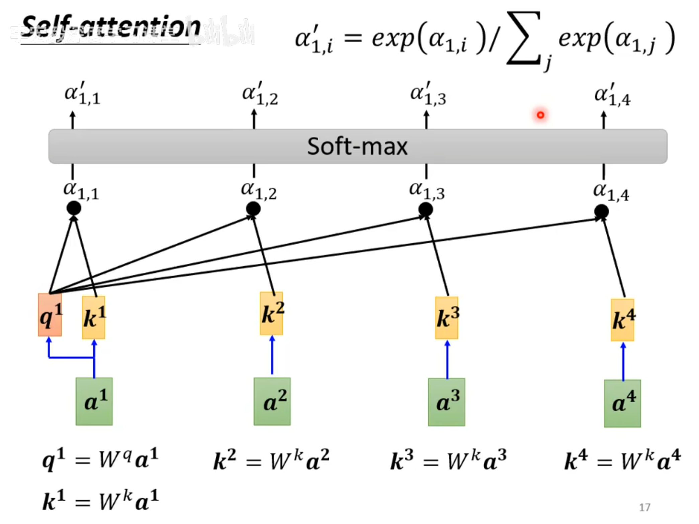


然后我们还会让每一个向量乘一个矩阵与Softmax得到的结果相乘后相加，计算得到b1

（这里其实就可以想到，相关性越强的它的影响就越大）


**这里需要学习的参数其实就是$W^k,W^v,W^q$**

- $W^q$ ：**查询权重矩阵**（Query weight matrix）
- $W^k$ ：**键权重矩阵**（Key weight matrix）
- $W^v$ ：**值权重矩阵**（Value weight matrix）


#### 2.Multi-head Self-attention

**多头注意力机制**


这里我的理解就是，我们用q去找相关的k,但是相关性从不同方面来解释也是不同的，所以我们可能需要多个q和k


我们这里用一个2头举个例


我们这里在得到$q^i$之后，再让其乘两个不同的矩阵得到两个新的q,(k和v也是同理)


然后1的q就与1的k和v进行计算


2的也同理


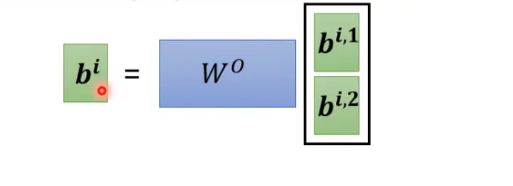

最后我们把得到的再乘一个矩阵得到一个$b^i$


#### 3.Positional Encoding

也就是位置编码


上面的自注意力机制，忽略了向量与向量之间的位置关系。

所以这里我们引入了位置编码


其实就是给每一个位置添加一个独一无二的位置向量，与数据进行相加


#### 4.Truncated Self-attention

截断的自注意力机制


**当我们的向量很多的时候，我们可以考虑只计算当前向量附近的关联性**


#### 5.Masked Self-attention

其实就是为了防止未来数据对当前数据造成影响


如图b1的输出只考虑a1。b2的输出只考虑a1,a2。b3的输出只考虑a1,a2,a3。依次往后推


#### .2可以解决的情况

**每一个向量对应着一个label**

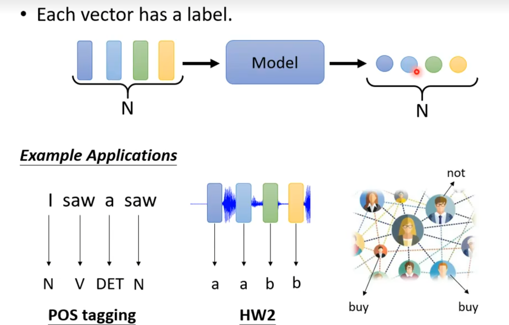


**一堆向量决定一个输出**


**不知道有多少个输出，由机器自己决定**


### 3.Generation

生成式神经网络


其实就是在输入时，除了对应的x，我们在输入一个随机分布的z


**这样的好处是，可以使模型具有“创造性”，当我们的x可能对应着多种输出时，这时可以有z来决定要输出哪一种（我们就可以用在视频生成(根据一张图片决定下一张图片是什么)）**


**请注意如果我们考虑采用同时输入x和y的话，往往在训练过程，会把x也输入给判别器做一下加强x的信息**


#### 1.GAN

**生成式对抗网络**


大致流程


其实从数学的角度来理解，我们的目标就是将$概率分布P_g逼近真实的概率分布P_data$


我们可以推导出生成器和判别器的优化目标


我们经过化简可以得到最终的目标函数


**我们要证明模型能够收敛，以及其最优值是什么**


这里我们通过对目标函数进行优化得到判别器要想使得目标函数最大，的最终取值


然后我们在已知D(x)的情况下，去求解生成器的最优解


这里第三步化简到第四步嘚正确写法应该是(注意后面的P不在log里面)

$\min_G \left[
\int_x \log\!\left(\frac{P_{\text{data}}(x)}{\frac{P_g(x)+P_{\text{data}}(x)}{2}}\right) P_{\text{data}}(x)\,dx+\int_x \log\!\left(\frac{P_g(x)}{\frac{P_g(x)+P_{\text{data}}(x)}{2}}\right) P_g(x)\,dx+\int_x \log(\frac{1}{2})\,P_{\text{data}}(x)\,dx+\int_x \log(\frac{1}{2})\,P_g(x)\,dx
\right]$

  


最终得到的结果就是**GAN（生成对抗网络）训练的最终平衡点**，也就是生成器 G 经过充分优化后达到的理想状态


请注意这里的化简用到了KL散度


**该模型存在的问题**


1.模式崩溃的原因是：
 在对抗训练中，生成器的目标是最大限度地欺骗判别器。
 当生成器发现某一类特定样本（或特定模式）能够成功骗过判别器时，它会不断强化这种模式的输出，因为从损失函数的角度来看，这样做能立即降低生成器的损失。
 由于判别器对其他潜在模式提供的梯度信号较弱或不稳定，生成器就会逐渐忽略数据分布中的其他模式，最终只生成有限的几种样本——这就是**模式崩溃（Mode Collapse）**。

 

2.GAN 难以训练高清图像的根本原因是：
 它在高维空间中要同时学习真实与生成分布的细粒度结构，而 min–max 对抗导致梯度极度不稳定，
 判别器太强、生成器太弱、计算资源不足、分布重叠太少，都会使训练发散或塌陷。


3.使用JSD来判断两个分布的相似程度不合适


因为这个函数来判断分布的话，会出现


这种情况，不能很好的判断，两个数据分布的相似程度


##### 2.WGAN


相较于GAN的优化方面


###### 1.使用EMD代替JSD


EMD也就是推土机距离

它是用来衡量 **两个概率分布之间差异** 的一种度量方式。
 直观上，它表示：

> “如果我们把一个分布看作一堆土（mass），另一个分布看作目标形状，
>  那么最少需要多少工作量（work）才能把第一堆土铲成第二堆的样子。”


**在 WGAN 中，Wasserstein 距离（WD）的值就是使得 Earth Mover’s Distance（EMD）最小的那个最优传输代价。**
 换句话说，**WD = 最小的 EMD（最优推土方案的代价）**


根据上述理论，我们会修改我们的目标函数


那么什么是1-Lipschitz条件呢


就是说函数的梯度不能大于一，也就是夹在绿色区域的部分，左图的函数就是满足该条件的函数，右图的就是不满足该条件的函数


那么我们要如何约束函数的梯度满足这个条件呢


**我们这里采用的是SNGAN**


##### 3.ScrachGAN

可以训练出来自然语言


##### 4.PCGAN


相较于传统GAN的优化

###### **1.渐进式训练**

先训练低分辨率图像，再从低分辨率逐渐提高到高分辨率


训练过程由简单到复杂

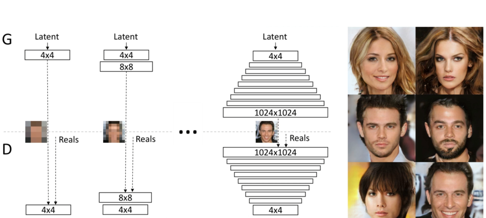


这里生成器中又低分辨率到高分辨率的过程我们叫上采样

而判别器的高分辨率到低分辨率，我们又叫下采样


上采样过程还有一个叫平滑过度的优化


这样做的原因是，刚开始训练的时候，由于卷积层的参数是刚刚初始化的，所以此时我们更加愿意相信图像A，所以此时的a为0，在训练过程中，卷积层学到越来越多的参数，我们也愿意相信图像B，会逐渐提高a的值


一种上采样的方法，最近邻采样


论文中的原图


 图中只有中间的 (b) 使用平滑过渡，是因为它代表了“分辨率扩展过程”的**中间阶段**。
 在开始阶段 (a) 和结束阶段 (c)，网络结构已经固定，不需要插值平滑，因此不再使用

引入平滑过渡的目的是为了在又低分辨率到高分辨率转化过程中突然接收到截然不同的特征空间而造成的训练震荡（梯度突变）


###### 2.均衡学习率

可以有效平衡所有权重的学习速率（避免某些参数训练一两下就到了，而有些可能要训练很多轮）


在普通神经网络中，我们初始化权重$ w∼N(0,1)$，然后在前向传播中，信号经过多个层叠加放大或缩小。

当网络结构很深时，**每一层输出的方差**（即激活值的动态范围）可能差别极大，这会导致：

- 某些层梯度过大 → 学习不稳定；
- 某些层梯度过小 → 几乎不更新。

这种不均衡在 **GAN 训练中更严重**，因为判别器和生成器在博弈过程中需要非常敏感的梯度平衡，一旦某一方更新过快，整个训练都会崩溃。


 n 是每个神经元输入的数量(该神经元接收的输入连接数，也就是它前一层有多少个输入值参与计算)


###### 3.像素特征向量归一化

防止生成网络和监督网络竞争中某一方崩溃

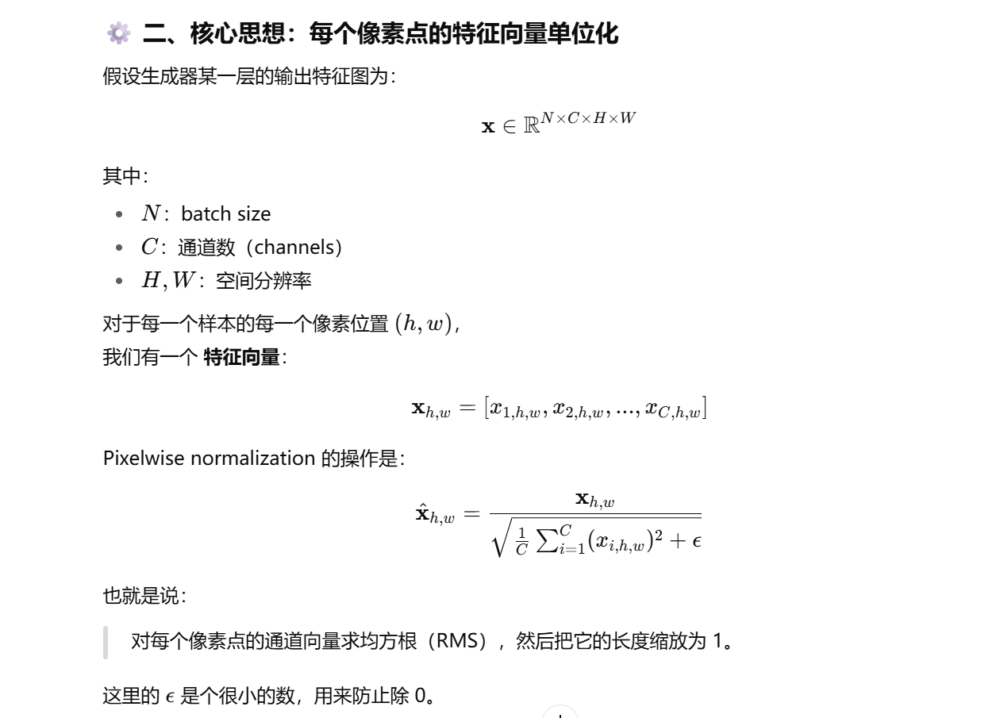

具体计算例子如下图所示


###### 4.小批量标准差

 在 **判别器（Discriminator）** 里非常关键的一个稳定训练技巧


它的核心目标是：

> 让判别器学会检测「生成样本缺乏多样性（mode collapse）」的问题，
>  并通过引入一个额外的统计特征（批量内标准差）来增强对样本多样性的敏感性。


在判别器最后几层加入一个额外通道，
 这个通道的值是 **整个 batch 的像素标准差**，
 从而让判别器显式地“感知”这一批图片的多样性。

（因为如果一个batch中的图像不一样，那么说明图像的多样性很大，则其标准差就一定很大，则证明生成器可能生成了不同的图像）


##### 5.Cycle GAN

这里我们假设做的是图片风格转换的任务。我们很难给图片标签，所以我们会让其进行自主学习(无监督学习)


这里我们会创建两个生成器，第一个生成器可以把图像从X转化成Y，第二个生成器可以把图像从Y转化为X

**这样做的好处是，这样第一个生成器就不可以随便生成与输入无关的图像了，不然下一个生成器难以返回**

判别器就会根据另一种划分的图像和第一个生成器生成的图像进行学习


但是我们当前的网络只能从一种画风转成另一种，反过来就不行了

所以我们进行进一步设计，如下图，就能实现两种画风相互转换


而图中的网络机构也就是Cycle Gan


#### 2.VAE


#### 3.Evaluation of Generation


##### 1.Problem

###### 1.Mode Collapse


这个其实就是前面说的模式崩塌，但这个针对的是模型的分布无限靠拢某一个数据


###### 2.Mode Dropping


这个说的主要是模型产生的数据分布只能是真实数据的一部分


##### 2.Solution

###### 1.quality


首先判断生成器生成的质量如何

假设是生成一个图片的话，我们可以把生成网络产生的一张图片放进一个图片辨识系统中，如果最终输出类别得分很高，那么我们可以认为，这个模型生成的质量很好


###### 2.diversity

然后可以判断生成器生成的多样性如何


我们把一堆图片送进模型，如果最终输出的分类很平均的话，说明多样性也是可以的


但其实上述判断依据也无法解决，如果生成器只生成原始数据的情况


# 4.决策树模型(ID3模型)

如图我们要判断是否是猫，我们根据耳朵的形状，脸部的形状，胡须的长短，作为离散数据来判断，构建下面的决策树，可以判断是否是猫


而这个模型的关键所在就在于

**如何选择在每个节点上使用哪个特征进行划分**

**如何决定何时停止划分(也就是何时到最下面的叶子节点)**


## 1.量化纯度

**纯度的意思就是当到达叶子节点时，此时正确数据的概率占所有到达这里的数据的比例**


我们采用熵来量化纯度


我们采用下面的函数来判断纯度是否好(p1这里就是正确数据的概率占所有到达这里的数据的比例)


如该例子，我们发现，p1越大或这越小，H(p1)就越小，也就代表着正确的纯度或不正确的纯度越高，越好

反而越接近中间值，H(P1)越大，也就代表着正确的纯度或不正确的纯度越小，越不好


## 2.计算信息增益

**学习过程中，熵的减少，我们成为信息增益**


以最左图举例

**先计算出分类前的熵H(p1) = 1**

**再分别计算出两个分支的熵H(0.8)= 0.72,H(0.2) = 0.72**

**再计算出两分枝加权平均的熵，((5/10)x0.72)+((5/10)x0.72), 这里加权的逻辑是（进入该分支的数量/总共要分类的数量）**

**最后再用分类前的熵-加权平均的得到的熵，得到的就是熵的减少，也就是信息增益**


总结一下上述公式


**为什么看熵的减少，而不是直接看熵呢？ 我的理解就是，可以看出本次分类的增益到底有多少，也可以在增益很小的时候停止分类，以防止过拟合**


## 3.学习流程

### 1. 选择根节点

我们首先从所有特征中选择一个最优的特征作为根节点进行划分，评估指标可以是**信息增益**、信息增益率或基尼指数（视算法而定）。该特征应该能够在当前数据中最好地进行分类。

### 2. 递归构建子节点

对于根节点划分后生成的每个子集：

- 判断是否满足终止条件（如：该子集中的样本属于同一类别、特征已用尽，或信息增益低于设定阈值）。
- 如果不满足终止条件，从剩余特征中再次选择最优特征进行划分，构建新的子节点。
- 对新的子节点继续进行相同的递归操作，直到整棵树构建完成。

### 3. 生成叶节点

当某个节点满足终止条件时，停止划分，并将该节点标记为叶节点，叶节点对应的是最终的分类结果。


## 4.独热编码

**将文本数据或表示类别的数据通过编码变成能够计算的数值型的一种方式**

**可以用在线性回归，逻辑回归，以及决策树一个特征多值的情况**


### 📌 场景举例：房价预测

我们要通过线性回归来预测房价，房价受到以下因素的影响：

| 面积（平方米） | 区域（类别） | 价格（元） |
| -------------- | ------------ | ---------- |
| 80             | A区          | 100万      |
| 100            | B区          | 120万      |
| 90             | C区          | 115万      |
| 70             | A区          | 95万       |


------

### 🧠 问题：如何使用线性回归？

线性回归要求输入变量（特征）必须是**数值型**。但上表中“区域”是**分类变量**（A区、B区、C区），不能直接用于计算。

------

### ✅ 解决方案：对“区域”使用**独热编码**

将“区域”列转化为如下形式：

| 面积 | A区  | B区  | C区  | 价格 |
| ---- | ---- | ---- | ---- | ---- |
| 80   | 1    | 0    | 0    | 100  |
| 100  | 0    | 1    | 0    | 120  |
| 90   | 0    | 0    | 1    | 115  |
| 70   | 1    | 0    | 0    | 95   |


------

### 🧮 构建线性回归模型

我们设模型为：

```
Price = w1 * Area + w2 * A区 + w3 * B区 + w4 * C区 + b
```

其中，A区、B区、C区中只会有一个为1，其余为0。	


## 5.处理数值类型的特征

比如说，我们分类猫的时候，引入了体重的特征

我们可以现根据数据做图


横轴就是体重，纵轴就是两个值，是猫或不是猫

然后我们可以根据不同体重，进行划分，然后算出信息增益，找到信息增益最高的节点，依次作为阈值来划分数据

 

如图可以看出，我们选择第二个作为阈值来进行筛选


## 6.树集成

### 1.基本概念

**在训练决策树的时候，往往改变一个或几个训练样本就会导致算法在根节点进行不同的分割，也就会的到两种完全不同的子树，这样的单个树并不稳健**


**这也就意味着我们可以训练多个树，然后集成在一起，也就是树集成**

**我们可以训练出来多个树，然后使用的时候，就把数据都给他们进行预测，然后然他们去投票，得到最终结果**


**例如这样，就是两个树输出是猫，一个输出不是猫，那他就很有可能是猫**


### 2.放回采样

**我们采用放回采样的方法构建新的数据集，用于构建树集成**


**如图左边箱子里是所有的数据集，然后我们有放回的进行随机抽取，抽取出来右边10个数据集，也就是构建了一个新的数据集**


### 3.随机森林算法


**我们有m个数据集，放回采样B次，构建B个树**


**这样我们将会得到B个树，这B个树都会参与最终的投票**

**注意并不是B越大越好，B太大对准确率往往不会有大的提升，还会增加计算，降低性能**


**再次基础上进行一点算法上的修改**

**我们在选择特征进行节点分裂的时候，我们并不在所有的特征n中选择，我们会设定一个值k,在选择的时候，随机选择k个特征进行分裂（如果n很大的话，k=根号下(n)）。进行这样的处理后，这样的算法就是随机森林算法**


这样的好处就是：

**✅ 一、减少过拟合，提高泛化能力**

- 如果每棵树都使用相同的全部特征集训练，它们的结构容易相似，集成后效果有限。
- 随机选取特征子集可以**让每棵树结构不同**，增加模型的“多样性”。
- 多样性 + 投票平均机制 => **降低整体模型的方差**，防止对训练集记忆化（即过拟合）。

------

**✅ 二、提高训练效率**

- 对于高维数据（例如文本、基因数据），特征维度 nnn 很大，计算每个特征的划分标准代价高。
- 只选取 kkk 个特征（如 k=nk = \sqrt{n}k=n）可以**显著降低每次分裂节点的计算量**，加快训练速度。

------

 **✅ 三、对噪声和无关特征鲁棒性强**

- 并不是每棵树都能看到所有特征，如果某些特征是“噪声”，它们可能不会对所有树产生影响。
- 多棵树投票平均结果，可以**降低对单个不良特征的敏感性**。

------

**✅ 四、提升并行性**

- 每棵决策树之间是**相互独立**的，甚至在每棵树内部的节点分裂中，特征也是随机选取的。
- 易于并行计算，**适合大规模数据与分布式计算环境**。****


### 4.XGBoost算法(极致梯度提升)

**在 XGBoost 中，每个样本在每轮训练中的重要性由其损失函数的一阶导数（梯度）和二阶导数（Hessian）决定。模型会根据当前的预测结果与真实标签之间的残差（即预测误差）计算梯度和 Hessian，然后训练新的树来拟合这些残差，从而不断优化整体预测结果。**

**这种做法相当于让模型在每一轮“专注于那些当前预测效果较差的样本”，但并不是通过调整样本权重或重抽样来实现的，而是通过梯度提升框架来迭代优化的。**


**在我们进行了第一次训练后，我们可以查看这10个训练数据的预测情况，然后我们会增大预测错误数据的权重，让他在下次抽取的时候更有可能被抽取出来，也就是一种刻意性的训练**


## 7.什么时候用


# 5.推荐系统

## 1.协同过滤

### 1.线性回归预测

在此之前我们先介绍一些符号


1. **`r(i, j)`**

- 定义：若**用户 j** 评价过**电影 i**，则为 1；否则为 0。
- 含义：这是一个指示函数，表示是否存在评分数据。
- 类型：二值（0 或 1）


**2. `y(i, j)`**

- 定义：**用户 j** 对 **电影 i** 的评分（如果已评价）。
- 含义：这是评分数据，通常是实际的标签值（比如 1~5 星）。
- 类型：实数（如 3.5、4）


 **3. `w^(j), b^(j)`**

- `w^(j)`：**用户 j** 的权重向量（或称偏好向量）
- `b^(j)`：**用户 j** 的偏置项（可理解为对评分的整体偏好）
- 含义：是模型为每个用户学到的一组参数，表示其对电影特征的偏好。
- 类型：`w^(j)` 是向量，`b^(j)` 是标量。


 **4. `x^(i)`**

- 定义：**电影 i** 的特征向量（例如类型、演员等潜在表示）
- 含义：用于表示每部电影的“属性”或“风格”，(例如x1可以是这个片子爱情元素占比，x2可以是这个片子动作元素占比)
- 类型：向量（和 `w^(j)` 维度相同）


 **预测评分公式：**

​	


含义：
 预测用户 `j` 对电影 `i` 的评分等于：

- **用户偏好向量 `w^(j)` 与电影特征向量 `x^(i)` 的内积**（表示匹配度）；
- 加上用户对评分的整体偏置 `b^(j)`（如某用户总是比别人更严格或更宽容）。


5. `m^(j)`

- 定义：**用户 j** 评价过的电影数量
- 含义：用于归一化、正则化或计算平均误差时可能会使用


**然后我们将使用线性回归的方法进行学习**


**成本函数**


当然这只是针对一个用户进行构建的模型，如何构建一个针对所有用户构建的模型呢


### 2.协同过滤算法

**上述情况都是我们有这些特征的具体数值，假如说我们只知道有这些特征，但是具体数值并不知道怎么处理**

例如我们知道x1是这个片子爱情元素占比，x2是这个片子动作元素占比，但是具体占比多少我们并不清楚，这种情况我们要如何处理


 

**假设我们已经有了w,b依次基础来推x，我们将使用同样的式子，只不过把正则项改变，以及把x当成自变量**


**那么这个w,b我们如何知晓呢**


第一个式子是用来求用户参数w,b的损失函数

第二个式子是用来求特征值x,的损失函数

第三个式子就是整合前两个部分，可以通过这个式子通过某些方法，得到对应的w,b,x


对于第三个式子，我们可以通过梯度下降来更新参数


### 3.二分类推荐系统

**当用户并没有进行评分，而是一个二元标签来表示喜欢或不喜欢时，如何更新我们的算法**

（该过程类似从线性回归到逻辑回归）


对于模型我们将修改为，和逻辑回归的一模一样


对于损失函数我们将修改为，也和损失函数的一摸一样


### 4.对于没有打分的处理


例如该图，有很多没有打分的情况，我们该如何在引入这个人的数据的情况下，又使得这个没有打分的情况对模型不产生较大影响

（试想一下，假如说我们用这个数据做训练炼出的模型(不做任何处理),那最终对于角色5的预测结果会是多少呢？肯定是0，因为他的w,和b默认只能为0）


**但假如我们这样处理，我们对每一个电影的评分求均值，然后将数据把这个均值减掉后来做训练。把最终预测的结果再加上这个均值。这样的话，对一般的数据不会有太大影响，但是对5号这种没有评分的数据，进行预测的时候，最终会预测为该电影评分的均值。相当于对5号的初步预测**


## 2.基于内容的推荐

**这个是把用户的属性作为数据，电影的属性也作为数据，最后训练的结果是判断电影和用户是否匹配**

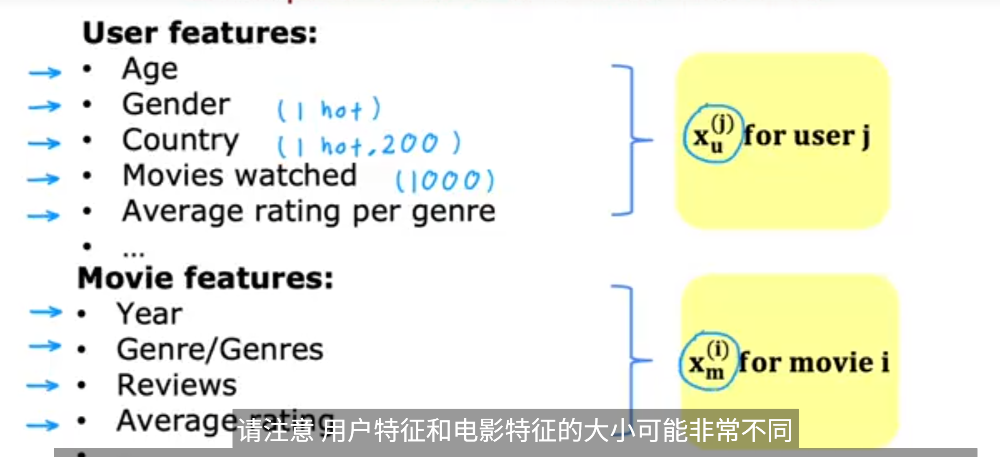


这里的特征数量可能不同但是下图中的$V_u和V_m$的格式必须相同，因为他们后面要做点积

这里的$V_u$就是由$X_u$（用户属性）推出来的比如说4.9是用户对爱情电影的喜欢程度……

这里的$V_m$是由$X_m$(电影属性)推出来的，比如说4.5就是电影的爱情因素的占比…..


如何的得到这样的$V_m和V_u$呢，我们采用神经网络的方法，要注意最后一层输出层的维度要一样

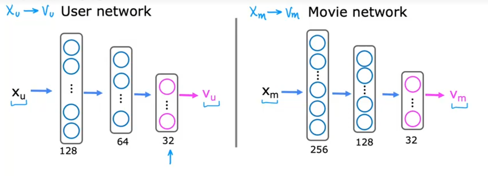


随后我们推出来


## 3.二者的区别


### 1.协同过滤的特点

**协同过滤的推荐理由不是物品的内容相似，而是“别人也喜欢它”。**


**✅ 如何体现“别人喜欢的我也可能喜欢”？**

模型在训练中尝试 **最小化预测评分与真实评分的差距**，而这个过程背后暗含以下逻辑：

1. **系统给所有用户打过分的物品做拟合**
   - 如果电影 A 被很多用户喜欢，那么它的特征向量$x^A$会“被优化成”一个能让很多用户的 $w^j*x^A+b^j$ 都高的方向。
2. **所以：**
   - **如果你（用户 j）和另一个用户兴趣向量相似（$w^j约等于w^k$），**
   - 那么你很可能也会对他喜欢的电影打高分（因为你们对同一个 $x^i$ 都会打高分）。

> 这就是“别人喜欢的你也可能喜欢”的协同效果。


### 2.基于内容过滤的特点

| 类型               | 核心思想                               |
| ------------------ | -------------------------------------- |
| **基于内容的过滤** | 推荐和用户历史喜欢的物品**相似的内容** |


# 6.强化学习

## 1.大致思路

只在乎结果，而不重视过程的训练方法。

我们会给出奖励机制和惩罚机制促使机器人学会某项本领


在这里我们强调，状态，动作，奖励，下一个状态，用式子表示出来就是

**（s,a,R(s),$s^,$）**

如下图这个例子，机器人在状态4，状态1和状态6分别对应着奖励100和40，而其他状态则对应着奖励0

机器人可以向左走通过三个状态到达状态1获得100的奖励

或者向右走两个状态到达状态6获得40奖励


但是如何知晓某一组奖励比另一组奖更好或更差


**我们通过引入折现因子，来处理。折现因子可以使机器人越早得到奖励，总回报就越高**

假设机器人选择向左走，折现因子为0.9，那么最终的得到的奖励就是72.9


**对于强化学习，我们的目标是找到一个$\pi(a)$函数,可以将状态s映射到动作a上**

例如如图，根据上面的奖励我们最终得到的$\pi(a)$函数其实就是右面蓝色的

·


**一些关键概念**


## 2.状态动作值函数


Q函数$ Q(s, a)$ 表示在状态 s 下采取动作 a，并在之后按策略 π 行动时，所能获得的期望总回报。


例如这个，上面的就是得到的$\pi(s)$函数,而下面的就是$Q(s,a)$函数

我们发现，任何状态s获得的最佳回报，就是当前Q的最大值

**Q 函数的作用是评估在每个状态 s 下，采取每个可能动作 a 所能获得的期望回报。我们可以通过比较 $Q(s,a)$ 的大小来选择最优动作，从而导出最优策略。**


**我觉得这里还有一个条件，就是当当前状态$s$有奖励的话，那么$Q(s,a)=R(s)$**


## 3.Bellaman方程

帮助我们计算Q函数


## 4.实现强化算法


### 1.确定状态和奖励函数


这里我们将月球登陆器的离散化数据定义为状态


并制定一系列的奖励和惩罚机制


### 2.学习状态值函数

**关键思想是训练一个神经网络来计算或近似状态动作值函数**


我们将状态和动作打包成一个向量，作为神将网络的输入值，并最终希望网络根据输入值可以输出对应的Q


但是我们如何制作训练的数据集呢?

**我们将使用Bellaman方程**

通过该方程计算出来对应的x->y


但是其实我们并不知道$maxQ(s^,,a^,)$,但实际上，当你不知道Q函数的时候，你可以对Q函数完全随机猜测开始


### 3.整体流程


1.**用随机数初始化$Q(s,a)$**


2.**让机器人随机采取行动去得到$(s,a,R(s),s^,)$,我们将储存最近的10000个这样的数据，这样的技术也叫重放缓冲区**


3.**使用上述的得到的数据，$x = (s,a)  y = (R(s)+\gamma maxQ(s^,,a^,))$去训练网络得到稍微好一点的$Q(s,a)$**


4.**然后重复循环2，3**


### 4.优化神经网络


对于原本的神经网络，对于每一个状态S和a，我们都要进行一次推理，对于四种动作，我们的网络计算其实就是要进行四次推理的，这样的计算是很冗余的，所以我们可以修改成下面的网络


我们把输入值改成只有状态，但是把输出变成四个神经元，分别对应着不同的动作，这样就会相对高效


### 5.采取合适的行动

我们如何决定机器人在训练时，如何进行行动呢

**我们采取的算法是贪婪策略**


我们会有0.95的可能性，去向最大化Q(s,a)的方向去采取行动，也有0，05的可能性，去随机化运动

为什么要这样做？

假设说，我们刚开始训练的时候，随机初始化的Q(s,a)认为启动引擎是一个很不好的策略，那么我们假设一直向最大化Q(s,a)的方向去移动的话，就有可能，永远不能启动引擎，导致永远不会着陆了


### 6.小批量的使用数据

假设我们有每次运动完保留最新的10000个数据，但是我们并不会一次使用全部数据去更新我们的网络，而是可能每次仅使用1000个数据去更新，然后多次去进行更新

这样可以使训练过程变得更快

这样的思想同样适用于监督学习

但这样可能会引入更多的噪声，但是速度相较于大量数据一次训练会来得更快


### 7.软更新


其实就是在原来的基础上进行更新


# 7.NLP

**其实就是自然语言处理的意思**


无外乎这六种模型


## 1.语音

### 1.输入与输出

#### 1.输出

语音辨识系统中，输出的是一串文本


那么我们要先知道

**Token就是模型输出的最小符号单位**

这里介绍几种最常见的Token


**Phoneme（音素）**

- 定义：语音中最小的发音单位。
- **在语音识别模型里，音素相当于“中间层”，连接声音波形（声学特征）和文字。**


  **Lexicon（词典/发音词典）**

- 定义：一个 **单词到音素序列的映射表**
- 把音素序列转换成可能的单词

（但这里的Lexicon很难得到，可能需要语言学相关学家来得到这个词典）


**Grapheme(英文字母，方格字)**

​		英文的话就是26个英文字母加上一个空格

​		中文的话就是一个一个的方格字，但是不用空格

​		这个的好处就是不需要Lexicon了


**Word(词语)**

​		英文就是想这样的一个一个的词语

​		中文的话就很难界定


**Morpheme（语素）** 是 **最小的有意义单位**。

它比 **word（单词）** 更小，但比 **grapheme（字形/字母）** 更大。

一个 morpheme 不能再拆分出更小的、仍然有意义的单位。


###### 7.输入

我们往往会把声音讯号转换成长度为T的d个向量


如何转换呢


我们一般会取一段时间(window)的声音讯号,通过某些描述方式(MFCC等等)，转换成对应的向量(frame)


然后将window向后平移一段时间(一般小于window),继续制造frame


**常见几种声音讯号处理方法**


声音讯号(**Waveform**)(可以用来做frame)通过DFT转换成**spectrogram**(可以用来做frame)

**spectrogram**通过一些方式可以转换成**filter bank**(可以用来做frame)

**filter bank**转化成向量后取log在通过DCT可以转化成**MFCC**(可以用来做frame)

##### 2.相关模型

###### 1.LAS


## 2.文字

### 1.词向量

既然要用机器来学习，那么我们首先要考虑的就是，词汇如何作为输入，进入我们的系统。因此引入了词向量。


**one-hot**

既然要编码，那么我们就很容易想到独热编码，我们可以先构建一个**词库**，根据该词库，对每一个词进行独热编码


但这样就会有不可避免的缺点：

1.维度灾难（词库太大就会导致）

2.无法度量词语之间的相似性


**因此我们将引入词向量这一概念**


就是用一段实数向量来表示一个词，例如这样第一列向量就表示在


**那么我们要如何得到这样的词向量呢**

**基于word2vec**


**word2vec基于文本中离得越近的词语，相似度越高的基本假设**。**用CBOW,skip-gram**来计算**词向量矩阵**


**CBOW：用上下文词来预测中心词**

**skip-gram:用中心词来预测上下文词**


这就意味着我们要定义 **窗口大小**来定义上下文词的范围

例如我们定义窗口大小为2，那么中心词前面两个就是上文，后面两个就是下文


（在后续优化时，我们不仅要考虑上下文词，还要考虑非上下文词(利于优化)，也就是上面的绿色部分，但当词量太大的时候，容易造成计算爆炸，所以我们对非上下文词采用随机采样，也就是负采样(也是一组超参数）)


**如何界定词向量是否是好的**


**word2vec的缺点**


#### 1.CBOW


**CBOW的embedding层**

​			


也就是把输入的词向量平均的结果


**CBOW的线性层**

​	没什么说的


**总结**


训练过程会对输入的上下文词的词向量，和线性层进行调整，最终输入的词向量被训练成查词向量用 → 常作为最终 embedding


softmax函数其实就是根据线性层输出的结果和词向量矩阵每一个词进行比对，最终输出最终的预测结果


#### 2.skip-gram


如何用一个词来推断上下文呢


这里判断距离远近的方法使用向量的点积


#### 3.优化方法

请仔细思考上面两个模型，由于最后一步用到了softmax，当训练的词典很大的时候，将会进行成千上万次的计算


#####  **1.负采样**

我们可以采用这个优化方法进行，我们这里以skip-gram为例进行说明


我们首先要选定，背景窗口大小m , 还有负采样的数量k


**训练代码**

```python
import jieba
import re
import numpy as np
from sklearn.decomposition import PCA
import gensim
from gensim.models import Word2Vec
import matplotlib.pyplot as plt
import matplotlib

'''结巴分词内部主要基于 前缀词典+词频+DAG+动态规划 实现最优分词路径，也支持用户自定义词典进行扩展，支持以下三种分词模式：

精确模式（jieba.lcut）：
jieba.lcut(line)
把句子最精确地切开，适合用于文本分析。
✅ 这是你目前在用的。

全模式（jieba.lcut(line, cut_all=True)）：
找出所有可能的词语，冗余度高，适合搜索引擎构建索引。

搜索引擎模式（jieba.lcut_for_search）：
在精确模式基础上，对长词再次切分，适合搜索引擎构建倒排索引。'''
#读文件--------------------------------------------------------------------------------
f = open(r"《三国演义》【爱上阅读_www.isyd.net】.txt",'r',encoding='utf-8')

lines = []
for line in f:
    temp = jieba.lcut(line)#结巴分词 精确模式
    words = []
    for i in temp:
        #过滤掉所有的标点符号
        i = re.sub("[\s+\.\!\/_,$%^*(+\"\')]+|[+——！，。？、~@#￥%……&*（）：“”‘’]+", "", i)
        if len(i) >0:
            words.append(i)
    if len(words)>0:
        lines.append(words)
print(lines[0:5])

#训练模型----------------------------------------------------------------------------------


#vector_size指每个词将被长度为20的向量表示
#window，窗口大小，
#min_count最小词频，小于这个值的不用训练，用于过滤低频词，防止过拟合
#negative负采样数量
model = Word2Vec(lines,vector_size=20,window=2,min_count=3,epochs=7,negative=10)
print("孔明的词向量:\n",model.wv.get_vector('孔明'))
print("\n和孔明相关性最高的前20个词语")
model.wv.most_similar('孔明', topn= 20)


#模型评估：可视化----------------------------------------------------
#PCA降维·······································································

# 将词向量投影到二维空间，便于可视化
rawWordVec = []       # 用于存储所有词的词向量
word2ind = {}         # 用于记录词与其在 rawWordVec 中对应的索引位置（{词语: 序号}）

# 遍历词向量模型中的所有词（按词频从高到低排序）
for i, w in enumerate(model.wv.index_to_key):
    rawWordVec.append(model.wv[w])  # 获取词语 w 的词向量，添加到列表中
    word2ind[w] = i                  # 构建 {词语: 序号} 映射字典

# 将词向量列表转为 NumPy 数组（n_words × vector_size 的二维矩阵）
rawWordVec = np.array(rawWordVec)

# 使用 PCA 将高维词向量降维到二维空间，便于后续可视化
X_reduced = PCA(n_components=2).fit_transform(rawWordVec)


#绘制图像-------------------------------------------------------------------

# ⭐️ 绘制“星空图”：词向量二维投影 + 高亮部分关键词
fig = plt.figure(figsize=(15, 10))     # 创建画布，尺寸为 15x10 英寸
ax = fig.gca()                         # 获取坐标轴对象
ax.set_facecolor('white')             # 设置图背景为白色

# 绘制所有词向量的二维坐标点（经过PCA降维），点很小、颜色淡
ax.plot(X_reduced[:, 0],              # 所有词向量的第1维,x
        X_reduced[:, 1],              # 所有词向量的第2维,y
        '.',                          # 点的样式为小圆点
        markersize=1,                 # 点的大小
        alpha=0.3,                    # 透明度，较淡
        color='black')               # 点的颜色为黑色（淡淡的）

# 高亮几个感兴趣的历史人物
words = ['孙权', '刘备', '曹操', '周瑜', '诸葛亮', '司马懿']

# 设置中文字体，防止显示文字时出现乱码（需使用你本地的中文字体路径）
zhfontl = matplotlib.font_manager.FontProperties(fname='STFANGSO.TTF', size=16)

# 依次标记每个指定词的坐标和标签
for w in words:
    ind = word2ind[w]                # 获取当前词在词向量列表中的索引
    xy = X_reduced[ind]              # 获取该词降维后的二维坐标
    
    # 绘制这个词的点（高亮显示）
    plt.plot(xy[0], xy[1],           # 点的坐标
             '.', alpha=1,           # 不透明
             color='orange',         # 点的颜色为橙色
             markersize=10)          # 点的大小
    
    # 在点旁边添加文字标签
    plt.text(xy[0], xy[1], w,        # 位置 & 文字内容
             fontproperties=zhfontl, # 使用中文字体
             alpha=1,                # 不透明
             color='red')            # 字体颜色为红色
    
    
    
 #类比实验----------------------------------------------------------
#曹操-魏=？-蜀
words = model.wv.most_similar(positive=['曹操','蜀'],negative=['魏'])


```


## 3.RNN循环网络

### 1.概念

**我的理解就是，为了使之前的数据能够影响到现在的数据**


下一次输入，的$s_t$会与前一刻的s有关


### 2.循环神经网络训练


### 3.扩展

#### **1.lstm长短期**


## 4.transfomer模型

不仅仅可以用在NLP，也可以用在计算机视觉等方向


从语言翻译的角度来看


TRM模型相当于输入一个“我爱你”，经过多个Encoder，和Decoder，得到输出“i love you”

**并且这里的每个Encoder都不相同，有着不同的参数，Decoder也一样。**

**并且数量是自己设定的并不固定，**

**并且Encoder的数量与Decoder的数量不需要一致**


**论文里的网络原图**


### 1.Positional Encoding

这里就是位置编码，为了让数据可以有位置的相关信息


### 2.Encoder

#### 1.流程


其实就是输入一段向量，在分别对应输出相同数量的向量


下面详细解析一下Encoder的过程，以下过程会经过N次


首先我们的输入会经过一层Self-attention,这里需要注意的是，这里加了一个residual的操作（就是把原向量直接加到Self-attention的输出作为一个最终向量，进行后续操作）


然后把residual得到的数据经过一层norm


然后我们会把经过norm的数据塞进Feed Forward，然后再进行一次上述操作

（这里也有一个residual的操作）


#### 2Feed Forward

通常在深度学习里说的 **前馈层（Feedforward Layer）**，就是指 **全连接层（Fully Connected Layer, FC）**。
 它们其实是同一类东西，只是强调的角度不同：

- **全连接层**：从结构上强调 —— 每个输入神经元都和输出神经元相连。
- **前馈层**：从信息流动上强调 —— 信息从输入经过权重、偏置线性变换，再通过激活函数“前向传播”到下一层，不存在循环或反馈。

所以：

- 在 **前馈神经网络（FNN, Feedforward Neural Network）** 里，每一层一般就是全连接层。
- 但是严格来说，**前馈层 = 线性层（FC） + 激活函数** 这一整体。
   单纯的 **FC 层** 只包含 `y = Wx + b` 的线性变换，而加上激活函数之后才能形成真正的“前馈层”。

👉 你可以理解为：

- **FC 层**：骨架（线性映射）。
- **前馈层**：骨架 + 肌肉（线性 + 非线性）。


### 3.Decoder(Autoregressive)


Decoder的每一次输出都会当作下一次的输入


**但是仅靠这样的话，我们好像没法知道模型的输出何时会停止，因为Decoder的这次输出可以作为下次输入，可以一直进行下去**


所以我们要再distribution中添加结束符号”Stop Token“


Encoder的输出如何进入Decoder呢


其实靠的就是中间这个模块，有两个输入来自Encoder，有一个输入来自Decoder本身


下面的过程就是Cross attention的过程

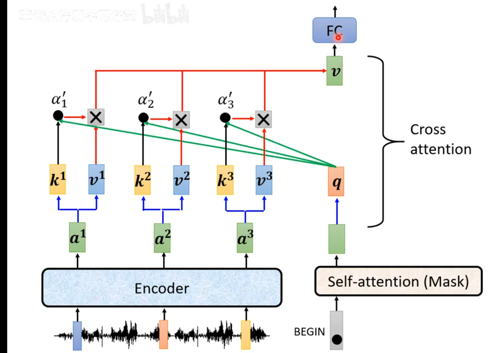


随后出现第二个的话也是上述步骤


### 4Train


在训练过程中，Decoder的输入不会是上一次的输出，而是真正的答案


## 5.BERT模型


### 1.bert的整体架构


### 2.如何预训练


### 3.如何微调


### 4.代码解析


## 6.Seq2Seq

Seq2Seq模型是输出的长度不确定时采用的模型，这种情况一般是在机器翻译的任务中出现，将一句中文翻译成英文，那么这句英文的长度有可能会比中文短，也有可能会比中文长，所以输出的长度就不确定了。


### 1.Encoder


### 2.Decoder


# 8.模型评估


## 1.分类常用指标


### 1.精确率和召回率

以二分类问题举例，我们首先列下下面的表格

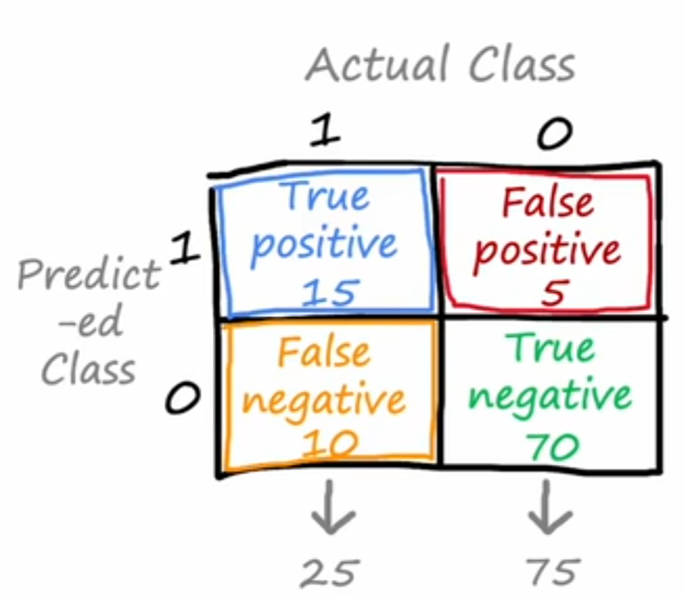

#### 1.精确率

对于精确率，以**预测结果**为判断依据

我们关心的主要部分是正例，所以查准率就是相对正例的预测结果而言，正例预测的准确度

模型预测为正例的样本中，其中真正的正例占预测为正例样本的比例，用此标准来**评估预测正例的准确度**。


**从实际角度出发（患病角度），精确率意味着，假如模型判断这个人患病，那么他有多少可能性是真是的结果**


#### 2.召回率

对于召回率，以**实际样本**为判断依据

召回率的另一个名字，叫做**“查全率”**，评估所有实际正例是否被预测出来的覆盖率占比多少


**从实际角度出发（患病角度），召回率意味着，如果这个病人患病，那么我有多少可能性真实的预测出来**


#### 3.准确率

准确度好理解，就是所有预测样本中预测准确的占比

**（TP+TN）/（TP+TN+FP+FN）= 85/100=0.85**


### 2.精确率与召回率的权衡（F1）

对于一个逻辑回归来说，如果我增大最后的阈值，则会导致最终结果更加精准，但是会有一些模棱两可的数据被判断为负，

**也就是说精确率升高，召回率降低，反之则相反**


**所以训练过程中如何权衡精确率与召回率呢**

除了手动调节阈值除外

我们还可以用以下公式来判断得分，从而实现自动调节阈值

**P是精确率，R是召回率**


**该公式也叫做调和平均，是强调较小值的一种平均算法**


### 如何选取指标


在⼆元分类指标中，当正负样本数量相等时，我们通常使⽤准确率、精确率、召回率和 F1。


## 2.回归常用指标


## 2.观察学习算法的方差和偏差

**当在训练集训练完成后的损失值很大，并在最终测试集的损失值很大，则表明这个算法有高偏差（欠拟合）；**

**当在训练集训练完成后的损失值很小，但在最终测试集的损失值很大，往往表明这个算法具有高方差（过拟合）** 


**往往越是高次项的模型，就越容易造成高方差，导致过拟合，越低此项的模型，就会导致高偏差导致欠拟合**

**往往越大的正则化参数，就会导致高偏差，导致欠拟合，越小的正则化参数，会导致高方差，过拟合**


**Jcv是测试集的损失值，Jtrain是训练集的损失值，X轴则是正则化参数的大小**


**该图的X轴是高次项的次数**


## 3.制作学习曲线观察方差和偏差

**我们在训练的时候，可以先取一小部分数据集进行训练，然后绘制其学习曲线Jcv和Jtrain来观察此模型的误差类型**


**对于高偏差的模型，往往会有下图学习曲线的格式**

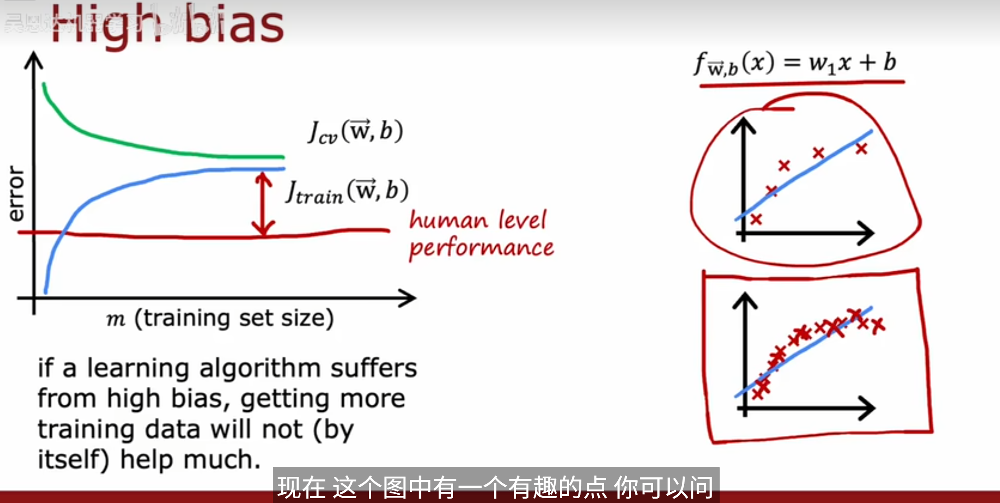


**对于高方差的模型，往往会有下面的类型**


## 5.计算误差的方式

### 1.MSE

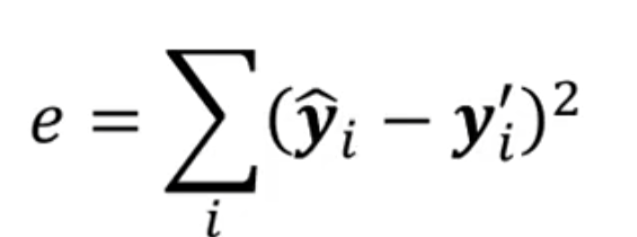


### 2.Cross-entropy


**这个算误差在pytorch里和SoftMax绑定在一起了**


# 9.模型误差解决方法


## 1.critical point


### 1.loss in train data

​			如果过大那么有几种个可能

​			1.模型设计的太简单，可以增加模型的参数，或者用深度学习来做

​			2.也可能是优化问题，陷入局部最优解	

​			

​			如何确定是我的模型问题，还是优化问题，我们可以再用一个模型来比较


如图我们发现56层的模型要比20层的模型误差还大，那就说明56层的模型的优化出现了问题


#### 1.optiization issue

 

可能是因为模型优化到了上面红点的部分，导致梯度为0，不再下降

**这种情况我们称之为，优化卡在了critical point**


那么我们如何知晓，模型是卡在了local minima 还是saddle point呢？

我们可以通过对损失函数进行泰勒二次展开，画出近似图像就可以看出是哪个了


而当我们卡在critical point时也就意味着，Gradient为0.所以上面的式子，中间项其实可以去掉


其实就是判断泰勒展开点是不是这里最小的或最大的，或时大时小

这段其实就是在利用 **Hessian 矩阵 HHH 的二次型和它的特征值性质**

因为 Hessian 矩阵是对称矩阵（来自二阶偏导对称性，满足 Schwarz 定理），对称矩阵有两个关键性质：

- 它的所有 **特征值都是实数**。
- 矩阵的正定性（positive definite/negative definite/indefinite）完全由特征值的符号决定。
- 换句话说：
  - 如果 **所有特征值都大于 0**，那么对于所有非零 $v$，都有$v^THv>0$，说明在所有方向上曲率为正 → **局部极小值**。
  - 如果 **所有特征值都小于 0**，那么对于所有非零 $v$，都有 $v^THv<0$，说明在所有方向上曲率为负 → **局部极大值**。
  - 如果特征值有正有负，说明有的方向曲率为正，有的为负 → **鞍点**。


这里举个实际例子


我们先对L求一阶导数，发现当w1=0并且w2=0时，此时梯度为0，所以w1=0和w2=0就是一个Critical point

然后我们带入这个w1和w2求对应的H矩阵算出其特征值发现有正有负，所以是Saddle point


**如果我们发现是陷入了Saddle point的话**


我们可以用这样的式子带入，继续减小loss


**但实际上，我们很少会直接将H算出来，因为运算量很大，所以上面这种方式，并不常用**


**2.当loss再traindata表现得很好，但是再testdata表现的不好**

​				1.可能是过拟合，可以增大正则化参数，还可以减小模型参数


## 1.解决高偏差

### 1.使用更多的特征

### 2.添加多项式特征

### 3.调小正则化参数

**2.高偏差（Underfitting）时**

- 模型在训练集上表现就不好。
- 模型太简单，没能力拟合真实数据关系。

📌 此时 **减小正则化参数 λ** 会：

- 减少对权重的惩罚
- 允许模型拥有更大的自由度
- 提高模型复杂度，有助于捕捉数据规律 ✅

🧠 类比：让模型“更放开手脚”，能学得更深入。


## 2.解决高方差

### 1.得到更多的训练数据

### 2.使用更少的特征

### 3.增大正则化参数

**1.高方差（Overfitting）时**

- 模型在训练集表现很好，但在测试集上误差很大。
- 模型复杂、对训练数据“记得太死”。

📌 此时 **加大正则化参数 λ** 会：

- 惩罚大权重，强迫模型“更简单”
- 降低模型复杂度，限制其自由度
- 从而减少过拟合，提升泛化能力 ✅

🧠 类比：相当于让模型不要“用力过猛”，学得更保守。


# 10.机器学习开发流程

## 1.获取数据集

我们需要通过各种途径获取到合适的数据集

## 2.数据清洗

### **1.了解数据集的内容**


**了解完内容之后，我们往往会把离散性数据和分类数据，以及时间序列进行分类**，**注意分类数据也可以是数值类型的**


就像这样（这里只分了两类）


### **2.查看数据的shape**

**如果数据过大，后续可能要考虑使用gc来手动清除内存数据**

### **3.数据质量分析**


#### 	1.正确性检验

看某一列数据是否符合该列所具备的特征。例如一个表格的主键，是否具有唯一标识性

#### 2.观察有无缺失值

有缺失值的话就需要进行处理


**对于离散型的缺失值：**

​					我们往往会先观察里面都有什么数据可以用unique()方法输出出来，然后对所有为nan的数据统一标注为-1


#### 3.观察有无无异常值

​	1.我们往往通过直方图之类的东西，可视化数据来观察

​	2.**或者说我们还可以通过$3σ $原则来界定，这个原则的思想就是，对于服从正态分布的变量X，约有约 99.73% 的数据落在：$μ±3σ$**


```python
import seaborn as sns
import matplotlib.pyplot as plt
sns.set()
#对图像进行绘制，kde=true代表同时绘制一个概率密度曲线
sns.histplot(train_data["target"],kde=True)
#当然除此之外，我们还可以3σ 原则（Three Sigma Rule），也叫“正态分布的 3 倍标准差法”原则进行异常值识别
#statistics = train_data["target"].describe()
#statistics.loc['mean']-3*statistics.loc['std']
```


**对于异常值的处理，我们往往有这几种方法**

1.如果是网上收集的数据，那很有可能就是单纯的异常值，我们可以把异常值删除，或者将异常值改为$μ±3σ$

2.如果数据是通过某些数学公式计算得来的，那么往往，有可能，这类异常数据，是对某些特殊用户的标记，因此不宜进行异常处理

而是应该将其单独视为一类

​					

#### 4.规律一致性分析


这里我们主要比较两个数据集，每个变量的分布是否一致

例如我们可以使用这样的代码

```python
features = ['first_active_month', 'feature_1', 'feature_2', 'feature_3']
train_count = train_data.shape[0]
test_count = test_data.shape[0]

for feature in features:
    (train_data[feature].value_counts().sort_index()/train_count).plot()
    (test_data[feature].value_counts().sort_index()/test_count).plot()
    plt.legend(['train','test'])
    plt.xlabel(feature)
    plt.ylabel('ratio')
    plt.show()
```


得到这样的数据图，这样就是很好的数据，我们就知道，测试集和训练集的高度一致性


但如果说，这一步得到的结果并不是很理想，


**我们还需要观察数据的多变量联合分布**

这里等遇到在做了解


### 4.对于分类的数据

往往来说，对于一个分类数据，我们可以使用独热编码进行转变

但假如说，这个分类信息蕴含着大小关系的特征(比如说这个数据分为A,B,C三个等级，其中A>B>C)，我们就不能简单的使用独热编码，不然他的大小关系将被删除掉


**如果是蕴含大小关系的分类数据：我们往往采用字典编码，**（字典编码就是先排序再赋值）

```python
def change_object_cols(se):
	value = se.unique().tolist()
    value.sort()
    return se.map(pd.Series(range(len(value)),index=value)).values
```


**如果是时序数据**


**如果不蕴含的话，我们就可以采用独热编码**


### 5.对于数值数据

我们除了要观察有没有空缺值，

我们还要查看其describe(),查看这些数据的均值，方差什么的


**情况一，describe()的数据中，存在无穷大inf**

​				我们可以用这一列中的最大值，替换掉，其中的inf


## 3.特征工程


**数据里面介绍的特征工程，在这里更像是数据清洗**

**而这里的特征工程，是把数据整合起来**


### 1.通用组合特征

**在我看来，这种特征工程的意义就是，对于一个主键的多条数据，我们可以把它合并到一起**

**容易造成维度爆炸**

**操作非常暴力**


例如这样将上面的数据表，转换成下面的数据表。

**转换的逻辑就是，根据分的类别(分别有1和2)，然后把对应的C,D进行相加**

**例如这里的A1&D ，当card_id为1的时候D的值为7+4=11，其他均没有出现，所以为0**


### 2.业务统计特征


**这里的统计思路就是，先按照card_id进行groupby(分组),然后，对每一个字段进行统计，统计的数据保存下来**


## 4.特征筛选

**我们可以根据一些算法，去选择出来数据集中相关性较强的数据，去进行模型选择，以及参数调优**

**以及筛选调无用特征**


### 1.Filter特征筛选

**不依赖于模型本身**

**评估每个特征与目标变量之间的关系来选择特征**


#### 1.卡方检验

 卡方检验适用于**分类问题**，尤其是当特征和目标变量都是**类别变量**时

**用于检验两个变量是否独立**


**卡方统计量**越大，表明变量之间的关联越强。


#### 2.皮尔逊相关系数

**皮尔逊相关系数**（Pearson Correlation Coefficient）是一种衡量两个连续变量之间线性相关程度的统计量。其值范围为 [−1,1]，其中：

- 1：完全正相关。
- −1：完全负相关。
- 0：没有线性相关。


**适用于回归问题，检验输入特征与目标变量的相关性**


### 2.Wrapper特征筛选

**依赖于机器学习模型的性能来评估特征子集的好坏。它通过递归地选择不同的特征子集并训练模型，从中选择性能最好的子集。**


## 5.交叉验证集

### 1.k 折交叉检验

其实就是把数据分成k分，每次训练用k-1的数据，剩下的就用来做验证集


```python
import pandas as pd
from sklearn import model_selection

df = pd.read_csv(r"C:\Users\lenovo\Downloads\logistic_regression_dataset_1000.csv")


df["kfold"] = -1

df = df.sample(frac=1).reset_index(drop=True)#打乱数据

kf = model_selection.KFold(n_splits=5)#分5段

for flod,(train_index,test_index) in enumerate(kf.split(X=df)):
    df.loc[test_index,'kfold'] = flod
```

|   X1 |        X2 |     Label | kfold |      |
| ---: | --------: | --------: | ----: | ---- |
|    0 |  1.181310 | -0.710759 |     1 | 0    |
|    1 | -0.468307 |  1.047335 |     0 | 0    |
|    2 | -0.132160 |  0.484752 |     0 | 0    |
|    3 | -0.703027 | -0.793579 |     1 | 0    |
|    4 | -1.027734 |  1.857425 |     1 | 0    |
|  ... |       ... |       ... |   ... | ...  |
|  995 | -1.837304 |  0.349824 |     0 | 4    |
|  996 | -0.727224 |  1.064178 |     0 | 4    |
|  997 | -0.140331 |  0.478762 |     0 | 4    |
|  998 |  0.227035 |  0.200311 |     0 | 4    |
|  999 | -0.904613 |  1.686169 |     1 | 4    |

这是最终得到的数据


**每次循环的规则**

- 如果 `kfold = 0`：
  - 用所有 **不是 0** 的行（1,2,3,4）作为训练集
  - 用 **kfold=0** 的行作为验证集
- 如果 `kfold = 1`：
  - 用所有 **不是 1** 的行（0,2,3,4）作为训练集
  - 用 **kfold=1** 的行作为验证集
- 以此类推，直到每一折都当过一次验证集。


### 2.分层 k 折交叉检验


#### 1.分类问题

如果你有⼀个偏斜的⼆元分类数据集，其中正样本占 90%，负样本只占 10%，那么你就不应该使⽤随机 k 折交叉。对这样的数据集使⽤简单的 k 折交叉检验可能会导致折叠样本全部为负样本

**分层 k 折交叉检验可以保持每个折中标签的⽐例不变**。因此，在每个折叠中，都会有相同的 90% 正样本和 10% 负样本


```python
import pandas as pd
from sklearn import model_selection

df = pd.read_csv(r"C:\Users\lenovo\Downloads\logistic_regression_dataset_1000.csv")

df['kfold'] =-1


df = df.sample(frac=1).reset_index(drop=True)

y = df.Label.values

kf = model_selection.StratifiedKFold(n_splits=5)

for fold,(train_index,test_index) in enumerate(kf.split(X=df,y=y)):
    df.loc[test_index,'kfold'] = fold

```


#### 2.回归问题

⼤多数情况下，简单的k 折交叉检验适⽤于任何回归问题。但是，如果发现⽬标分布不⼀致，就可以使⽤分层 k 折交叉检验。

假设你的目标是预测房价（y 值范围从 10 万到 500 万）：

- 如果你用 **普通的 k 折**：
  - 有可能某一折里大多数样本是低价房（比如 10 万–30 万）
  - 另一折里大多数样本是高价房（比如 300 万以上）
  - 这样训练和验证的分布差异太大，模型验证结果就会不稳定。
- 这时就说：**目标分布在各折之间不一致**。


选择合适的分层数有⼏种选择。

如果样本量很⼤（>10k，> 100k），那么就不需要考虑分层的数量。只需将数据分为 10或 20层即可。

如果样本数不多，则可以使⽤ Sturge's Rule 这样的简单规则来计算适当的分层数。

$N = 1+log_2(datasize)$


```python
import numpy
import pandas as pd
from sklearn import model_selection

data = data.drop(columns=['split','kfold'])

data['kfold'] = -1

data = data.sample(frac=1).reset_index(drop=True)

N = int(np.floor(1+np.log(data.shape[0])))

data.loc[:,'bin'] = pd.cut(data['target'],bins=N,labels=False)

kf = model_selection.StratifiedKFold(n_splits=N)

for fold,(train_index,test_index) in enumerate(kf.split(X=data,y=data['bin'])):
    data.loc[test_index,'kfold'] = fold

```


### 3.暂留交叉检验

针对数据量很大很大的情况


（我目前最常用的）

直接把数据集随机划分成两部分：

1. **训练集**（train set）：用来训练模型
2. **验证集**（validation set）：用来评估模型性能


处理时间序列数据时，暂留交叉检验也⾮常常⽤。假设我们要解决的问题是预测⼀家商店 2020

年的销售额，⽽我们得到的是 2015-2019 年的所有数据。在这种情况下，你可以选择 2019 年的

所有数据作为保留数据，然后在 2015年⾄ 2018 年的所有数据上训练你的模型。


## 6.单模型训练

### 1.获取最优超参数

#### 1.网格搜索

**网格搜索是一种穷举搜索方法，它通过遍历超参数的所有可能组合来寻找最优超参数**

**缺点是计算量太大了**


使用的话我们往往需要定义一个超参数的候选值，类似这样

```python
grid_params = {
    "n_estimators": [200, 400, 800, 1200, 1600, 2000],
    "learning_rate": np.linspace(0.01, 0.2, 10),
    "max_depth": [3, 4, 5, 6, 8, 10],
    "min_child_weight": [1, 2, 3, 4, 6, 8],
    "subsample": np.linspace(0.5, 1.0, 6),
    "colsample_bytree": np.linspace(0.5, 1.0, 6),
    "gamma": np.linspace(0.0, 0.5, 6),
    "reg_lambda": [0, 1, 5, 10, 20, 50],
    "reg_alpha": [0, 0.1, 0.5, 1, 2, 5, 10],
}
```


然后使用sklearn里的库进行所有可能的排列组合

```python
from sklearn.model_selection import train_test_split, RandomizedSearchCV, GridSearchCV

grid = GridSearchCV(
    estimator=base,                     # 基础模型：XGBRegressor
    param_grid=grid_params,             # 参数网格（字典形式，每个参数所有候选值）
    scoring="neg_root_mean_squared_error", # 评估指标：负 RMSE
    cv=3,                               # 3 折交叉验证
    n_jobs=-1 if SEARCH_ON_CPU else 1,  # CPU并行核数
    verbose=1                           # 输出日志详细程度
)	

grid.fit(X_train, y_train) #启动网格搜索
```

**3 折交叉验证（3-fold CV）就是把数据集均分成 3 份，可以防止偶然划分导致结果不稳定。**

假设你有 90 条样本，3 折交叉验证会先把它分成 3 份：

- F1（30 条）
- F2（30 条）
- F3（30 条）

然后做 3 轮训练 → 验证：

- **第 1 折**：训练 = F2+F3，验证 = F1
- **第 2 折**：训练 = F1+F3，验证 = F2
- **第 3 折**：训练 = F1+F2，验证 = F3

最后把这 3 个验证结果取平均，作为最终评分。


#### 2.随机搜索


**随机搜索是一种随机化的搜索方法，它通过随机采样超参数的组合来寻找最优超参数**


```python

from sklearn.model_selection import train_test_split, RandomizedSearchCV, GridSearchCV

param_dist = {
    "n_estimators": [200, 400, 800, 1200, 1600, 2000],
    "learning_rate": np.linspace(0.01, 0.2, 10),
    "max_depth": [3, 4, 5, 6, 8, 10],
    "min_child_weight": [1, 2, 3, 4, 6, 8],
    "subsample": np.linspace(0.5, 1.0, 6),
    "colsample_bytree": np.linspace(0.5, 1.0, 6),
    "gamma": np.linspace(0.0, 0.5, 6),
    "reg_lambda": [0, 1, 5, 10, 20, 50],
    "reg_alpha": [0, 0.1, 0.5, 1, 2, 5, 10],
}


rand_search = RandomizedSearchCV(
    estimator=base,                     # 基础模型：XGBRegressor
    param_distributions=param_dist,     # 超参数搜索空间（字典形式）
    n_iter=60,                          # 随机抽取 60 组参数组合
    scoring="neg_root_mean_squared_error", # 评估指标：负的 RMSE（因为 sklearn 越大越好，所以取负号）
    cv=3,                               # 3 折交叉验证
    random_state=42,                    # 随机种子，保证搜索过程可复现
    n_jobs=-1 if SEARCH_ON_CPU else 1,  # 并行任务数：CPU 模式下全核加速，GPU 模式下只用 1
    verbose=1                           # 输出搜索过程的日志信息
)

rand_search.fit(X_train, y_train) #启动随机搜索

```


### 2.利用上述超参数进行训练

这里我们有两种想法

1.用全部的训练集，训练出来一个模型

2.将训练集进行交叉查验证，训练出来多组相同类型而不相似的模型，进行融合


## 7.多模型融合


### 1.Voting融合

1.均值融合

2.加权融合

3.投票法


### 2.Stacking融合

**公认比较好的融合方案**


## 8.一些小设计

### 1.输入特征级的随机失活（Input Feature Dropout）

假设现在的特征有body和rule，我们可以随机舍去部分的rule

 **防止“条件过拟合”**

如果总是喂 `rule + body`，模型可能学成：

> “我看 rule 就够了，body 不重要。”

这样一旦规则换了（或没规则），模型就崩掉。
 随机丢掉规则，迫使模型学：

- 从 body 中找违规信号（即使没 rule）
- 从 rule 与 body 的交互中理解更深的语义


可以提高模型的泛化能力


### 2.AMP混合精度

这个东西是由于数学计算时，不同的精度如(float32,float16)，有着不同的优缺点


**所以我们通过混合精度，可以融合高精度和低精度的优点**


对于模型训练过程，有很多需要这项技术的流程，这里以参数更新为例。


在初始化模型的时候，我们往往会保存一份FP32的权重数据，这是由于如图，红线左边的数据，对于FP16太小，会被下放为0，也会有大数吃小数的现象，所以我们需要保存一份对应的FP32的权重数据


在训练过程中精度会进行如图所示的转化


其次往往梯度会很小，对于FP16来说会在表示范围之外，而且如图我们发现右边还有很大范围没有被使用


对此我们的解决方式是进行缩放

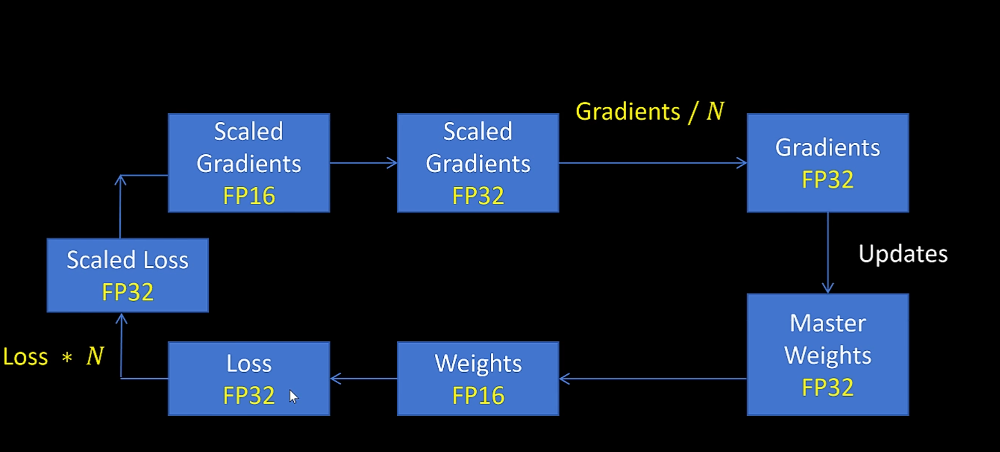

这样的好处就是

我们缩放后的Scaled Loss转化为FP16位之后，进行的梯度计算不会溢出FP16的精度，还能提高速度，随后我们再把精度转化为FP32就能避免溢出现象


# 11.数据

对于大量的数据我们也有着不同的处理方法

## 1.数据增强

**我们可以对已有数据进行旋转，模型，加噪等处理，产生新的数据，进行训练**

**事实证明，用数据增强的数据进行训练，模型的泛化能力往往更强**


## 2.数据迁移

**对于数据量不够的模型，我们往往可以采用数据迁移的方式**


**假设说我们要构建一个识别手写数字的模型**

**例如下图，上面的网络，我们可以先来训练一个大模型，可能可以用几百万个数据去训练**

**接下来，把该模型迁移到下面的网络，保留前四个神经元的权重,舍弃掉最后一层的权重(也就是舍弃输出层的权重)，并把输出层改成，10神经元，然后用较小的数据去训练**


**这就是预训练的概念**


## 3.特征工程

**特征工程（Feature Engineering）是指对原始数据进行处理、转换、构造、选择等操作，使其更适合机器学习模型建模的全过程。**


### 1.需要特殊考虑的数据

我们在拿到数据集后，除了要区分数值型和非数值型数据，还要特别注意：
 **有些看起来是“数值类型”的列，其实本质上是“分类特征”，它的大小并不具有实际的大小比较意义**


📍 示例 1：楼层编号（Floor）

| 楼层 | 房价  |
| ---- | ----- |
| 1    | 100万 |
| 5    | 120万 |
| 10   | 110万 |

虽然 `Floor` 是整数，但：

- 它**不是严格的“越高越贵”**；
- 某些城市底层贵（方便出行），有些高层贵（采光好）；
- 也就是说：**Floor 更像是一个“分类特征”**，不能简单地当作连续变量使用。

👉 **处理建议**：考虑做成分箱（如“低层”、“中层”、“高层”）或 One-hot 编码。


### 2.特征编码

**将非数值数据转化为数值数据**

独热编码就是其中的操作之一


我们可以直接使用pandas中的自带的get_dummies方法，可以一键做到One-Hot


### 3.正态化

当我们发现数据的柱状图呈现


这种形式，类似于一个log函数，那么我们就可以用log函数把他转变为正态分布的函数


或者说用一些概率论上的知识

| 方法              | 公式                | 结果范围               | 是否受异常值影响 | 常用于               |
| ----------------- | ------------------- | ---------------------- | ---------------- | -------------------- |
| **Z-score标准化** | $(x−μ)/σ$           | 平均值为 0，标准差为 1 | ✅ 受影响         | 大多数算法           |
| **Min-Max归一化** | $(x−min⁡)/(max−min⁡)$ | [0, 1] 或 [-1, 1]      | ✅ 更敏感         | 图像、神经网络输入等 |
| **RobustScaler**  | $(x−median)/IQR)$   | 中位数为中心           | ❌ 更稳健         | 有异常值的数据       |


### 4.日期

如果日期和时间分割开的话，我们可以把它们合并成datetime,后续从中获取数据也容易，也方便我们排序


```python
assert {"date","hour"}.issubset(df.columns)

df["date"] = pd.to_datetime(df["date"])
dt = df["date"]+pd.to_timedelta(df["hour"],unit="h")
df = df.assign(datetime=dt).sort_values("datetime").reset_index(drop=True)
print(df.datetime)
```


# 补充


## 1.集成算法

我的理解就是，由多个小学习器集合成一个大的学习器，最终结果由每个小学习器投票


目前常见的集成算法就是：bagging，boosting, stacking


### 1.bagging


这里其实就是决策树里面的树集成的随机森林算法思想

每个子模型都是相对独立的，相互之间没有直接的联系


### 2.boosting


**若想使用该算法，则必须能够计算损失值，也就是说，如果特征是文本类型的数据，那就需使用独热编码之类的算法，是文本数据可以进行数值计算**


这里就是树集成里面的XGBoost算法的思想

每次训练对会对下一个模型训练产生影响


**实现该算法的逻辑：**

- **步骤1：所有分布下的基础学习器对于每个观测值都应该有相同的权重（这里指第一次训练）**
- **步骤2：如果第一个基础的学习算法预测错误，则该点在下一次的基础学习算法中有更高的权重**
- **步骤3：迭代第2步，直到到达预定的学习器数量或预定的预测精度。**


#### 1.GBDT（[Gradient](https://so.csdn.net/so/search?q=Gradient&spm=1001.2101.3001.7020) Boosting Decision Tree）梯度提升决策树

**原理：**

- 所有弱分类器的**结果相加等于预测值**（这里是理解下一步的关键）。
- 每次都以当前预测为基准，下一个弱分类器去拟合误差函数对预测值的残差（负梯度）。
- GBDT的弱分类器使用的是树模型。


这里的第二步并不是去更改样本权重，，而是残差直接作为新的标签

在MSE损失下，残差其实就是真实值-预测值

下面举个例子

**✅ 场景设定：回归任务**

假设我们要预测一个人的收入（单位：万元），我们有如下训练数据：

| 样本编号 | 特征x | 实际收入 y |
| -------- | ----- | ---------- |
| 1        | 1.0   | 5          |
| 2        | 2.0   | 7          |
| 3        | 3.0   | 9          |


------

 **🟢 第0轮：初始模型（常数）**

我们先用一个常数值作为预测：

F0(x)=所有 yi 的平均值=(5+7+9)/3=7

即：

- 对所有样本的初始预测值为 7

------

**🟢 第1轮：计算残差（真实值 - 当前预测值）**

| 样本编号 | 实际值 y | 当前预测 F0(x) | 残差 $r(1)=y−F0(x)$ |
| -------- | -------- | -------------- | ------------------- |
| 1        | 5        | 7              | -2                  |
| 2        | 7        | 7              | 0                   |
| 3        | 9        | 7              | +2                  |


这些残差 r(1)就是我们要去“拟合”的目标！

------

 **🟢 训练第1棵树（回归树）——标签是残差！**

我们现在构造一棵回归树，训练它预测残差：

| 特征x | 新的“标签”（残差） |
| ----- | ------------------ |
| 1.0   | -2                 |
| 2.0   | 0                  |
| 3.0   | +2                 |


也就是说：

> 🌟 这棵树的训练目标不是原始的收入 y，而是“我上一轮还差多少”。

🌳 这棵树学完之后，它输出一个“拟合残差”的函数 h1(x)。


**数学原理**

第一步：初始化弱学习器


第二步：迭代训练


##### 1.XGBoost极致梯度提升

基于GBDT的一种算法


#### 2.AdaBoost

- **原理：**
  - 所有弱分类器通过加权投票（或加权求和）构成最终预测结果；
  - 初始时，每个样本的权重相等；
  - 每一轮训练后，根据分类结果**调整样本权重**：
    - 错分的样本权重提高；
    - 正确分类的样本权重降低；
  - 下一轮弱分类器在加权后的数据分布上重新训练（更关注错分样本）；
  - 最终模型是所有弱分类器的加权组合。


### 3. stacking


## 2.决策树模型(CART模型)

这里介绍一种更牛的决策树

CART模型叫做分类回归树


### 1.分类树

#### 1.量化纯度(基尼指数)

分类树用**基尼指数**（gini index）最小化准则进行特征选择生成二叉树 

类似于ID3模型中用熵量化纯度的方法

基尼指数的计算公式为：

​	

其中：

- G(D) 是数据集 D 的基尼指数。
- C 是类别的数量（例如，对于二分类问题，C=2）。
- pi 是类别 i 在数据集 D 中的比例。


**直观理解**

- **基尼指数反映了一个数据集的“不纯度”**，即数据集中样本分类的不确定性程度。值越小表示数据集越纯，越大则表示数据集越不纯。
- 对于完全纯净的集合（即所有样本都属于同一类别），基尼指数为 0。
- 对于完全不纯的集合（即样本均匀分布在各类别中），基尼指数为最大值，通常情况下为 1−1/c ，其中 C 是类别数。


#### 2.分裂(Gini增益)


**这里的Gini增益，其实就是在基尼系数前加上权重后，把分类后数据的基尼指数相加。N就是要分裂的节点有多少数据，Ni就是分裂后的某个节点所有的数据**


**这里Gini(D,A)就代表着，此节点根据特征A分类D个数据的Gini增益**


【分类树算法步骤】：

1.首先是根据当前特征计算他们的基尼增益。

2.选择基尼增益最小的特征作为划分特征。

3.从该特征中查找基尼指数最小的分类类别作为最优划分点。
4.将当前样本划分成两类，一类是划分特征的类别等于最优划分点，另一类就是不等于
针对这两类递归进行上述的划分工作，直达结点中的样本个数小于预定阈值，或样本集的基尼指数小于预定阈值（样本基本属于同一类），或者没有更多特征。


### 2.回归树

回归树采用均方误差作为损失函数，树生成时会递归的按最优特征与最优特征下的最优取值对空间进行划分，直到满足停止条件为止。

回归树该怎么确定哪个分法才最好呢？最小二乘！经典的最小二乘算法！

之所以称为最小二乘回归树，是因为，回归树以误差平方和为准则选择最优二分切点，该生成算法在训练数据集上所在的输入空间中，递归的将每个区域划分为两个子区域并决定每个子区域的输出值，在这里分为两种情况。

一是输出值为子区域输出值的均值该种情况下为回归树，

二是输出值为子区域输入与输出的线性回归，输出值为回归系数，该种情况下为模型树。


**学习流程**


(1) 选择切分特征j与切分特征取值s（阈值）。j将训练集D划分为两部R1与R2，依照(j,s)切分后如下：


其中，c1,c2分别为左右子区域输出的均值（模型树时是输出变量的回归值），可通过遍历每个变量的每个可能取值来切分数据集找出最优切分点。


(2) 遍历所有可能的解(j,s)，找到最优的 (j∗,s∗)，最优的解使得对应损失最小，按照最优特征 (j∗,s∗) 来切分即可。


(3) 递归条用(1)∼(2)，直到满足停止条件。
(4) 返回决策树T

注：停止条件可以人为设定，比如说设置某个节点的样本容量小于给定的阈值 c ，或者当切分后的损失减小值小于给定的阈值小于给定的 ε，则停止切分，生成叶节点。


### 3.CART剪枝

由于CART生成算法是让生成的决策树自然生长，尽量大，所以容易造成过拟合，因此采取剪枝策略避免过拟合。

CART采取Cost-Complexity Pruning(CCP、代价复杂度)剪枝法，即**在不显著增加错误的情况下，减少树的复杂度**


#### 1.CCP剪枝法的两个步骤

1. **生成子树序列**：
    从原始的决策树 $T_0$（即完全生长的树）开始，逐渐生成一系列大小递减的子树 {$T_0$,$T_1$,$T_2$,…,$T_N$},其中：
   
   - $T_0$ 是最初的决策树。
   - {$T_0$,$T_1$,$T_2$,…,$T_N$} 是通过剪除某些分裂节点（即合并一些节点）得到的子树，直到最终得到一个只有根节点的树 $T_N$。
   
   每一步的子树$T_(i+1)$ 是通过在$T_i$ 的基础上剪除一些分裂节点或合并较小的部分生成的，这样得到的树序列呈现从复杂度高到低逐渐简化的趋势。
   
2. **交叉验证选择最优子树**：
   接下来，在独立的验证集上使用交叉验证方法来评估每个子树的表现。交叉验证用于选择最优的子树，即找到一个在验证集上表现最好的子树。通常，选择使得验证误差最小的子树，而不是训练误差最小的子树，从而避免过拟合。
   
   通过交叉验证来衡量每个子树的效果，可以有效防止模型在训练集上的过拟合，提高模型的泛化能力。

#### 2.代价复杂度（Cost-Complexity）的定义

代价复杂度 \( $\alpha$ \) 是通过引入一个惩罚项来控制树的复杂度：

$R_\alpha(T) = R(T)+\alpha|T|$

其中：
- $R(T)$ 是树 $T$ 在训练数据上的误差（比如均方误差）$R(T)=\sum_{n=1}^{N}(y_i−\hat(y_i))^2$。
- $|T|$ 是树 $T$ 的大小，即树中节点的数量（通常是叶子节点的数量）。
- $\alpha$是代价复杂度的参数，用于平衡误差和树的复杂度(这个是自己取值)。

较大的 $\alpha$ 会导致更小的树，较小的 $\alpha$会使得树变得更复杂。

#### 3.CCP剪枝的逻辑

1. **初步生成大树**：首先生成一个可能过拟合的较大树  $T_0$。
2. **逐步简化树结构**：逐渐通过剪枝（合并叶子节点）形成更简单的树。每一次剪枝都会去掉一些枝叶，减少树的复杂度。
3. **交叉验证评估每个子树**：通过交叉验证在不同的子树上评估其在独立验证集上的性能。最终选择一个在验证集上表现最好的子树作为最终模型。


## 3.对于超平面的理解

在**感知机或逻辑回归**中，模型的预测基于下面这个公式：

$f(x) = sign(w*x+b)$

这里：

- $w$ 是权重向量
- $b$ 是偏置项
- $w*x+b$ 就定义了一个 **超平面（hyperplane）**

### 🧠 几何意义：

在 $n$维空间中，超平面就是一个 $n-1$维的几何对象：

- 在二维平面上（2D）：超平面就是一条直线
- 在三维空间里（3D）：超平面是一个平面
- 在更高维空间中：我们称其为“超平面”

这个超平面将特征空间分为两侧，对应不同的类别。

------

### 🔶 二、超平面与权重的关系

我们可以将超平面理解为：

${x|w*x+b=0}$

- 向量 $w$是这个超平面的**法向量（normal vector）**，即它垂直于超平面
- 偏置 $b$ 控制这个超平面在空间中的位置（向量平移）

------

### 🔁 三、更新时“往样本靠近”是什么意思？

#### 分类错误时：

当样本 $x_i$ 被错误分类，说明当前的超平面把它划到了错误的那一侧。

此时我们要调整超平面，把它朝着这个样本“推一下”：

$w<-w+y_ix_i$

#### 具体解释：

##### ✅ 情况一：$y_i=+1$，但被误分为负类

说明：

$w*x_i+b<0$

我们希望：

$w*x_i+b>0$

于是我们做更新：

$w<w+x_i$

这相当于：**往 $x_i$ 方向移动超平面**，让这个正样本更容易被正确分类。

------

##### ❌ 情况二：$y_i=-1$，但被误分为正类

说明：

$w*x_i+b>0$

我们希望：

$w*x_i+b<0$

于是我们做更新：

$w<w-x_i$

这相当于：**往反方向调整超平面**，推开这个负样本。


## 4.PCA主成分析

**其实就是一种把数据降维的算法**


### 1.直观理解


对于这种特殊情况，源数据在一条直线上

我们降维的方式，**就是找到一个新的坐标系，让数据可以舍弃一个维度，进行标识**


**那么我们的目标其实就是，找到一个新的坐标系，数据投影上去后，信息损失最小**，就像这样


### 2.算法流程


**这是我们的目的**


****


**第一步就是去中心化，因为把坐标系中心点放在数据中心后，坐标系旋转更容易看出，哪个方向分布最散**


首先我们的数据是可以从一个白数据(x,y都符合标准正态分布)，拉伸旋转后的得到的，那么反过来，就可以逆推出，我们所需要的R


**那么怎么求R**

**协方差矩阵的特征向量就是R**


通过这样的式子，我们可以算出来现有数据的协方差，**有什么用呢？**


通过上面的公式推导，我们可以进一步


**所以说根据$D' = RSD和C=1/(N-1)DD^T$**

我们就可以得到

$C' = RLR^-1 $


又有协方差的特征向量转换可得


### 3.基础数学知识


**线性拉伸，注意这里是D左乘S**

**拉伸对角线为0，所以$S = S^T$**


**线性旋转，这里也是左乘**

这里也有一个公式，**$R^T=R^-1$**


**协方差**

**协方差是用来，描述的两个向量的关系**


## 5.特征工程


## 6Triton

Triton 是一个专门为深度学习和高性能计算任务设计的编程语言和编译器，它旨在简化并优化在GPU上执行的复杂操作的开发。Triton 的目标是提供一个开源环境，以比 CUDA 更高的生产力编写快速代码。


## 7.泰勒展开

.PNG)


## 8.解码器和编码器


Encoder(编码器):将输入编程成中间表达形式（特征）

Decoder(解码器)：将中间表示解码成输出

