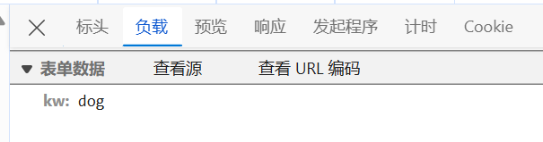

# 1.经验

## 1.遇到反爬时的检查

1.**首先要检查user-agent,也就是对应的浏览器型号**

2.

```python
data = requests.get(domain,headers=head,verify=False)#在get函数内部加上verify=False可以跳过安全验证
```


## 2.爬取网络时的返回值

```python
s = requests.get(url,headers=header)
s.text就是对应的字符串类型
s.json就是对应的字典类型
```

## 3.正则表达式的使用

1.在爬取html源码的时候，遇到空格一律用/s来表示，不要直接自己打空格，因为你不知道这中间到底有多少个空格

2.在使用re.S后，.会匹配换行符，我们要注意区分是使用.*（尽可能多的匹配）还是    . *?(尽可能少的匹配)


## 4.遇到乱码

### 1.编译器与网站html的编码格式不同


找到网页源代码，找到charset这个标识符，我们可以知道，这个网页是根据gb2312的编码

```python
data = requests.get(domain,headers=head,verify=False)

data.encoding = 'gb2312'
```


## 5.pycharm下载图片时需要注意的

**当我们把对应图片下载到某个文件夹中时，由于会一直有新东西出现，导致pycharm会一直添加对应的索引，导致很卡，所以我们可以把对应的文件夹的相关属性关闭**


选择**已排除**就可以了

## 6.已在调试过程中暂停

**当打开调试后，网页停止运行，可以这样做**

1.在源码里点击“停用断点”


2.然后点击“恢复脚本执行”


这样就可以继续了


## 7.登录的login一瞬间就消失了

只需要点击“保留日志就可以了”


## 8.下载地址经过处理

```python
"https://video.pearvideo.com/mp4/short/20240928/1728029079325-16037705-hd.mp4"#这是请求网页内容，爬取到内部的下载地址
"https://video.pearvideo.com/mp4/short/20240928/cont-1796529-16037705-hd.mp4"#这是在网页中使用F12工具找到的真正的下载地址
“https://www.pearvideo.com/video_1796529”#这是原网页的地址

#经过分析我们发现，他们的差距就是1728029079325被替换成了cont-1796529而179652正好对应着video_1796529的数据
```


# 2.web请求的返回结果

## 1.服务器渲染


这种情况可以直接获取数据


## 2.客户端渲染


这种可以利用抓包工具看到获取数据是访问的哪个网站


# 3.	HTTP协议


**请求方式**

1.GET：一般是查询东西的时候用的是这个请求方式

在浏览器输入栏里的url统一使用get方式提交


2.POST：一般是增加数据或修改数据的时候，用的是这个请求方式


## 1.什么是http


个人理解这就是一种协议，用来规范请求和回应的发送格式


## 2.http请求的完整过程


DNS：域名系统 ([DNS](https://www.cloudflare.com/learning/dns/what-is-dns/)) 是互联网的电话簿。当用户在网络浏览器中键入[域名](https://www.cloudflare.com/learning/dns/glossary/what-is-a-domain-name/)（例如“google.com”或“nytimes.com”）的时候，DNS 负责为这些站点查找正确的 [IP 地址](https://www.cloudflare.com/learning/dns/glossary/what-is-my-ip-address/)


## 3.状态码


**里面重要的信息**


# 4.Requests模块

## 1.爬取实战

**请注意这里的get和post的使用主要是根据抓包工具的对应请求方式来获取的**

### 1.无登录

#### 1.get爬取网页信息

```python
import requests

query = "周杰伦"

url = f"https://www.sogou.com/web?query={query}"

#伪造头信息（伪装成浏览器访问）
headers = {
    "user-agent":"Mozilla/5.0 (Windows NT 10.0; Win64; x64) AppleWebKit/537.36 (KHTML, like Gecko) Chrome/129.0.0.0 Safari/537.36 Edg/129.0.0.0"
}

#用get请求方式请求该网页
resp = requests.get(url,headers=headers)

#输出请求结果
print(resp)

#拿到页面源代码
print(resp.text)

#一定要写，不然持续访问后，可能会报错
resp.close()
```


#### 2.post爬取用户可输入的返回信息

如百度翻译的翻译结果

```python
import requests
import time
url = "https://fanyi.baidu.com/sug"

#这里在请求过程中如果不加cookies，就会返回一个报错1022,具体原因不清楚
co = {
    "cookie": "BAIDUID_BFESS=A7204E4912D9B9AA67C0FA9BE1AEEC03:FG=1; __bid_n=18d91edda430288e84360b; BAIDU_WISE_UID=wapp_1707840652356_559; BIDUPSID=A7204E4912D9B9AA67C0FA9BE1AEEC03; PSTM=1708345911; REALTIME_TRANS_SWITCH=1; FANYI_WORD_SWITCH=1; HISTORY_SWITCH=1; SOUND_SPD_SWITCH=1; SOUND_PREFER_SWITCH=1; H_PS_PSSID=40377_40415_40445_40464_40456_40499_40513_40398_60040_60029_60033_60048_40511; BDUSS=NybHpCUlRUbzhuNWFPWlZIZWctaUxPWlh3Wjd1dEY1UXl6SlJHSnNuT2FOZDFtRVFBQUFBJCQAAAAAAQAAAAEAAABapOKFMTIzNDU2eGZhc2ZkAAAAAAAAAAAAAAAAAAAAAAAAAAAAAAAAAAAAAAAAAAAAAAAAAAAAAAAAAAAAAAAAAAAAAJqotWaaqLVmWW; BDUSS_BFESS=NybHpCUlRUbzhuNWFPWlZIZWctaUxPWlh3Wjd1dEY1UXl6SlJHSnNuT2FOZDFtRVFBQUFBJCQAAAAAAQAAAAEAAABapOKFMTIzNDU2eGZhc2ZkAAAAAAAAAAAAAAAAAAAAAAAAAAAAAAAAAAAAAAAAAAAAAAAAAAAAAAAAAAAAAAAAAAAAAJqotWaaqLVmWW; Hm_lvt_afd111fa62852d1f37001d1f980b6800=1726053024; Hm_lvt_64ecd82404c51e03dc91cb9e8c025574=1726053024; ZFY=6JUUyUKNBhQjCSFOsmjaBd65MfkScsYbC1CUya2mRSo:C; ab_sr=1.0.1_MWU2MGUwNmI0ZjRhOWMxOTZlZWIwNjA0MjI2NDU1NGU3YmRhZDQxNDhjYmJkZGY2YTk4ZmVmNDZlZGQxMmExOGViMDY3M2ZiZThlYzVlMWNiOGQ1YmM5NzNiNmYwMjMyNTg5NTRkMjMxMmQ3YmU5NTU0ZjY4YzZkMjQzNDdmZjBkMDAzM2IwMjY3ZGYzMWRhMTk1NWZhZjI0YmZkZGI0MQ==; RT=\"z=1&dm=baidu.com&si=711a2193-ce17-438e-861b-59b4ed390632&ss=m1hqgk9l&sl=i&tt=b53&bcn=https%3A%2F%2Ffclog.baidu.com%2Flog%2Fweirwood%3Ftype%3Dperf&ld=31nt0\""
}

#这里的输入字典要根据具体的负载来确定
dat = {
    "kw": "dog"
}


resp = requests.post(url,data=dat,cookies=co)


print(resp.json())#将服务器返回的内容直接处理成json() => dict 也就是字典的形式

#一定要写，不然持续访问后，可能会报错
resp.close()
```





#### 3.爬取一些具体网页信息(网站名过长如何处理)

```python
import requests

'''
url = "
https://movie.douban.com/j/chart/top_list?type=24&interval_id=100%3A90&action=&start=0&limit=20"
？后面的往往是参数，一旦我们发现？后面过长，我们可以考虑用其他方式编写
'''

url = "https://movie.douban.com/j/chart/top_list"

#伪造头信息（伪装成浏览器访问）
headers = {
    "user-agent":"Mozilla/5.0 (Windows NT 10.0; Win64; x64) AppleWebKit/537.36 (KHTML, like Gecko) Chrome/129.0.0.0 Safari/537.36 Edg/129.0.0.0"
}

#然后在对应的包的负载的所有参数复制
#这里我们发现，每当网页向下滑动到头，就会刷新出来新的东西，经过观察发现，这些包的唯一区别，就是对应负载里的start参数在递增，所以若想持续爬，可以将start设成一个变量

param = {
    "type": "24",
    "interval_id": "100:90",
    "action": "" ,
    "start": 0,
    "limit": 20
}

resp = requests.get(url,params=param,headers=headers)

#我们发现现在的请求网络地址与封装前的地址一摸一样
print(resp.request.url)

#对应的数据
print(resp.json())

#一定要写，不然持续访问后，可能会报错
resp.close()

```


#### 4.利用re爬取排行榜并保存成csv格式

```python
import requests
import re
import csv

url = "https://movie.douban.com/chart"

header = {
    "user-agent":"Mozilla/5.0 (Windows NT 10.0; Win64; x64) AppleWebKit/537.36 (KHTML, like Gecko) Chrome/129.0.0.0 Safari/537.36 Edg/129.0.0.0"
}

s = requests.get(url,headers=header)
#先将爬取到的数据整成字典
#data = s.json()
#将Python字典转换回JSON格式的字符串


obj = re.compile(r'<tr class="item">.*?title="(?P<file_name>.*?)">.*?<p class="pl">(?P<file_time>.*?)/.*?<span class="pl">(?P<file_people>.*?)</span>',re.S)
content = obj.finditer(s.text)
f = open("data.csv",mode="w",encoding='utf-8')
csvwriter = csv.writer(f)
csvwriter.writerow((["file_name","file_time","file_people"]))
t = 1
for i in content:
    print(t)
    t = t+1
    dic = i.groupdict()#转化成字典的形式
    print(dic.values())
    csvwriter.writerow(dic.values())
 
f.close()
s.close()
```


#### 5.利用re爬取电影天堂电影信息(继续向内层爬取)

```python
import requests
import re


#先从主页面中爬取子页面的网站信息
domain = "https://www.dyttcn.com"

head = {
    "user-agent": "Mozilla/5.0 (Windows NT 10.0; Win64; x64) AppleWebKit/537.36 (KHTML, like Gecko) Chrome/129.0.0.0 Safari/537.36 Edg/129.0.0.0"
}

data = requests.get(domain,headers=head)

data.encoding = 'gb2312'

list = re.compile(r"<li><a href='(?P<html>.*?)'\stitle" ,re.S)


xml = list.finditer(data.text)


for i in xml:
    #组合起来进入子页面爬取信息
    url = domain+i.group("html")
    #print(url)
    final = requests.get(url,headers=head)
    final.encoding = 'gb2312'
    #print(final.text)
    final_list = re.compile(r'<p>.*?◎片　　名\s(?P<file_name>.*?)</p>.*?◎年　　代\s(?P<file_data>.*?)</p>.*?◎地　　区\s(?P<file_country>.*?)</p>',re.S)
    final_data = final_list.finditer(final.text)

    for x in final_data:
        print(x.group("file_name"))
        print(x.group("file_data"))
        print(x.group("file_country"))

    final.close()


data.close()
```


#### 6.利用bs4爬取并下载图片(向内层爬取，下载图片)

```python
import requests
from bs4 import BeautifulSoup

url = "https://www.umeituku.com/bizhitupian/weimeibizhi/"
header = {
    'user-agent': 'Mozilla/5.0 (Windows NT 10.0; Win64; x64) AppleWebKit/537.36 (KHTML, like Gecko) Chrome/129.0.0.0 Safari/537.36 Edg/129.0.0.0'
}

html = requests.get(url,headers=header)

html.encoding = 'utf-8'

page = BeautifulSoup(html.text,'html.parser')
page1 = page.find("div", class_="TypeList")
page2 = page1.find_all("a")

urls = []

for p in page2:
    urls.append(p["href"])
for u in urls:
    html1 = requests.get(u,headers=header)
    html1.encoding='utf-8'
    page3 = BeautifulSoup(html1.text,'html.parser')
    page4 = page3.find("div",attrs={"class":"ImageBody","id":"ArticleId60"})
    page5 = page4.find("img")
    src = page5['src']


    #下载图片的方式，就是用get方式请求爬取到的网页，并获取网页的内容即可
    img_resp = requests.get(src,headers=header)
    content = img_resp.content
    img_name = src.split("/")[-1]#以网址的最后一个/后面的名字作为名字
    with open(img_name,mode='wb') as f:
        f.write(content)
        f.close()


html.close()
```


#### 7.爬取网易云评论（有具体过程）


假设我目前的目标是爬取这个网页的所有评论

可以很容易找到大概是这个包里的东西


但是它对应的参数却是加密过的

假如说，我只想爬取这个网页的内容的话，直接使用加密过的参数也可以，

但是如果想要爬取更多内容，最终还是需要原参数的加持

所以现在的目标就是，找到原参数，并实现这个加密过程

我们需要点击对应的“发起程序”


这里就是该包加载过程中运行的所有程序，运行过程是从下往上运行的

点进去我们要找到send_data的相关字样


我们在第四个里面找到对应的send字样，可以猜测这个大概就是对应的发送参数的函数

然后我们在对应的行打上断点

刷新该网页


可以发现这里的data是加密过的（不重要，因为这个不是我们需要的url的数据）

一直执行，直到找到我们需要的url


这个就是我们对应的要找的网页

接下来我们就需要找参数究竟是在哪里被加密的

点击“调用堆栈”，一个一个找之前的程序


可以看到在这一步，出现了一个i7b参数，这个大概就是我们需要的真实的参数，然后data里面被加密了，我们可以知道在这一步大概就是将真实的数据加密的过程


我就偶们可以看到这里有一个赋值的代码，而对应的window.asrsea就是对应的加密过程

所以加密函数其实就是window.asrsea，他的参数可能看不懂，但是很明显

第一个就是对应的数据

第二个就是一个函数加密过的结果，我们可以点击“控制台”，把这个参数赋值过来运行一下看看结果


我们发现无论怎么运行，都是一个确定的值

剩下的也都一样

接下来我们就需要找到这个东西究竟是如何加密的

在该地方搜索window.asrsea


我们发现这个函数其实对应的就是d函数而其中的参数相互对应的

我们把对应的参数先抠出来


这里我们把用到的函数抠出来方便分析

```
   function a(a) {
        var d, e, b = "abcdefghijklmnopqrstuvwxyzABCDEFGHIJKLMNOPQRSTUVWXYZ0123456789", c = "";
        for (d = 0; a > d; d += 1)
            e = Math.random() * b.length,
            e = Math.floor(e),
            c += b.charAt(e);
        return c
    }
    function b(a, b) {
        var c = CryptoJS.enc.Utf8.parse(b)
          , d = CryptoJS.enc.Utf8.parse("0102030405060708")
          , e = CryptoJS.enc.Utf8.parse(a)
          , f = CryptoJS.AES.encrypt(e, c, {
            iv: d,
            mode: CryptoJS.mode.CBC
        });
        return f.toString()
    }
   function c(a, b, c) {
        var d, e;
        return setMaxDigits(131),
        d = new RSAKeyPair(b,"",c),
        e = encryptedString(d, a)
    }
    function d(d, e, f, g) {
        var h = {}
          , i = a(16);
        return h.encText = b(d, g),
        h.encText = b(h.encText, i),
        h.encSecKey = c(i, e, f),
        h
    }
    function e(a, b, d, e) {
        var f = {};
        return f.encText = c(a + e, b, d),
        f
    }
    window.asrsea = d
```

 h.encText ，h.encSecKey这两个很明显我们最终的得到的数据


首先分析h.encSecKey因为这个看起来简单一点，这个最终的返回值用了c函数，其中传参i,e,f

其中e和f都是确定值，而i大概就是一个随机数，所以我们可以知晓，真正影响h.encSecKey这个值的其实就是随机数i

那么如果我们固定一个i，那么我们就可以得到固定的h.encSecKey

所以我们再次进入调试找到当前包时


对应的i和h.encSecKey


这就是其中一个i的对应值

可以写出代码


然后分析h.encText ，我们发现这个东西经过了两次b函数，b函数大概可以看出是一个加密函数，所以这个函数经历了两次加密函数，在b函数中 f = CryptoJS.AES.encrypt(e, c, {
            iv: d,
            mode: CryptoJS.mode.CBC
        });

这个大概就是用到的加密方法，所以我们也需要用到这个加密方法aes，

经过查资料我们可以知道，iv对应的是偏移量，mode就是用的aes的哪种方式


最终的代码

```python
import json
from Crypto.Util.Padding import pad, unpad
import requests
from base64 import b64encode
from Crypto.Cipher import AES

data = {
    "csrf_token": "",
    "cursor": "-1",
    "offset": "0",
    "orderType": "1",
    "pageNo": "1",
    "pageSize": "20",
    "rid": "A_PL_0_2610231104",
    "threadId": "A_PL_0_2610231104",
}
e = "010001"
f = "00e0b509f6259df8642dbc35662901477df22677ec152b5ff68ace615bb7b725152b3ab17a876aea8a5aa76d2e417629ec4ee341f56135fccf695280104e0312ecbda92557c93870114af6c9d05c4f7f0c3685b7a46bee255932575cce10b424d813cfe4875d3e82047b97ddef52741d546b8e289dc6935b3ece0462db0a22b8e7"
g = "0CoJUm6Qyw8W8jud"
i = "WFkjzdxKqR46Mnzb"


def enc_params(d,b):
    iv = "0102030405060708"
    #这里的key就是对应的密钥，可以在对应的函数看到网易云用的是哪个做密钥的
    aes = AES.new(key=b.encode('utf-8'), iv=iv.encode('utf-8'), mode=AES.MODE_CBC)  # 创建一个aes对象
    #return aes.encrypt(d.encode('utf-8'))但是如果这样写的话返回是字节类型，但是字节类型没有encode的方法，所以最终我们还是要返回一个str类型

    bs = aes.encrypt( pad(d.encode('utf-8'), AES.block_size))#加密内容的长度必须是16的倍数，这是aes的特性
    return str(b64encode(bs) ,"utf-8")


def get_encText(data):
    param = enc_params(data,g)
    param = enc_params(param,i)
    return param

def get_encSecKey():
    return "026b825c0031cd9bf5d0a8cffb16cfcf8a137ad1a62c00b263cea2684730e651f2b0f8efda8baef36b3177aaba81dc8aaf2f05fc286c17864fab11de53013cf500ca6aeeff1a0a49016c8f93b34a4f0abb820b9dba8d303a226537cfbb7394c258d22d44854258f870193051c5e5be4a0dc6e801bb77eb1613323143d70fef0e"

data1 = {
    "params": get_encText(json.dumps(data)),
    "encSecKey": get_encSecKey()
}
header = {
    "referer": "https://music.163.com/playlist?id=2610231104",
    "user-agent": "Mozilla/5.0 (Windows NT 10.0; Win64; x64) AppleWebKit/537.36 (KHTML, like Gecko) Chrome/129.0.0.0 Safari/537.36 Edg/129.0.0.0"
}
url = "https://music.163.com/weapi/comment/resource/comments/get?csrf_token="
resp = requests.post(url,data=data1,headers=header)
print(resp.text)
```


#### 8.多线程爬取(代码能跑，但对这个网站爬不出来数据)

```python
import requests
from concurrent.futures import ThreadPoolExecutor
import csv
import time

f = open("data.csv",mode="w",encoding="utf-8")
csvwriter = csv.writer(f)
csvwriter.writerow(["prodName","lowPrice","highPrice","avgPrice","unitInfo","pubDate"])

def get_parm(i):
    parm = {
        "limit": "20",
        "current": f"{i}",
        "pubDateStartTime": "",
        "pubDateEndTime": "",
        "prodPcatid": "",
        "prodCatid": "",
        "prodName": ""
    }
    return parm

def download_one_page(url,i):
    header = {
        "referer": "http://www.xinfadi.com.cn/priceDetail.html",
        "user-agent": "Mozilla/5.0 (Windows NT 10.0; Win64; x64) AppleWebKit/537.36 (KHTML, like Gecko) Chrome/129.0.0.0 Safari/537.36 Edg/129.0.0.0"
    }
    parm = get_parm(i)
    resp = requests.post(url,headers=header,data=parm)

    # 检查响应状态码
    if resp.status_code == 200:
        try:
            # 尝试解析JSON响应
            data = resp.json()
            # 检查'list'键是否存在且是列表类型
            if 'list' in data and isinstance(data['list'], list):
                # 遍历列表并写入CSV
                for i in range(min(20, len(data['list']))):  # 确保不会超出列表长度
                    d = data["list"][i]
                    # 检查每个必需的键是否存在
                    if all(key in d for key in
                           ['prodName', 'lowPrice', 'highPrice', 'avgPrice', 'unitInfo', 'pubDate']):
                        csvwriter.writerow(
                            [d['prodName'], d['lowPrice'], d['highPrice'], d['avgPrice'], d['unitInfo'], d['pubDate']])

                    else:
                        print(f"Missing keys in data item at index {i}")
            else:
                print("'list' key is missing or not a list")
        except ValueError:
            # 如果resp.json()引发ValueError，说明响应不是有效的JSON
            print("Failed to parse JSON response")
        except KeyError as e:
            # 如果在访问字典键时引发KeyError，说明某个必需的键不存在
            print(f"Missing key in JSON response: {e}")
    else:
        # 处理非200状态码
        print(f"Request failed with status code: {resp.status_code}")


if __name__ == "__main__":
    with ThreadPoolExecutor(10) as t:
        for i in range(1,22537):
            t.submit(download_one_page,url="http://www.xinfadi.com.cn/getPriceData.html",i=i)
            time.sleep(0.1)

    f.close()
```


#### 9.多协程爬取

```python
import aiohttp
import asyncio
import requests


async def get_content_novel(content_url,param,header):

    async with aiohttp.ClientSession() as session:
        async with session.get(content_url,params=param,headers=header) as content_resp:
            content_resp_json = await content_resp.json()
            novel_content_title = content_resp_json['data']['novel']['chapter_title']
            novel_content = content_resp_json['data']['novel']['content']
            with open(f"西游记/{novel_content_title}.txt", mode="wb") as f:
                f.write(novel_content.encode('utf-8'))
                print(f"{novel_content_title}下载完成")

def get_content_params(url,header, data):


    resp = requests.get(url,params=data,headers=header)


    resp_json = resp.json()
    book_id = resp_json['data']['novel']['book_id']
    title = []
    cid = []
    for n in resp_json['data']['novel']['items']:
        title.append(n['title'])
        cid.append(n['cid'])
    return book_id,title,cid


async def main():
    content_url = "https://dushu.baidu.com/api/pc/getChapterContent"

    url = "https://dushu.baidu.com/api/pc/getCatalog"
    header = {
        "referer": "https://dushu.baidu.com/pc/detail?gid=4306063500&cid=1569782244",
        "user-agent": "Mozilla/5.0 (Windows NT 10.0; Win64; x64) AppleWebKit/537.36 (KHTML, like Gecko) Chrome/129.0.0.0 Safari/537.36 Edg/129.0.0.0"
    }

    data = {
        "data": '{"book_id":"4306063500"}'
    }
    book_id,title,cid = get_content_params(url,header,data)

    params = []
    for i in cid:
        parm = {
            "data": f'{{"book_id":"{book_id}","cid":"{book_id}|{i}","need_bookinfo":"1"}}'
        }
        params.append(parm)

    tasks = []
    for p in params:
        tasks.append(asyncio.create_task(get_content_novel(content_url,p,header)))
    await asyncio.wait(tasks)


if __name__ == "__main__":
    asyncio.run(main())
```

#### 10.爬取视频(简单版)

**视频是如何从网站读取的**


视频存放了路径往往放在M3U8的文件下


播放顺序就是这里存放文件地址的顺序


所以要想爬取一个视频

****


### 2.有登录

#### 1.处理cookie登录小说网

```python
#登录 -》得到cookie
#带着cookie去请求书架的url 得到书架的内容
import time

#把上述操作联系起来
#我们可以用session进行请求，->session可以认为是一连串的请求在这个过程cookie不会丢失
import requests

#创建一个会话
session = requests.session()

#登录
header = {
    "referer": "https://www.3bqg.cc/user/login.html",
    "user-agent": "Mozilla/5.0 (Windows NT 10.0; Win64; x64) AppleWebKit/537.36 (KHTML, like Gecko) Chrome/129.0.0.0 Safari/537.36 Edg/129.0.0.0"
}
data = {
    "action": "login",
    "username": "16642237241",
    "password": "de78sw45aq12"
}#这里的登录数据是对应login里面的负载内容
url = "https://www.3bqg.cc/user/action.html"#这里的是登录后对应login里面的请求地址
resp = session.post(url,data=data,headers=header)
resp.encoding = 'utf-8'

#这里的cookies应该是可以与对应.html中响应标头的set-cookie中的数据对应的
#print(resp.cookies)


#从书架拿数据，首先要利用F12找到请求书架的网址
#刚才的session中是有cookie的，所以用刚才的session来请求数据
bool_url = "https://www.3bqg.cc/user/action.html?action=bookcase&t=1728026745819"
book = session.get(bool_url,headers=header)
book.encoding = 'utf-8'
print(book.json())

session.close()
```


## 2.数据解析

从杂乱的html文件中，获取我想要的数据


### 1.re解析

**利用正则表达式进行对文章的筛选**

相关语句

```python
import re

#匹配字符串中所有符合正则表达式的字符
lst = re.findall(r"\d+","我的电话是：10086,她的电话是：10010")
print(lst)


#匹配字符串中所有符合正则表达式的字符的内容，但是返回的是迭代器，从迭代器中拿到我需要的内容，需要输出对应的.group()
it = re.finditer(r"\d+","我的电话是：10086,她的电话是：10010")
for i in it:
    print(i.group())

#匹配字符串中第一个符合正则表达式的字符的内容，返回的是match，拿数据需要用对应的.group()
s = re.search(r"\d+","我的电话是：10086,她的电话是：10010")
print(s.group())

#从头开始匹配满足正则表达式的内容,例如下式，匹配数字，但是开头不是数字，所以最终什么都不会返回，所以这个东西是用来匹配开头的
#a = re.match(r"\d+","我的电话是：10086,她的电话是：10010")
#print(a.group())


#预加载正则表达式,相当于提前加载了一个具有相关正则表达式的对象，可以直接使用对应的re的相关函数
#obj = re.compile(r"d+",re.S)  #re.S的作用是让.可以匹配换行符（这里并没有用到，只是加以说明）	
#m = obj.match("我的电话是：10086,她的电话是：10010")
#s = obj.search("我的电话是：10086,她的电话是：10010")
```

​	

简单利用正则，获取段话的具体数据

```python
import re

#比如我要获取这段文字中对应的名字
s = """
<div class='jay'><span id='1'>郭麒麟</span></div>
<div class='jay23'><span id='2'>郭富城</span></div>
<div class= jay123'><span id='3'>接送但</span></div>
<div class='jay4124'><span id='4'>宋丹丹</span></div>
<div class='jay45123'><span id='5'>才气</span></div>
"""
#把我需要的数据的对应的正则表达式括号起来，加上?P<name>，name随便起，相当于将该数据储存到对应的name变量名中
obj = re.compile(r"<div class='.*'><span id='\d+'>(?P<name>.*?)</span></div>")
#obj = re.compile(r"<div class='[^']*?'><span id='\d+'>(?P<name>.*?)</span></div>", re.S)
it = obj.finditer(s)
for i in it:
    print(i.group("name"))
```


### 2.bs4解析

**根据html的标签和属性来筛选**

#### 1.html语句

**基本语句**

```html
<标签 属性="属性值">被标记的内容</标签>

<标签 />
```


#### 2.bs4的使用

```python
import requests
from bs4 import BeautifulSoup
import csv
import re
import json

url = "http://www.xinfadi.com.cn/getPriceData.html"

header = {
    "user-agent": "Mozilla/5.0 (Windows NT 10.0; Win64; x64) AppleWebKit/537.36 (KHTML, like Gecko) Chrome/129.0.0.0 Safari/537.36 Edg/129.0.0.0"

}

par = {
    "limit": "",
    "current": "",
    "pubDateStartTime": "",
    "pubDateEndTime": "",
    "prodPcatid": '1186',
    "prodCatid": "",
    "prodName": ""
}

resp = requests.post(url,headers=header,params=par)

#1.将爬取的html交给BeautifulSoup，生成bs对象，features参数是告诉该函数第一个参数的类型，
page = BeautifulSoup(resp.text,"html.parser")
#2.从bs对象中查找数据
#find(标签，属性=值)该函数是查找到第一个对应标签
#find_all(标签，属性=值)该函数是查找到所有的对应标签

#由于class既是网页对应的属性，又是python中的关键字，所以造成冲突
#方法一：BeautifulSoup提供了一方法，只需要在对应关键字后面加上_下划线即可，如class_
page.find("table",class_="hq_table")
#方法二：利用字典的形式
page.find("table",attrs={"class": "hq_table"})


#还可以找对应属性的值
#这里找的就是对应标签a中属性href的值
page = BeautifulSoup(resp.text,"html.parser")
text = page.find_all("a")
for i in text:
    print(i.get("href"))
   

```


### 3.xpath解析

**在xml文档中搜索内容的一门语言**

**html是xml的一个子集**

**技巧：在网页中使用F12找到对应需要的数据的xpath**

```python
from lxml import etree

xml = """
<books>  
    <book>  
        <title>Python编程：从入门到实践</title>  
        <author>埃里克·马瑟斯</author>  
        <year>2019</year>  
        <price>89.99</price>
        <partner>
            <title>hhhhhhhhhhhhhhhh1</title>  
        </partner> 
        <partner1>
            <title>hhhhhhhhhhhhhhhh12</title>  
        </partner1>  
        <partner2>
            <title>hhhhhhhhhhhhhhhh13</title>  
        </partner2>
        <partner2>
            <title>hhhhhhhhhhhhhhhh24</title>  
        </partner2> 
        <partner2>
            <title>hhhhhhhhhhhhhhhh28</title>  
        </partner2>
        <partner3>
            <title href="qwer">hhhhhhhhhhhhhhhh28as</title>  
        </partner3>
        <partner3>
            <title href="asdf">hhhhhhhhhhhhhhhh2p</title>  
        </partner3>
        <partner3>
            <title href="zxcv">hhhhhhhhhhhhhhhh2u</title>  
        </partner3> 
        <partner4>
            <title>hhhhhhhhhhhhhhhh28</title> 
            <author>埃里克·马瑟斯</author>  
            <year>2019</year>  
            <price>89.99</price> 
        </partner4>   
    </book>    
</books>
"""


tree = etree.XML(xml)
#比如这里我想获取对应xml的title节点信息
result = tree.xpath("/books/book/title/text()")#text()是指对应节点的文本信息，前面的是对应的节点路径

#从节点中拿到不同辈分的同名子节点的数据
result1 = tree.xpath("/books/book//title/text()")#//就是代表着后代的意思

#从节点中拿到同一个辈分，不同名字的子节点数据
result2 =tree.xpath("/books/book/*/title/text()")#*就代表任意都可以，与正则表达式中的.类似

#从节点中拿到所有的某个名字节点的内容
result3 = tree.xpath("/books//title/text()")

#取统一辈分中相同名字的某一个节点的数据
result4 = tree.xpath("/books/book/partner2[2]/title/text()")#类似于列表的使用方法,但是xpath是从1开始数的

#取统一辈分中相同名字不同属性的某一个节点的数据
result5 = tree.xpath('/books/book/partner3/title[@href="asdf"]/text()')#[@xxx="xxx"]就是对应节点下的对应的属性值的值，@是属性的标识符

#查找对应节点属性的值
result6 = tree.xpath("/books/book/partner3/title/@href")
print(result6)


#从原xml提取出来一个新xml继续查找
child_xml = tree.xpath("/books/book/partner4/*")
for c in child_xml:
    data = c.xpath("./text()")#这里的根节点不再是books，而是对应的partner4/*作为根节点继续查找


```


## 3.模拟登录

**使用session**

```python
#我们可以用session进行请求，->session可以认为是一连串的请求在这个过程cookie不会丢失
import requests

#创建一个会话
session = requests.session()

#登录
data = {
    "action": "login",
    "username": "16642237241",
    "password": "de78sw45aq12"
}#这里的登录数据是对应login里面的负载内容
url = "https://www.3bqg.cc/user/action.html"#这里的是登录后对应login里面的请求地址
resp = session.post(url,data=data,headers=header)

#进入登陆后的页面找数据
#刚才的session中是有cookie的，所以用刚才的session来请求数据
bool_url = "https://www.3bqg.cc/user/action.html?action=bookcase&t=1728026745819"
book = session.get(bool_url,headers=header)

```


## 4.防盗链处理

防盗链可以理解成：原网站是从A网页访问的B网页，但是我用爬虫直接访问的就是B网页，跳过了A网页，此时B网页就认为这个请求不正常

解决方法：

```python
header = {
    "referer": "https://www.pearvideo.com/video_1796529"}
```

在请求头上加上对应的referer就可以了 


## 5.代理

可以理解成通过第三方机器发送请求


```python
import requests

proxies = {
    'https': 'https://101.251.204.174', # 注意https代理通常需要指定https协议
}

try:
    response = requests.get('https://baidu.com/', proxies=proxies, timeout=60)
    print(response.text)
except requests.exceptions.RequestException as e:
    print(e)
```


# 5.多线程，多进程

## 1.二者的关系

**进程是资源单位，线程是执行单位，进程内有多个线程，进程分配资源给线程**

## 2.多线程

**第一种写法**

```python
from threading import Thread

def fun(a):
    for i in range(1000):
        print("fun运行中")
        print(a,i)


t = Thread(target=fun,args=("子进程",))#创建线程，并给线程安排任务,传参必须是元组
t.start()#此线程状态为可以开始工作状态，具体的执行时间由cpu决定


for i in range(1000):
    print("main进行中")
    print(i)
```

**第二种写法**

```python
from threading import Thread

class MyThread(Thread):
    def run(self):#当线程被执行的时候，默认执行的就是run函数
        for i in range(1000):
            print("子线程",i)

t = MyThread()
t.start()


for i in range(1000):
    print("主线程",i)
```

### 1.线程池

**一次性开辟一些线程，用户直接给线程池提交任务，如何调度任务由线程池来完成**

```python
from concurrent.futures import ThreadPoolExecutor,ProcessPoolExecutor

def fn(url):
    for i in range(1000):
        print(url,i)

if __name__ == "__main__":
    #创建线程池
    with ThreadPoolExecutor(50) as t:#创建了一个50个线程的线程池
        #假设有100个任务交给线程池去提交
        for i in range(100):
            t.submit(fn,url=f"线程{i}")#后面是对应的参数
    #这里的代码会在线性池工作完毕后再继续进行
    print("123")

```


## 3.多进程

**不建议使用**

```python
from multiprocessing import Process

def fun():
    for i in range(1000):
        print("子进程",i)

if __name__ == '__main__':
    p = Process(target=fun)
    p.start()
    for i in range(1000):
        print("主进程", i)
```

另一种方法跟多线程一样


# 6.协程

```python
#这些代码会将当前线程处于阻塞状态，CPU不为我工作
input()
requests.get()#在网络请求返回数据之前，程序也是处于阻塞状态
#一般情况下，当程序处于IO操作时，线程都会处于阻塞状态

#避免这种情况的发生就要用到协程
```

**协程：当程序遇到IO操作时，可以选择性的切换到其他任务上**

**在微观上是不同任务之间的切换**

**在宏观上，我们可以看到多个任务一起执行**

**这就是多任务异步协程**

**这些都是在单线程条件下**


## 1.基础操作方法

```python
import asyncio
import time

#异步协程函数
async def func1():
    print("func1 start")
    #time.sleep(3)# 当程序中出现了同步操作时，异步就中断了，不能直接这么写
    await asyncio.sleep(3)# 异步操作的代码 asyncio.sleep(3)代表异步睡觉 await代表挂起，上一边睡去，把cpu给其他任务
    print("func1 end")

async def func2():
    print("func2 start")

    await asyncio.sleep(2)
    print("func2 end")

async def func3():
    print("func3 start")
    await asyncio.sleep(4)
    print("func3 end")

async def main():
    tasks = [
        asyncio.create_task(func1()),
        asyncio.create_task(func2()),
        asyncio.create_task(func3())
    ]
    await asyncio.wait(tasks)


if __name__ == "__main__":
    # 此时函数执行得到的是一个协程对象
    #g1 = func1()


    t1 = time.time()
    #运行函数
    asyncio.run(main())
    t2 = time.time()
    print(t2-t1)
```

**所以可以理解async就是用来声明一个异步方法，而 await是用来等待异步方法执行**


## 2.异步http请求

**将requests.get()同步代码，转变为异步操作**

```python
import aiohttp
import asyncio

import requests

#异步下载三张图片


urls = [
    "https://img36.tp3001.com/wp-content/uploads/ti/fengjing/5.jpg",
    "https://img36.tp3001.com/wp-content/uploads/ti/fengjing/188.jpg",
    "https://img36.tp3001.com/wp-content/uploads/ti/fengjing/1097.jpg"
]

async def aiodownload(url):
    name = url.rsplit("/", 1)[1]

    #aiohttp.ClientSession()的操作很像requests
    #加了with之后，aiohttp.ClientSession()这个对象使用完之后，自动关闭
    async with aiohttp.ClientSession() as session:
        async with session.get(url) as resp:
            #resp.content.read()等价于同步的resp.content()
            #其实这里的打开文件也是IO操作，所以也会有对应的异步操作的方法，但这里用的还是同步操作
            with open(name,mode="wb") as f:
                f.write(await resp.content.read())
    print(name,"搞定")


async def main():
    tasks = []
    for url in urls:
        tasks.append(asyncio.create_task(aiodownload(url)))
    await asyncio.wait(tasks)

if __name__ == "__main__":
    asyncio.run(main())

```


# 7.Socket套接字

## 1.什么是Socket

它是计算机之间进行**通信**的**一种约定**或一种方式。通过 socket 这种约定，一台计算机可以接收其他计算机的数据，也可以向其他计算机发送数据

即socket是一种特殊的文件，一些socket函数就是对其进行的操作（读/写IO、打开、关闭）。


## 2.Socket如何通信

我们要理解网络中进程如何通信，得解决两个问题：
　　ａ、我们要如何标识一台主机，即怎样确定我们将要通信的进程是在那一台主机上运行。
　　ｂ、我们要如何标识唯一进程，本地通过pid标识，网络中应该怎样标识？
解决办法：
　　ａ、TCP/IP协议族已经帮我们解决了这个问题，网络层的“ip地址”可以唯一标识网络中的主机
　　ｂ、传输层的“协议+端口”可以唯一标识主机中的应用程序（进程），因此，我们利用三元组（ip地址，协议，端口）就可以标识网络的进程了，网络中的进程通信就可以利用这个标志与其它进程进行交互


### 1.TCP/IP协议

TCP是真实传递数据前，客户端与服务端进行连接的一个协议，他是双向的传输


​	


