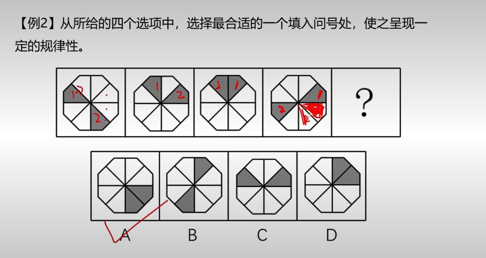
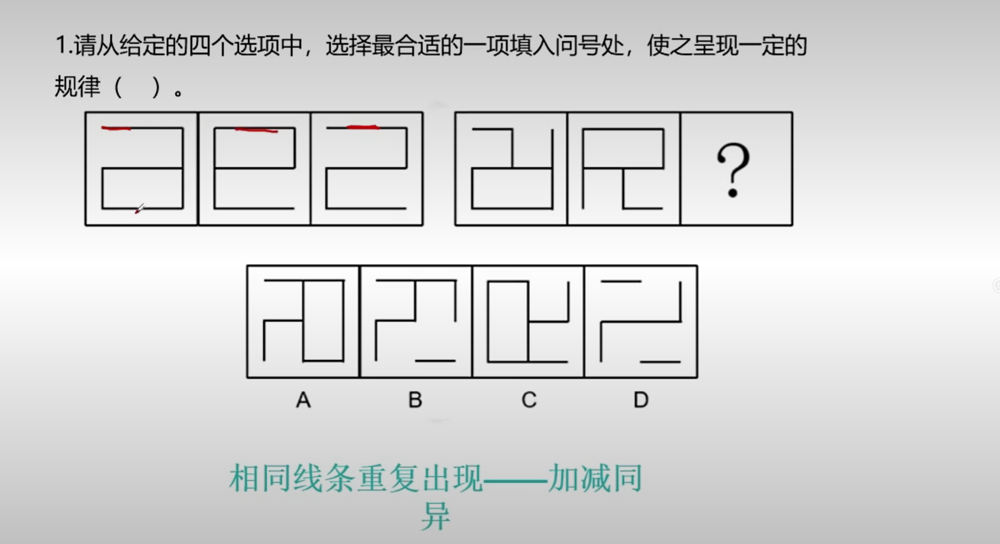
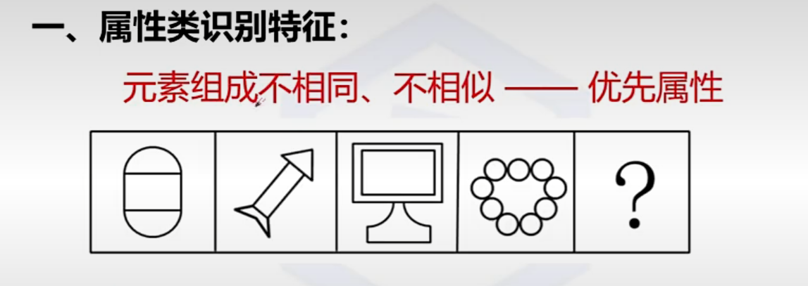
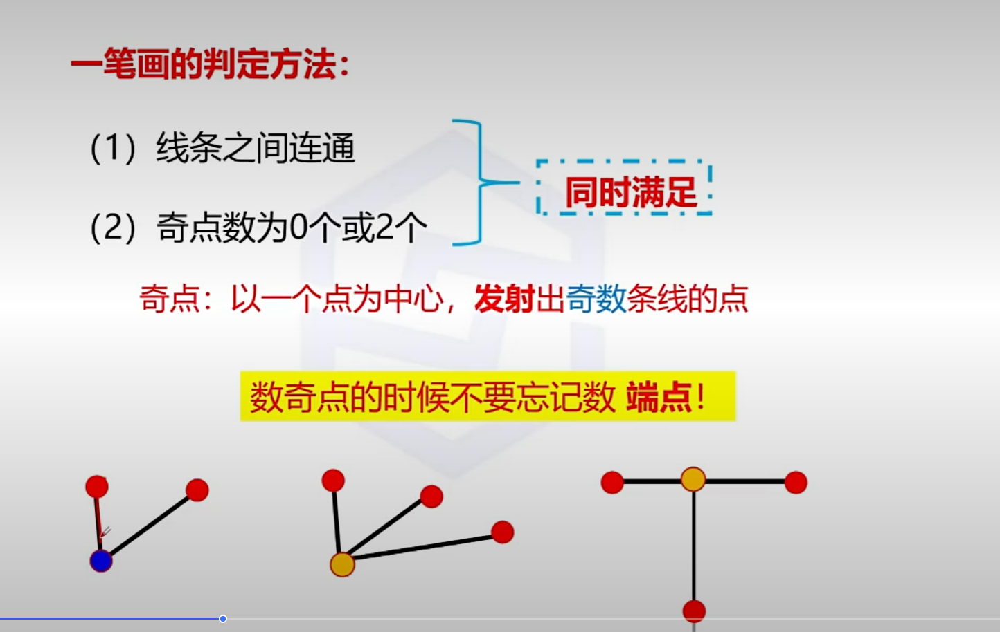
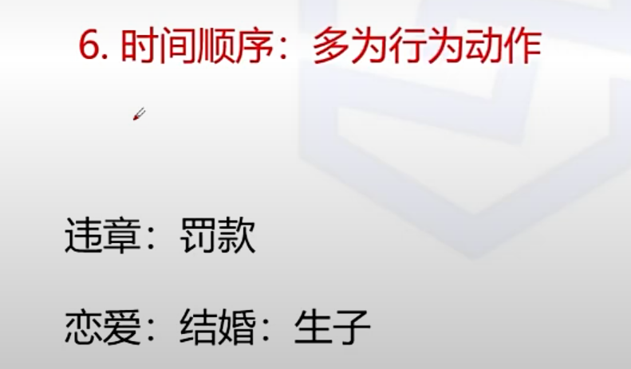

#  1.图形推理

ADACBBB

## 1.位置规律

**元素组成相同时，我们考虑位置规律**

例如如图

一般都是图形的平移或旋转、

### 1.平移

#### 1.一组

##### 1.多个元素分开看

分别从圆和三角进行位置分析，可以得到B选项

##### 2.相同元素就标号

#### 2.多组

##### 1.相同元素

**关键是要在明确组别中找到某些规律，往往是，穿越或反弹**

**比如这道题的第一列，我们发现他是穿越特性，所以在最后问号的第一列，也应该是穿越**

### 2.旋转

### 3.翻转

## 2.样式规律

### 1.遍历

### 2加减同异

例如这道题就是关注的线条是否存在，而不是反转或遍历

这道题的规律就是

**第一个图有，第二个图没有，则第三个图也没有**

**第一个图没有，第二个图有，则第三个图也没有**

也不全然是线条的同异，也可能是加减

****

例如这道题的规律就是，第一幅图加第二幅图再翻转

### 3.黑白运算

## 3.属性规律

### 1.对称性

**对于对称性我们往往需要考虑的就是**

**1.对称轴的数量**

**2.对称轴的方向**

**3.对称轴与图形的关系（重合，平行，垂直）**

来一道做错的题

**这个不仅要考虑中心对称，还要考虑中心对称的方向**

**这个不仅要考虑对称，还要考虑对称轴的数量**

### 2.曲直性

### 3.开闭性

这个往往和生活化的东西联系起来

比如这种图案

## 4.数量规律

### 1.交点数量

 

### 2.线的数量

### 3.笔画的数量

### 4.角的数量

**角的考察，不一定就是看数量，也可能是看性质**

比如这道题就是所有图形都有直角，所以最后一个选D

### 5.面的数量

例如这道题，除了注意面数，我们还要考虑是一个怎样的面，第一组都是三角形，第二组都是四边形

这道题就是找到最大面都是四边形

这里分类就是按最大面是中心对称还是轴对称

#### 1.最大面的考法

### 6.素数点

这里的考点：

1.查独立小图形的种类数

2.分别查每种小图形的数量

​					然后可能是1.每种小图形有规律-》例如第一幅图正方形有1，第二幅图正方形有2………….

​										2.不同小图形之间有规律 -》例如第一幅图正方形和圆形相差1，第二幅图正方形与圆形还相差1

## 5.特殊规律

一般就是图像上出现小黑点，箭头之类的标记物就考虑这个

## 6.空间规律

### 1.空间折叠

### 2.三视图

### 3.截面图

### 4.立体拼合

# 2.定义判断

**关键点就在于找关键词，然后找最优**

**还有就是关键看清楚最后问的是属于还是不属于**

着重关注这些词语

# 3.类比推理

## 1.语义关系

### 1.近义，反义

### 2.比喻象征

## 2.逻辑关系(重要)

### 1.全同关系

### 2.并列关系

### 3.包容关系

### 4.交叉关系

**这里要求四个句子全部成立才可以**

### 5.对应关系

**3.属性**

**4.功能**

**5.工具**

**6.时间顺序**

**7.因果**

**8.场所**

## 3.语法关系

# 4.逻辑判断

## 1.翻译推理

## 2.集合推理

### 1.四组翻译

 

### 2.三组换位

### 3.两组推理

 

### 4.一组递推

## 3.组合排列

这种题就一个一个试就可以推出来了

## 4.真假推理

这个也是一个一个带入就可以解答了

# 5.言语理解与表达

## 1.片段阅读

**对于这类题统一先看问题，后看选项，最后看原文**

### 1.主旨概括

**1.找主旨句**

**2.注意转折**

要注意转折前后的感情色彩

### 2.意图推断

### 3.标题添加

### 4.语句排序

**1.不要把指代词太多的作为主句**

**2.一般都是总结句**

### 5.语句衔接

**1.话题的主语对象一致，找到话题的主语**

**2.思路一致**

**3.上文提出观点，下文解释原因或提出对策**

# 6.资料分析

## 1.增长

这类题我认为关键就是求出这四个点，**增长量，增长率，现期，基期**

**概念**：指数据相较于基期的变化幅度。

**公式**：

- 增长量 = 本期数 − 基期数
- 增长率 = (增长量 ÷ 基期数) × 100%

**注意点**：

- 正数表示增长，负数表示下降。
- 基期为 0 时，不能直接算增长率。
- 有时题目会给“环比增长”“同比增长”，要区分。

## 2.倍数

- **概念**：描述一个数是另一个数的几倍。
- **公式**：
  - 倍数 = 本期数 ÷ 基期数
- **与增长的关系**：
  - 倍数 − 1 = 增长率（如果用小数表示）。
  - 例如：增长率 200% = 倍数 3。
- **常见考点**：
  - 倍数越大，增长幅度越大。
  - 可以转化为增长率来比较。

## 3.比重

**概念**：某部分占总体的比例。

**公式**：

- 比重 = 部分数 ÷ 总数 × 100%

**变化**：

- 可以考“比重上升/下降”。
- 比重的变化不仅取决于部分的增减，还与总体的增减有关。

**常见陷阱**：

- 部分数增加，但比重可能下降（若总体增幅更大）。
- 注意分子、分母同时变化的情况。

# 成语积累

| 成语                               | 释义 / 用法                                                  | 易考点 / 搭配                                 | 例子 / 拓展                                                  |
| ---------------------------------- | ------------------------------------------------------------ | --------------------------------------------- | ------------------------------------------------------------ |
| **功亏一篑**                       | 原意：功劳因最后一篑土而没能完成，比喻做事情差最后一点就失败。 | 易与“前功尽弃”“半途而废”混淆                  | 在项目收尾阶段疏忽，导致功亏一篑。                           |
| **异曲同工**                       | 虽然方法不一样，但效果相似；各有特色，却能达到相似的高度。   | 用于褒义、艺术 / 表现 / 思路等方面            | 两位作家的文风不同，但都能感染人，真是异曲同工。             |
| **防患未然**                       | 在灾祸 / 危险尚未发生之前就采取防备措施。                    | 常用于“措施”、“预防”、“警觉性”语境            | 必须加强监管，防患未然。                                     |
| **姹紫嫣红**                       | 各种鲜艳的花朵争相开放，形容花姿绚丽多彩；也比喻事物繁盛、色彩丰富。 | 主要用于描写景物、繁盛场面                    | 春天里，花园中姹紫嫣红，令人目不暇接。                       |
| **触目惊心**                       | 看到极其严重或骇人的情况而心中震惊。                         | 多用于形容灾害、惨状、违规行为等              | 那些新闻报道的腐败案，触目惊心。                             |
| **泰然自若**                       | 指在紧急或复杂情形下，神态自然，不慌不乱。                   | 多用于心理 / 态度描写                         | 面对突发情况，他仍能泰然自若。                               |
| **别具一格**                       | 有自己独特的风格 / 形式，与众不同。                          | 多用来评价文艺 / 作品 / 设计等                | 这首诗别具一格，让人眼前一亮。                               |
| **包罗万象**                       | 内容十分丰富，应有尽有；包含各种事物、情形。                 | 描写宏大 / 全面 / 综合的事物                  | 这本百科全书包罗万象，适合翻阅。                             |
| **沧海桑田**                       | 原指海变成田、田变成海，比喻世事、自然的巨大变化。           | 多用于历史 / 刻画变化的语境                   | 世事沧海桑田，昔日风光已成浮云。                             |
| **一脉相承 / 薪火相传**            | 强调文化 / 思想 / 技艺等在一系之中代代传承。                 | 文化 / 传承 / 传统 / 机关单位文化背景题里常见 | 古老技艺需一脉相承，不可断绝。                               |
| **推陈出新 / 吐故纳新 / 革故鼎新** | 推陈出新：去掉旧的、引入新的；吐故纳新：排除糟粕，吸收新意；革故鼎新：重大的变革 / 改革。 | 常用于“创新 / 变革 / 改良”语境                | 企业要敢于推陈出新，否则难以持续发展。                       |
| **拈轻怕重 / 避重就轻**            | 拈轻怕重：主动挑轻松的 / 不敢担当重任；避重就轻：逃避主要问题，只谈小事情。 | 易混淆，两者有细微差异                        | 光说边边角角，不敢触根本，是避重就轻；不愿承担重任，是拈轻怕重。 |
| **排除万难 / 披荆斩棘**            | 排除万难：扫除各种障碍；披荆斩棘：比喻在前进路上清除重重障碍。 | 效果近似，但语气 / 强调点不同                 | 在创业道路上，他们披荆斩棘，终于成功。                       |
