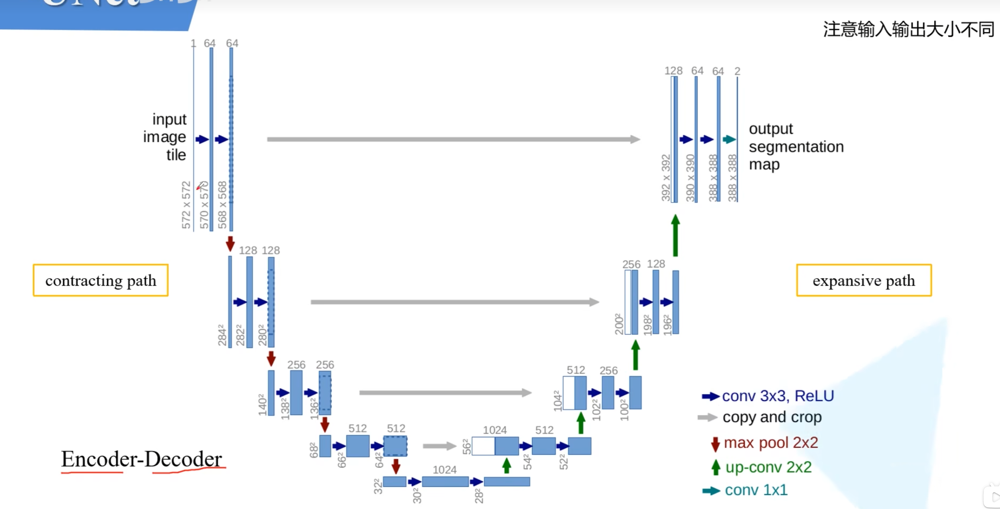
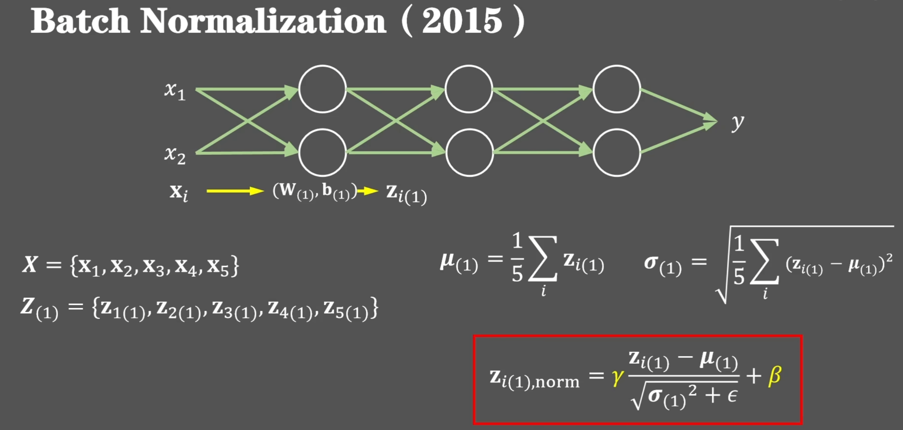
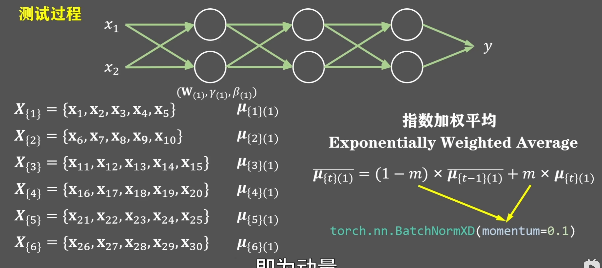
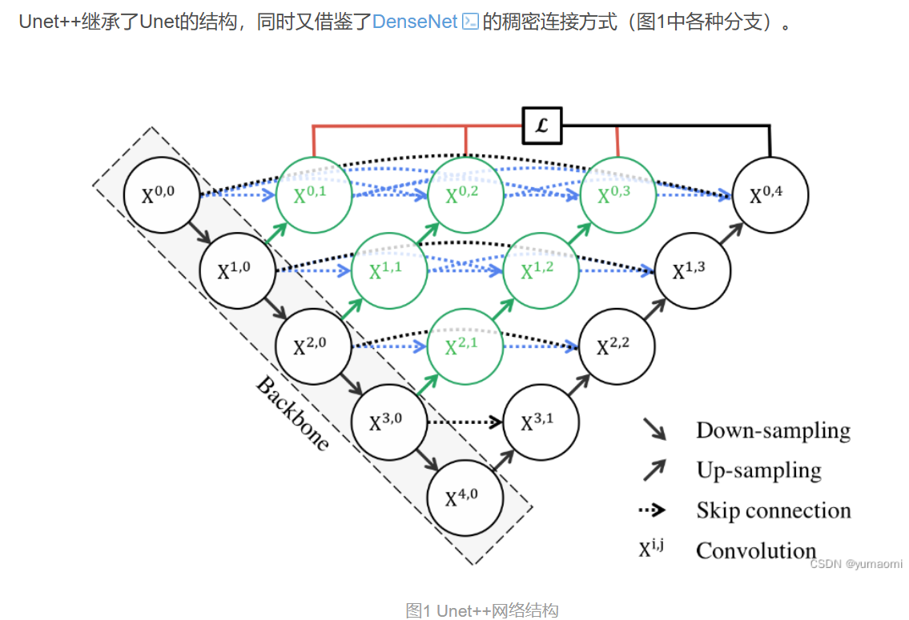

# 神经网络架构

## 1.U-Net

这是原论文中的操作，由于没有使用padding，所以输入时572x572而输出则是388x388，并且在进行copy and crop操作的时候会对左边的特征进行中间部分的裁剪，裁剪出来合适大小的与右边部分进行拼接

**而现在主流的操作是，1.每次进行卷积都会加上padding，防止改变输入的高和宽**

​										**2.每次在conv 3x3和ReLU中间我们会加上一个BN(batch normalization)**

### 1.Batch Normalization

**BN 使得每一层的输入在训练过程中保持相对稳定的均值和方差，避免因参数更新导致的剧烈分布偏移，但不同层的特征分布本身仍然可以且应该不同。**

BN 通过标准化 + 可学习缩放，**既控制了输入尺度，又保留了模型表达能力**，从而间接帮助训练，而不是强行统一分布。

**Batch Normalization 通过对每一层的输出（或输入）在 batch 维度上进行标准化，缓解了训练过程中因参数更新导致的内部协变量偏移问题。这使得每一层的输入分布保持相对稳定（均值和方差可控），从而允许使用更大的学习率、对初始化更鲁棒，并加速训练收敛。但 BN 并不强制所有层的输入分布“相同”或“类似”，不同层学到的特征本质不同，其分布自然也不同；BN 只是防止这些分布在训练中剧烈漂移。**

**缺点**

#### 1.训练时

X由线性变换后得到Z，我们会对Z进行右边的操作，而红色框架里的就是BN的过程

$\gamma和\beta是可以将归一化后的结果进行一层线性变换，使得不同层之间的分布类似而不同，需要进行学习$

$\epsilon则是为了防止分母为0的一个参数，不需要进行学习$

并且训练阶段需要训练的数据只有

这三个而没有b,因为在进行归一化的时候，会减去均值，导致b被减掉了

我们往往按这样的操作进行排布(归一化和非线性激活可以换顺序)

​	

#### 2.推理时

训练时可以使用$\gamma和\beta$参数，但是由于训练集的样本和测试及的样本分布不同，并有时推理时，我们可能只用了一个样本,不能计算均值和标准差。**所以我们需要保存并使用训练过程中的结果辅助运算**

这里是总样本30个数据，分为6个batch。所以总共会得到6个均值 

（**图中给出的公式也是方差的计算公式**）

## 2.U-Net++

